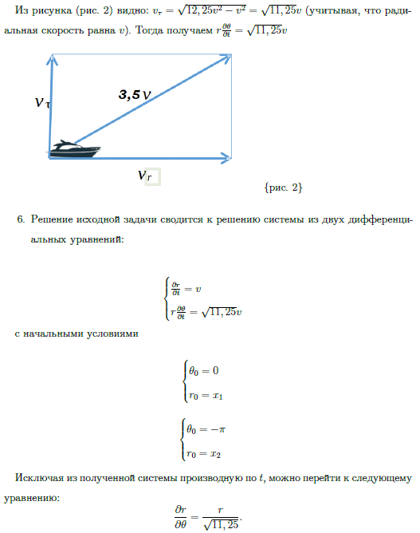
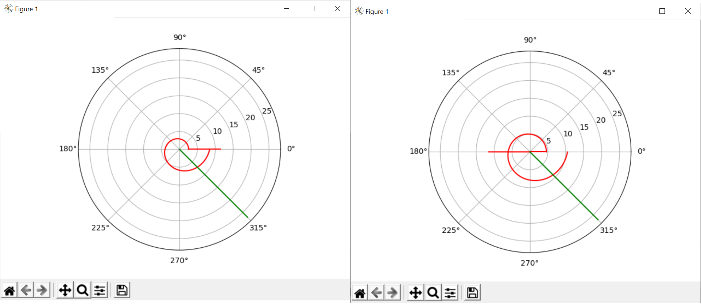

---
## Front matter
lang: ru-RU
title: Лабораторная № 2
author: |
	Ли Тимофей Александрович, НФИбд-01-18

## Formatting
toc: false
slide_level: 2
theme: metropolis
header-includes: 
 - \metroset{progressbar=frametitle,sectionpage=progressbar,numbering=fraction}
 - '\makeatletter'
 - '\beamer@ignorenonframefalse'
 - '\makeatother'
aspectratio: 43
section-titles: true
---

# Цель работы

## Цель работы

- Научиться решать задачу о погоне
- Строить графики траектории движения
- Выводить уравнение, описывающее движение

# Задачи

## Задачи

- Записать уравнение, описывающее движение катера, с начальными условиями для двух случаев (в зависимости от расположения катера относительно лодки в начальный момент времени)
- Построbnm траекторию движения катера и лодки для двух случаев
- Найnb точку пересечения траектории катера и лодки 

# Результат

## Уравнение

{ #fig:001 }

## Результат

{ #fig:002 }
