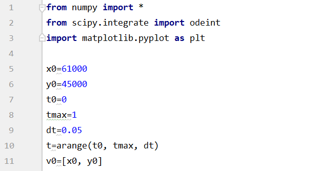
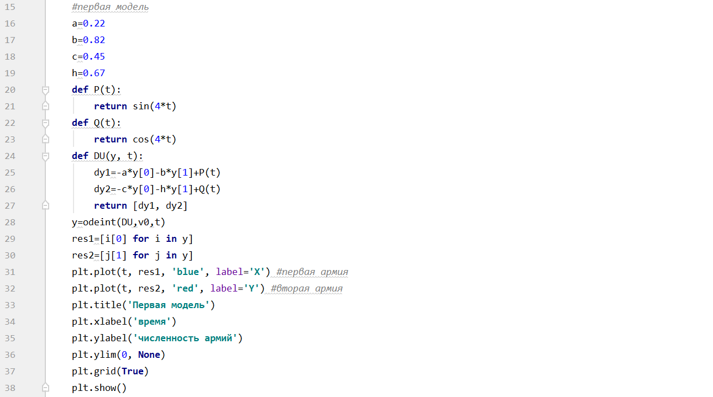
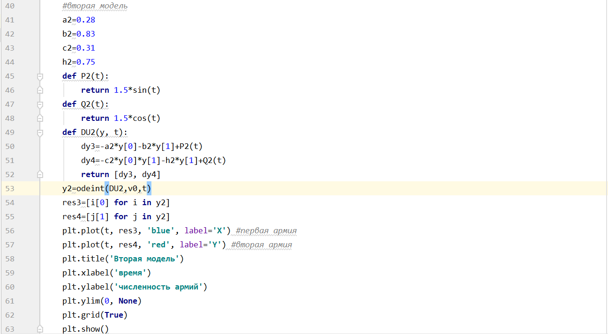
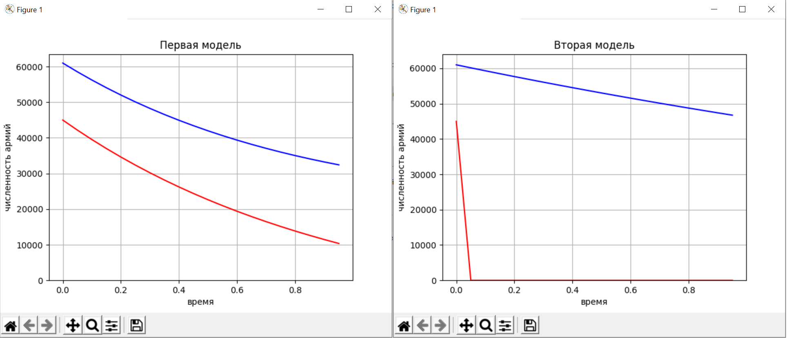

---
## Front matter
lang: ru-RU
title: Лабораторная работа № 3
author: |
	Ли Тимофей Александрович, НФИбд-01-18

## Formatting
toc: false
slide_level: 2
theme: metropolis
header-includes: 
 - \metroset{progressbar=frametitle,sectionpage=progressbar,numbering=fraction}
 - '\makeatletter'
 - '\beamer@ignorenonframefalse'
 - '\makeatother'
aspectratio: 43
section-titles: true
---

# Цель работы

## Цель работы

- Изучить виды моделей боевых действий и написать код, моделирующий данную задачу.

# Задачи

## Задачи

- изучить теорию о модели боевых действий
- реализовать программный код для 32 варианта

# Ход работы

## Начальные данные

{ #fig:001 }

## Первая модель

{ #fig:001 }

## Вторая модель

{ #fig:001 }

# Результат

## Уравнение

{ #fig:001 }

# Выводы

  - Изучил различные модели боевых действий
  - Реализовал программный код для поставленной задачи
  - По построенным графикам можно понять, что модель с партизанскими отрядами совсем не выгодна для армии Y, поскольку она очень быстро проиграет, потеряв всех бойцов.
