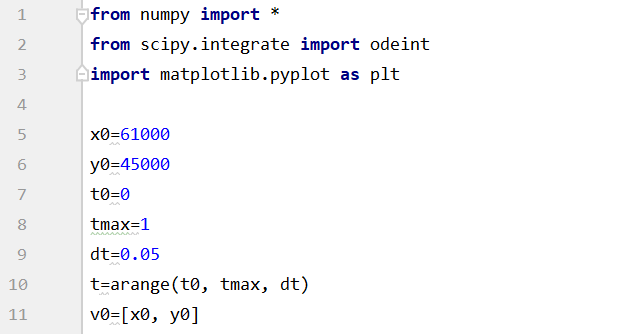
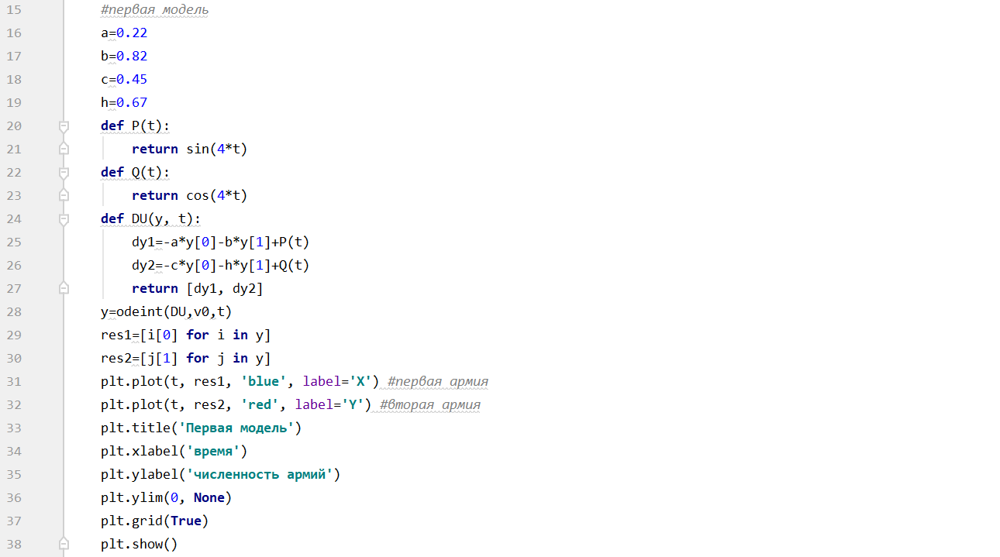
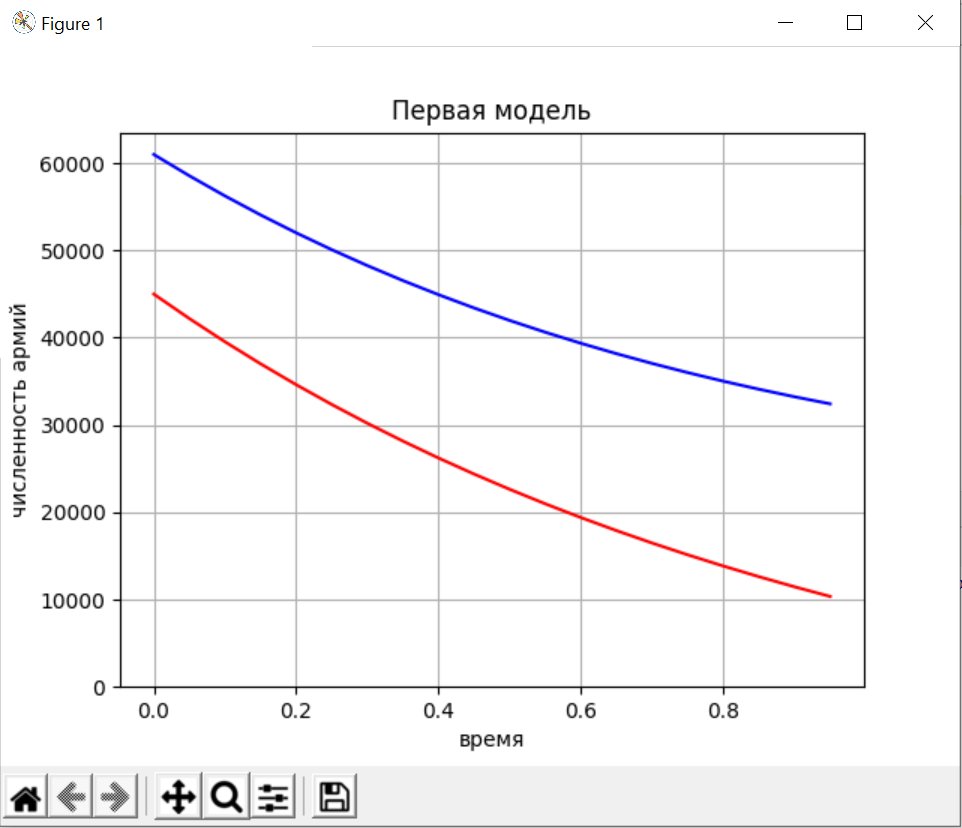
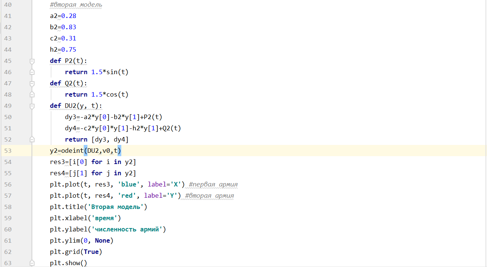
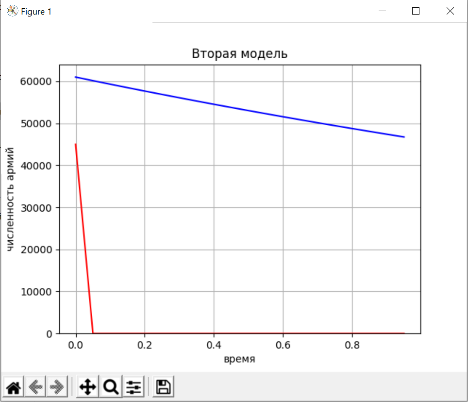
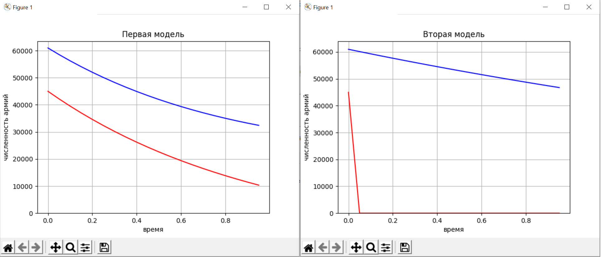

---
# Front matter
lang: ru-RU
title: "Лабораторная работа №3"
subtitle: "Модель боевых действий"
author: "Ли Тимофей Александрович, НФИбд-01-18"

# Formatting
toc-title: "Содержание"
toc: true # Table of contents
toc_depth: 2
lof: true # List of figures
lot: true # List of tables
fontsize: 12pt
linestretch: 1.5
papersize: a4paper
documentclass: scrreprt
polyglossia-lang: russian
polyglossia-otherlangs: english
mainfont: PT Serif
romanfont: PT Serif
sansfont: PT Sans
monofont: PT Mono
mainfontoptions: Ligatures=TeX
romanfontoptions: Ligatures=TeX
sansfontoptions: Ligatures=TeX,Scale=MatchLowercase
monofontoptions: Scale=MatchLowercase
indent: true
pdf-engine: lualatex
header-includes:
  - \linepenalty=10 # the penalty added to the badness of each line within a paragraph (no associated penalty node) Increasing the value makes tex try to have fewer lines in the paragraph.
  - \interlinepenalty=0 # value of the penalty (node) added after each line of a paragraph.
  - \hyphenpenalty=50 # the penalty for line breaking at an automatically inserted hyphen
  - \exhyphenpenalty=50 # the penalty for line breaking at an explicit hyphen
  - \binoppenalty=700 # the penalty for breaking a line at a binary operator
  - \relpenalty=500 # the penalty for breaking a line at a relation
  - \clubpenalty=150 # extra penalty for breaking after first line of a paragraph
  - \widowpenalty=150 # extra penalty for breaking before last line of a paragraph
  - \displaywidowpenalty=50 # extra penalty for breaking before last line before a display math
  - \brokenpenalty=100 # extra penalty for page breaking after a hyphenated line
  - \predisplaypenalty=10000 # penalty for breaking before a display
  - \postdisplaypenalty=0 # penalty for breaking after a display
  - \floatingpenalty = 20000 # penalty for splitting an insertion (can only be split footnote in standard LaTeX)
  - \raggedbottom # or \flushbottom
  - \usepackage{float} # keep figures where there are in the text
  - \floatplacement{figure}{H} # keep figures where there are in the text
---

# Цель работы

Изучить виды моделей боевых действий и написать код, моделирующий данную задачу.

# Задание

- изучить теорию о модели боевых действий
- реализовать программный код для 32 варианта

# Теоретическая справка

В теоретической части лабораторной работы рассмотрим все интерпретации модели боевых действий.

## Первая модель

$$ \begin{cases}
\frac{dx}{dt} =  -a(t)x(t) - b(t)y(t)+P(t)
\\
\frac{dy}{dt} =  -c(t)x(t) - h(t)y(t)+Q(t)
\end{cases},
$$

где $a(t)$ и $h(t)$ - параметры, описывающие влияние побочных факторов на потери во время боевых действий, а $b(t)$ и $c(t)$ - параметры эффективности боевых действий со стороны армий $Y$ и $X$.

## Вторая модель

Во втором случае в борьбу добавляются партизанские отряды. Нерегулярные войска в отличии от постоянной армии менее уязвимы, так как действуют скрытно, в этом случае сопернику приходится действовать неизбирательно, по площадям, занимаемым партизанами. Поэтому считается, что тем потерь партизан, проводящих свои операции в разных местах на некоторой известной территории, пропорционален не только численности армейских соединений, но и численности самих партизан.

$$ \begin{cases}
\frac{dx}{dt} =  -a(t)x(t) - b(t)y(t)+P(t)
\\
\frac{dy}{dt} =  -c(t)x(t)y(t) - h(t)y(t)+Q(t)
\end{cases}
$$

## Третья модель

$$ \begin{cases}
\frac{dx}{dt} =  -a(t)x(t) - b(t)x(t)y(t)+P(t)
\\
\frac{dy}{dt} =  -c(t)x(t)y(t) - h(t)y(t)+Q(t)
\end{cases}
$$

# Выполнение лабораторной работы

Сначала ввели начальные данные (рис. 1)

{рис. 1}

Затем ввели значения a,b,c,h, функции P(t) и Q(t), решили систему ДУ с помощью odeint, вывели результаты в виде графика. (рис. 2,3)

{рис. 2}

{рис. 3}

После, сделали то же самое для второй модели (регулярные войска и партизанские отряды). (рис. 4,5)

{рис. 4}
{рис. 5}

# Выводы

  - Изучил различные модели боевых действий
  - Реализовал программный код для поставленной задачи
  - По построенным графикам (рис. 6) можно понять, что модель с партизанскими отрядами совсем не выгодна для армии Y, поскольку она очень быстро проиграет, потеряв всех бойцов.
 
 {рис. 6}
