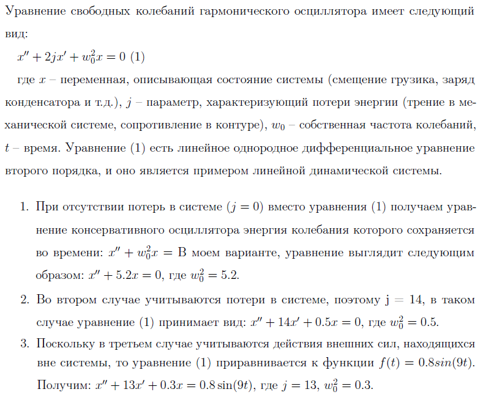
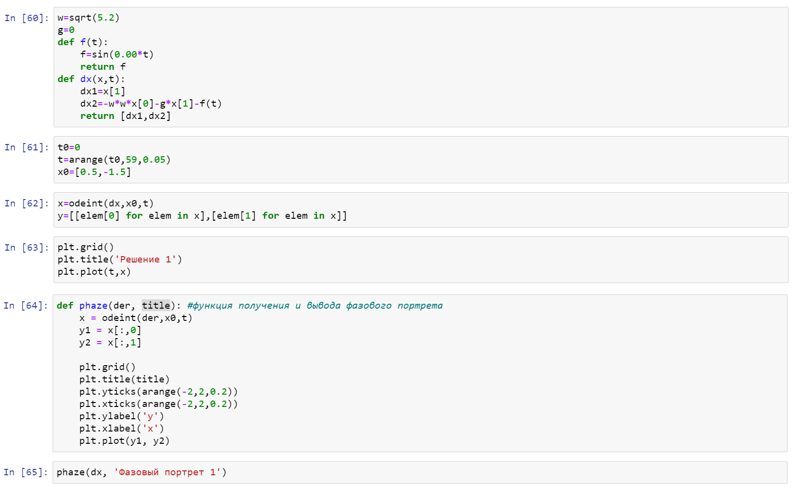
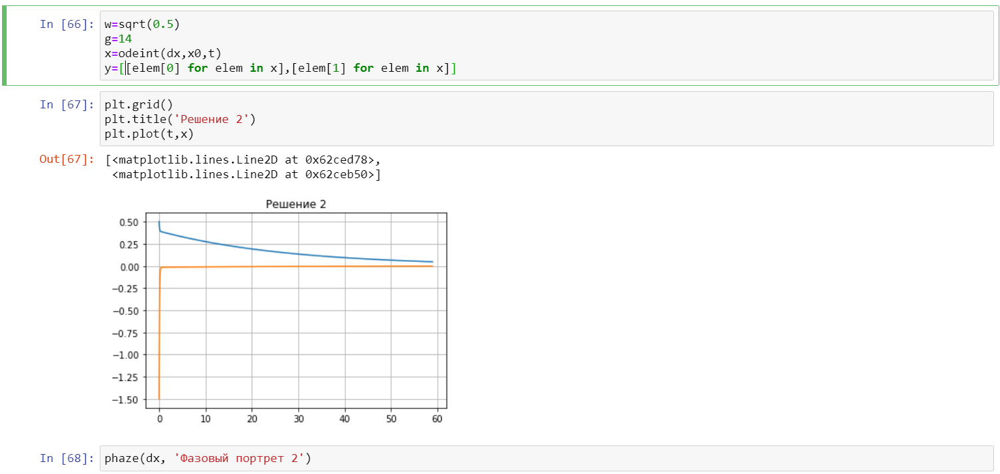
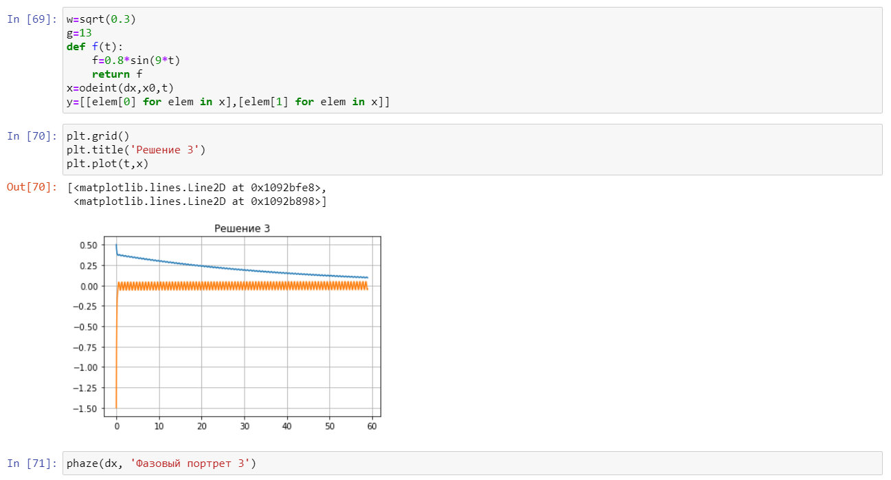
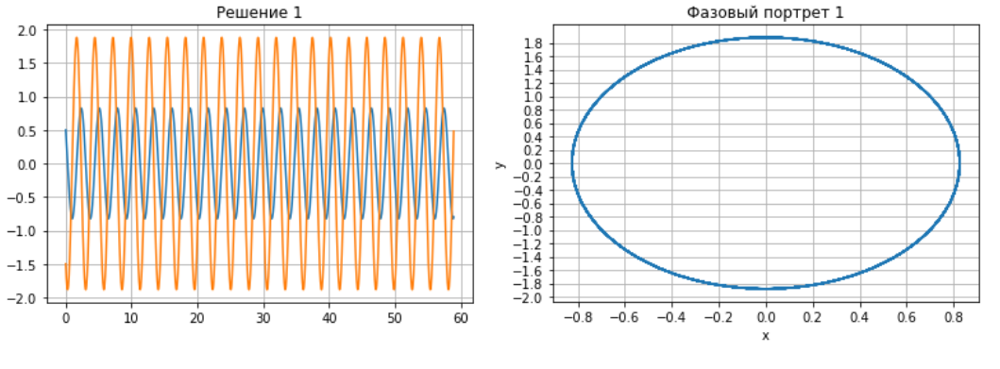
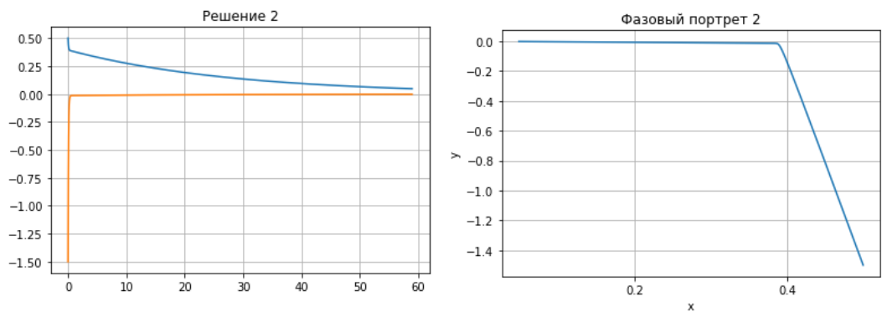
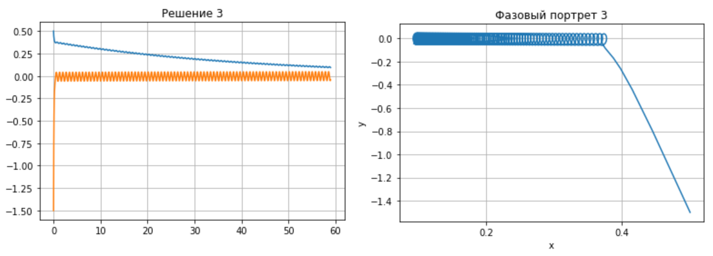

---
## Front matter
lang: "ru"
title: Лабораторная работа № 4
author: Ли Тимофей Александрович, НФИбд-01-18

## Formatting
toc: false
slide_level: 2
theme: metropolis
mainfont: PT Serif
romanfont: PT Serif
sansfont: PT Sans
monofont: Consolas
header-includes: 
 - \metroset{progressbar=frametitle,sectionpage=progressbar,numbering=fraction}
 - '\makeatletter'
 - '\beamer@ignorenonframefalse'
 - '\makeatother'
aspectratio: 43
section-titles: true
---

# Цель работы

## Цель работы

- Изучить модель гармонический колебаний, построить фазовый портрет гармонического осциллятора и решение уравнения гармонического осциллятора для трех данных случаев.

# Задачи

## Задачи

- изучить теорию о модели гармонических колебаний
- реализовать программный код для 32 варианта

# Ход работы

## Описание решения

{ #fig:001 }

## Первый случай

{ #fig:002 }

## Второй случай

{ #fig:003 }

## Третий случай

{ #fig:004 }

# Результат

## Решение и фазовый портрет для первого случая

{ #fig:005 }

## Решение и фазовый портрет для второго случая

{ #fig:006 }

## Решение и фазовый портрет для третьего случая

{ #fig:007 }

# Выводы

  - Изучил различные модели гармонических колебаний
  - Реализовал программный код для поставленной задачи

