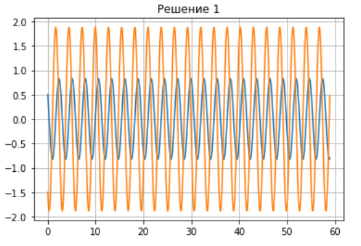
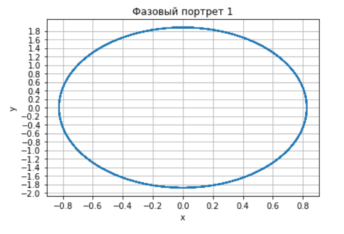
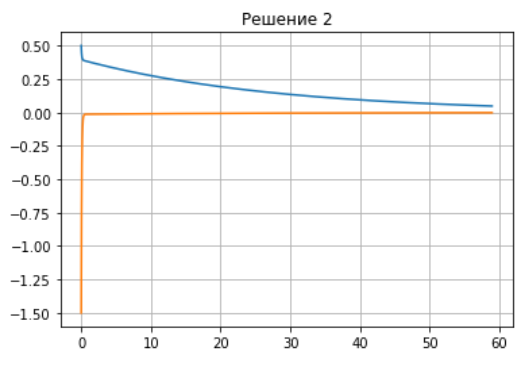
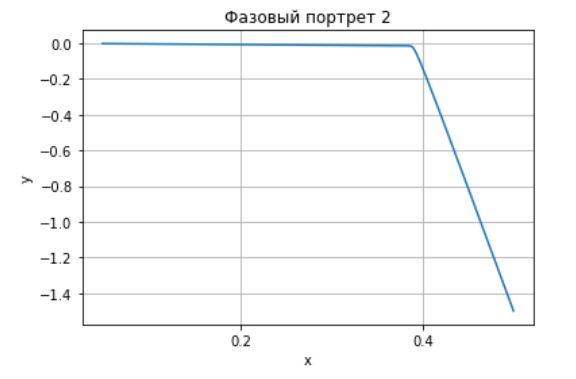
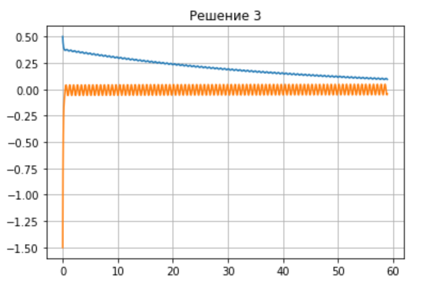
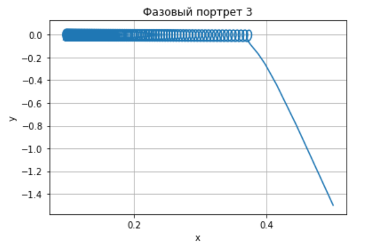
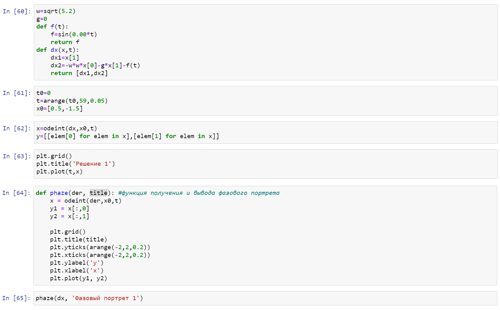
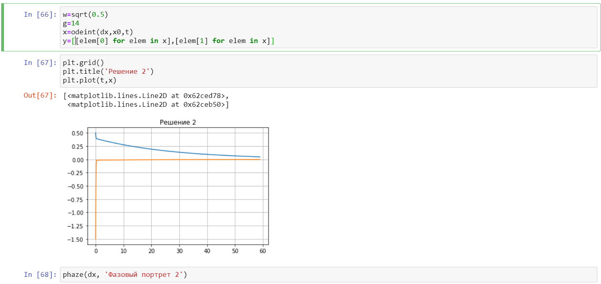
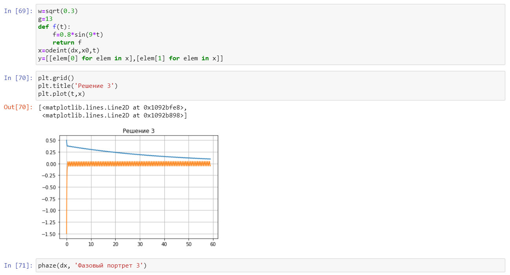


---
# Front matter
lang: "ru"
title: "Лабораторная работа №4"
subtitle: "Модель гармонических колебаний"
author: "Ли Тимофей Александрович"

# Formatting
toc-title: "Содержание"
toc: true # Table of contents
toc_depth: 2
lof: true # List of figures
fontsize: 12pt
linestretch: 1.5
papersize: a4paper
documentclass: scrreprt
mainfont: PT Serif
romanfont: PT Serif
sansfont: PT Sans
monofont: Fira Code
mainfontoptions: Ligatures=TeX
romanfontoptions: Ligatures=TeX
sansfontoptions: Ligatures=TeX,Scale=MatchLowercase
monofontoptions: Scale=MatchLowercase
indent: true
pdf-engine: xelatex
header-includes:
  - \linepenalty=10 # the penalty added to the badness of each line within a paragraph (no associated penalty node) Increasing the value makes tex try to have fewer lines in the paragraph.
  - \interlinepenalty=0 # value of the penalty (node) added after each line of a paragraph.
  - \hyphenpenalty=50 # the penalty for line breaking at an automatically inserted hyphen
  - \exhyphenpenalty=50 # the penalty for line breaking at an explicit hyphen
  - \binoppenalty=700 # the penalty for breaking a line at a binary operator
  - \relpenalty=500 # the penalty for breaking a line at a relation
  - \clubpenalty=150 # extra penalty for breaking after first line of a paragraph
  - \widowpenalty=150 # extra penalty for breaking before last line of a paragraph
  - \displaywidowpenalty=50 # extra penalty for breaking before last line before a display math
  - \brokenpenalty=100 # extra penalty for page breaking after a hyphenated line
  - \predisplaypenalty=10000 # penalty for breaking before a display
  - \postdisplaypenalty=0 # penalty for breaking after a display
  - \floatingpenalty = 20000 # penalty for splitting an insertion (can only be split footnote in standard LaTeX)
  - \raggedbottom # or \flushbottom
  - \usepackage{float} # keep figures where there are in the text
  - \floatplacement{figure}{H} # keep figures where there are in the text
---

# Цель работы

Изучить модель гармонический колебаний, построить фазовый портрет гармонического осциллятора и решение уравнения гармонического осциллятора для трех данных случаев.

# Задание
Вариант 32

Постройте фазовый портрет гармонического осциллятора и решение уравнения гармонического осциллятора для следующих случаев
1. Колебания гармонического осциллятора без затуханий и без действий внешней силы $x''+5.2x=0$
2. Колебания гармонического осциллятора c затуханием и без действий внешней силы $x''+14x'+0.5x=0$
3. Колебания гармонического осциллятора c затуханием и под действием внешней силы $x''+13x'+0.3x=0.8\sin(9t)$
На интервале
$t=(0;59)$ (шаг 0.05) с начальными условиями $x_0 = 0.5, y_{0} = -1.5$

# Выполнение лабораторной работы

## Решение задачи:

Уравнение свободных колебаний гармонического осциллятора имеет следующий вид: 

$x''+2jx'+w_0^2x=0$ (1)

где $x$ – переменная, описывающая состояние системы (смещение грузика, заряд конденсатора и т.д.), $j$ – параметр, характеризующий потери энергии (трение в механической системе, сопротивление в контуре), $w_0$ – собственная частота колебаний, $t$ – время.
Уравнение (1) есть линейное однородное дифференциальное уравнение второго порядка, и оно является примером линейной динамической системы.

1. При отсутствии потерь в системе ($j = 0$) вместо уравнения (1) получаем уравнение консервативного осциллятора энергия колебания которого сохраняется во времени:
$x''+w_0^2x=$
В моем варианте, уравнение выглядит следующим образом:
$x'' + 5.2x = 0$, где $w_0^2 = 5.2$.

Решение уравнения колебания гармонического осциллятора без затуханий и без действий внешней силы (рис. -@fig:001):

{ #fig:001 width=70% }

Фазовый портрет (рис. -@fig:002):

{ #fig:002 width=70% }

2. Во втором случае учитываются потери в системе, поэтому j = 14, в таком случае уравнение (1) принимает вид:
$x''+14x'+0.5x=0$, где $w_0^2 = 0.5$.

Решение уравнения колебания гармонического осциллятора c затуханием и без действий внешней силы (рис. -@fig:003):

{ #fig:003 width=70% }

Фазовый портрет (рис. -@fig:004):

{ #fig:004 width=70% }

3. Поскольку в третьем случае учитываются действия внешних сил, находящихся вне системы, то уравнение (1) приравнивается к функции $f(t)=0.8sin(9t)$. Получим: 
$x''+13x'+0.3x=0.8\sin(9t)$, где $j = 13$, $w_0^2 = 0.3$.

Решение уравнения колебания гармонического осциллятора c затуханием и под действием внешней силы (рис. -@fig:005):

{ #fig:005 width=70% }

Фазовый портрет (рис. -@fig:006):

{ #fig:006 width=70% }

## Построение модели гармонических колебаний

Код для первого случая  (рис. -@fig:007)

{ #fig:007 width=70% }

Код для второго случая  (рис. -@fig:008)

{ #fig:008 width=70% }

Код для третьего случая  (рис. -@fig:009)

{ #fig:009 width=70% }

# Выводы

В ходе лабораторной работы мы построили решения уравнений, а также фазовые портреты для трех возможных моделей гармонического осциллятора.
