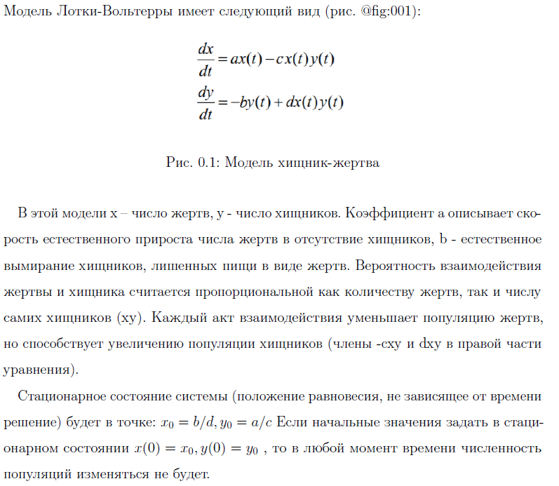
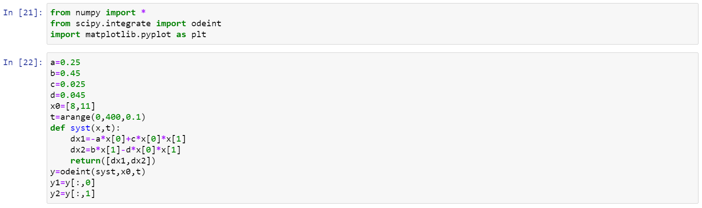
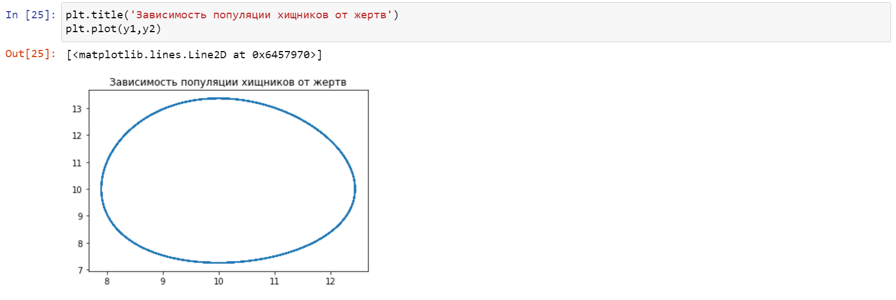
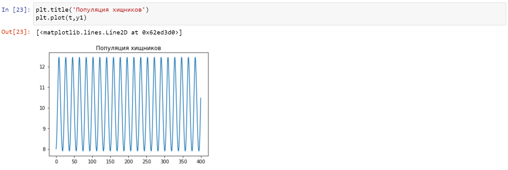
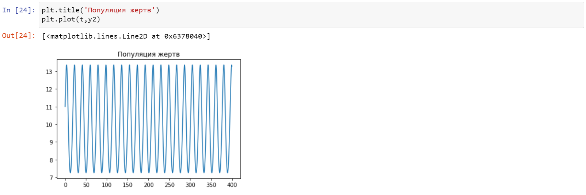
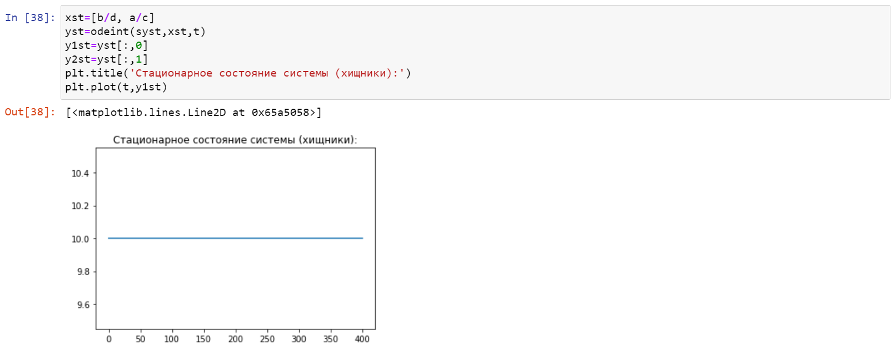
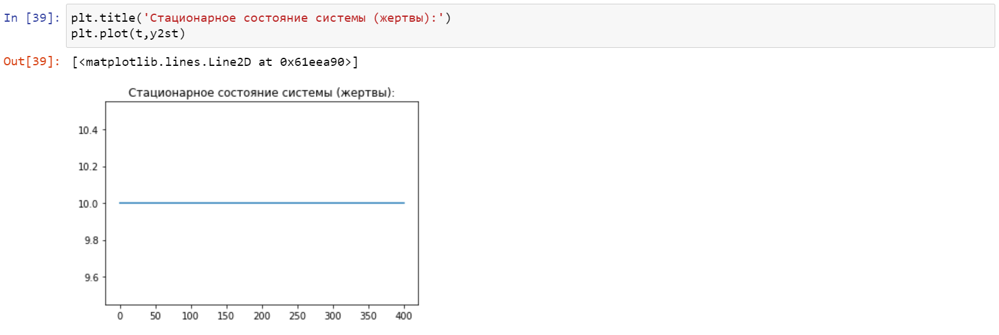

---
## Front matter
lang: "ru"
title: Лабораторная работа № 5
author: Ли Тимофей Александрович, НФИбд-01-18

## Formatting
toc: false
slide_level: 2
theme: metropolis
mainfont: PT Serif
romanfont: PT Serif
sansfont: PT Sans
monofont: Consolas
header-includes: 
 - \metroset{progressbar=frametitle,sectionpage=progressbar,numbering=fraction}
 - '\makeatletter'
 - '\beamer@ignorenonframefalse'
 - '\makeatother'
aspectratio: 43
section-titles: true
---

# Цель работы

## Цель работы

- Изучить модель "хищник-жертва", построить график зависимости численности хищников от численности жертв, а также графики изменения численности хищников и численности жертв при начальных условиях 32 варианта. Найти стационарное состояние системы.

# Задачи

## Задачи

- изучить теорию о модели "хищник-жертва"
- реализовать программный код для 32 варианта

# Ход работы

## Описание решения

{ #fig:001 }

## Начальные условия и решение системы уравнений

{ #fig:002 }

## Построение графика зависимости численности хищников от численности жертв

{ #fig:003 }

## Построение графика численности хищников

{ #fig:004 }

## Построение графика численности жертв

{ #fig:005 }

## Нахождение стационарного состояния системы

{ #fig:006 }

## Нахождение стационарного состояния системы

{ #fig:007 }

# Выводы

  - Изучил модель "хищник-жертва"
  - Реализовал программный код для поставленной задачи

