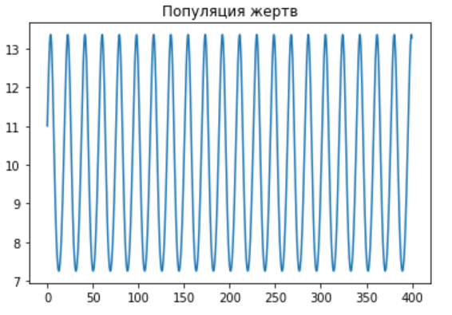

---
# Front matter
lang: "ru"
title: "Лабораторная работа №5"
subtitle: "Модель хищник-жертва"
author: "Ли Тимофей Александрович"

# Formatting
toc-title: "Содержание"
toc: true # Table of contents
toc_depth: 2
lof: true # List of figures
fontsize: 12pt
linestretch: 1.5
papersize: a4paper
documentclass: scrreprt
mainfont: PT Serif
romanfont: PT Serif
sansfont: PT Sans
monofont: Fira Code
mainfontoptions: Ligatures=TeX
romanfontoptions: Ligatures=TeX
sansfontoptions: Ligatures=TeX,Scale=MatchLowercase
monofontoptions: Scale=MatchLowercase
indent: true
pdf-engine: xelatex
header-includes:
  - \linepenalty=10 # the penalty added to the badness of each line within a paragraph (no associated penalty node) Increasing the value makes tex try to have fewer lines in the paragraph.
  - \interlinepenalty=0 # value of the penalty (node) added after each line of a paragraph.
  - \hyphenpenalty=50 # the penalty for line breaking at an automatically inserted hyphen
  - \exhyphenpenalty=50 # the penalty for line breaking at an explicit hyphen
  - \binoppenalty=700 # the penalty for breaking a line at a binary operator
  - \relpenalty=500 # the penalty for breaking a line at a relation
  - \clubpenalty=150 # extra penalty for breaking after first line of a paragraph
  - \widowpenalty=150 # extra penalty for breaking before last line of a paragraph
  - \displaywidowpenalty=50 # extra penalty for breaking before last line before a display math
  - \brokenpenalty=100 # extra penalty for page breaking after a hyphenated line
  - \predisplaypenalty=10000 # penalty for breaking before a display
  - \postdisplaypenalty=0 # penalty for breaking after a display
  - \floatingpenalty = 20000 # penalty for splitting an insertion (can only be split footnote in standard LaTeX)
  - \raggedbottom # or \flushbottom
  - \usepackage{float} # keep figures where there are in the text
  - \floatplacement{figure}{H} # keep figures where there are in the text
---

# Цель работы

Изучить модель "хищник-жертва", построить график зависимости численности хищников от численности жертв, а также графики изменения численности хищников и численности жертв при начальных условиях 32 варианта. Найти стационарное состояние системы.

# Задание
Вариант 32

Для модели "хищник-жертва":
 1. Постройте график зависимости численности хищников от численности жертв
 2. Постройте графики изменения численности хищников и численности жертв при следующих начальных условиях: $x_0 = 8, y_{0} = 11$
 3. Найдите стационарное состояние системы

# Выполнение лабораторной работы

## Решение задачи:

Модель Лотки-Вольтерры имеет следующий вид (рис. -@fig:001): 

{ #fig:001 width=30% }

В этой модели x – число жертв, y - число хищников. Коэффициент a описывает скорость естественного прироста числа жертв в отсутствие хищников, b - естественное вымирание хищников, лишенных пищи в виде жертв. Вероятность взаимодействия жертвы и хищника считается пропорциональной как количеству жертв, так и числу самих хищников (xy). Каждый акт взаимодействия уменьшает популяцию жертв, но способствует увеличению популяции хищников (члены -cxy и dxy в правой части уравнения).

Стационарное состояние системы (положение равновесия, не зависящее от времени решение) будет в точке: $x_0 = b/d, y_{0} = a/c$
Если начальные значения задать в стационарном состоянии $x(0) = x_0, y(0) = y_0$ , то в любой момент времени численность популяций изменяться не будет.

График зависимости численности хищников от численности жертв (рис. -@fig:002):

{ #fig:002 width=70% }

График изменения численности хищников при заданных начальных условиях (рис. -@fig:003):

{ #fig:003 width=70% }

График изменения численности жертв при заданных начальных условиях (рис. -@fig:004):

{ #fig:004 width=70% }

Стационарное состояние системы (рис. -@fig:005):

{ #fig:005 width=70% }

## Построение модели "хищник-жертва"

Начальные условия и задание системы уравнений (рис. -@fig:006):

{ #fig:006 width=70% }

Вывод графика зависимости численности хищников от численности жертв  (рис. -@fig:007)

{ #fig:007 width=70% }

Вывод графика изменения численности хищников  (рис. -@fig:008)

{ #fig:008 width=70% }

Вывод графика изменения численности жертв  (рис. -@fig:009)

{ #fig:009 width=70% }

Расчет и вывод стационарного состояния системы для хищников (рис. -@fig:010)

{ #fig:010 width=70% }

... и для жертв (рис. -@fig:011)

{ #fig:011 width=70% }

# Выводы

В ходе лабораторной работы я изучил модель "хищник-жертва", а также построил необходимые графики и нашел стационарное состояние системы.
