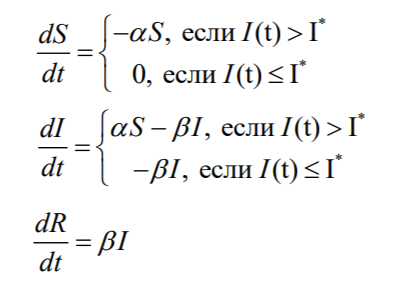
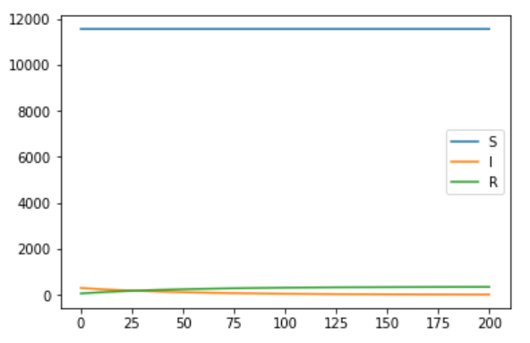
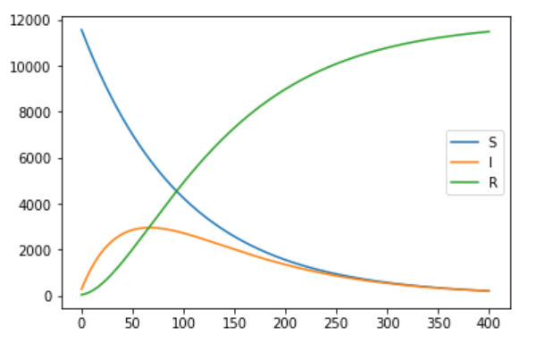
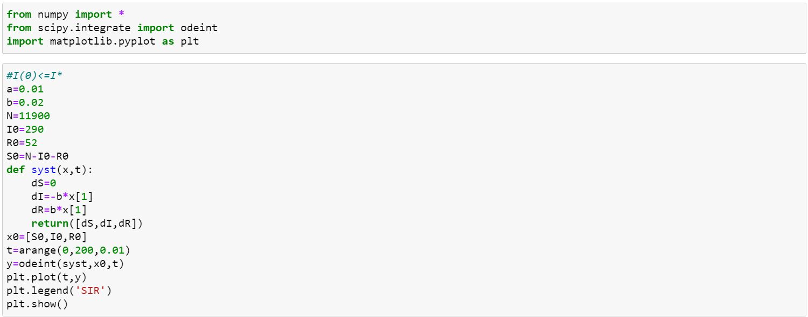
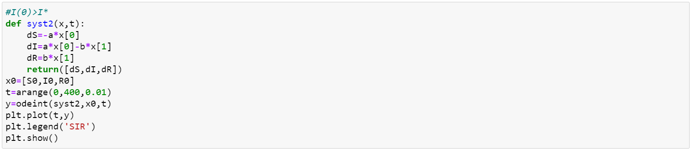


---
# Front matter
lang: "ru"
title: "Лабораторная работа №6"
subtitle: "Задача о пандемии"
author: "Ли Тимофей Александрович"

# Formatting
toc-title: "Содержание"
toc: true # Table of contents
toc_depth: 2
lof: true # List of figures
fontsize: 12pt
linestretch: 1.5
papersize: a4paper
documentclass: scrreprt
mainfont: PT Serif
romanfont: PT Serif
sansfont: PT Sans
monofont: Fira Code
mainfontoptions: Ligatures=TeX
romanfontoptions: Ligatures=TeX
sansfontoptions: Ligatures=TeX,Scale=MatchLowercase
monofontoptions: Scale=MatchLowercase
indent: true
pdf-engine: xelatex
header-includes:
  - \linepenalty=10 # the penalty added to the badness of each line within a paragraph (no associated penalty node) Increasing the value makes tex try to have fewer lines in the paragraph.
  - \interlinepenalty=0 # value of the penalty (node) added after each line of a paragraph.
  - \hyphenpenalty=50 # the penalty for line breaking at an automatically inserted hyphen
  - \exhyphenpenalty=50 # the penalty for line breaking at an explicit hyphen
  - \binoppenalty=700 # the penalty for breaking a line at a binary operator
  - \relpenalty=500 # the penalty for breaking a line at a relation
  - \clubpenalty=150 # extra penalty for breaking after first line of a paragraph
  - \widowpenalty=150 # extra penalty for breaking before last line of a paragraph
  - \displaywidowpenalty=50 # extra penalty for breaking before last line before a display math
  - \brokenpenalty=100 # extra penalty for page breaking after a hyphenated line
  - \predisplaypenalty=10000 # penalty for breaking before a display
  - \postdisplaypenalty=0 # penalty for breaking after a display
  - \floatingpenalty = 20000 # penalty for splitting an insertion (can only be split footnote in standard LaTeX)
  - \raggedbottom # or \flushbottom
  - \usepackage{float} # keep figures where there are in the text
  - \floatplacement{figure}{H} # keep figures where there are in the text
---

# Цель работы

Изучить модель распространения заболевания, построить графики изменения числа особей трех групп (восприимчивые к болезни, инфицированные и обладающие иммунитетом) для случаев I(0)<=I' и I(0)>I'.

# Задание
Вариант 32

На одном острове вспыхнула эпидемия. Известно, что из всех проживающих на острове (N=11 900) в момент начала эпидемии (t=0) число заболевших людей (являющихся распространителями инфекции) I(0)=290, А число здоровых людей с иммунитетом к болезни R(0)=52. Таким образом, число людей восприимчивых к болезни, но пока здоровых, в начальный момент времени S(0)=N-I(0)- R(0).
Постройте графики изменения числа особей в каждой из трех групп.
Рассмотрите, как будет протекать эпидемия в случае:
 1. если I(0)<=I'
 2. если I(0)>I'

# Выполнение лабораторной работы

## Решение задачи:

Рассмотрим простейшую модель эпидемии. Предположим, что некая популяция, состоящая из N особей, (считаем, что популяция изолирована) подразделяется на три группы. Первая группа - это восприимчивые к болезни, но пока здоровые особи, обозначим их через S(t). Вторая группа – это число инфицированных особей, которые также при этом являются распространителями инфекции, обозначим их I(t). А третья группа, обозначающаяся через R(t) – это здоровые особи с иммунитетом к болезни.
До того, как число заболевших не превышает критического значения I' , считаем, что все больные изолированы и не заражают здоровых. Когда I(t)>I', тогда инфицирование способны заражать восприимчивых к болезни особей.
Таким образом, скорость изменения S(t), I(t) и R(t) изменяется по следующему закону (альфа и бета - коэффициенты заболеваемости и выздоровления): (рис. -@fig:001): 

{ #fig:001 width=30% }

График для первого случая (рис. -@fig:002):

{ #fig:002 width=70% }

График для второго случая (рис. -@fig:003):

{ #fig:003 width=70% }

## Построение модели эпидемии

Начальные условия и задание системы для первого случая (рис. -@fig:004):

{ #fig:004 width=70% }

Условия и система для второго случая (рис. -@fig:005):

{ #fig:005 width=70% }

# Выводы

В ходе лабораторной работы я изучил модель модель эпидемии, а также построил необходимые графики.
