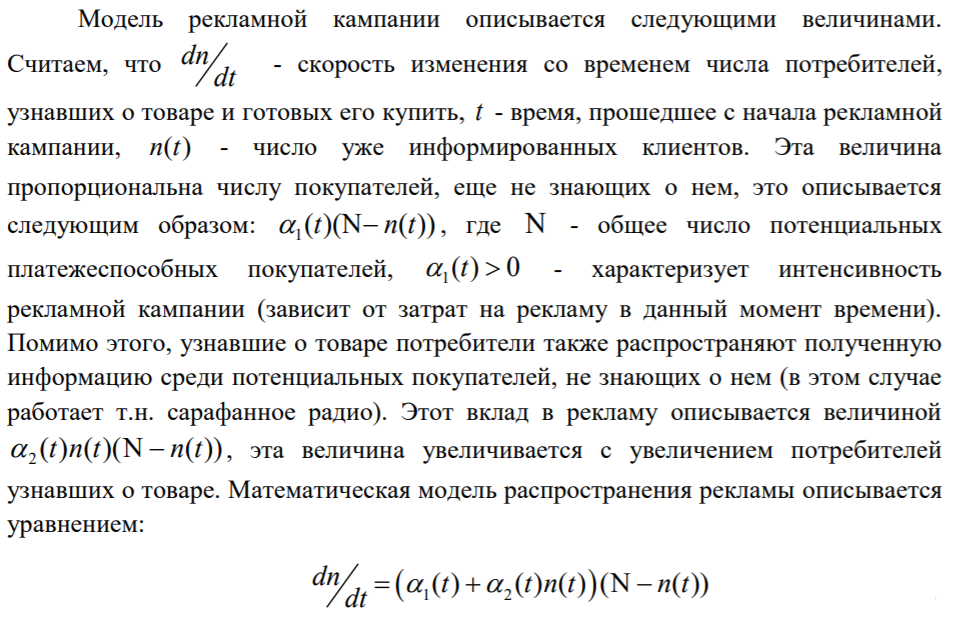
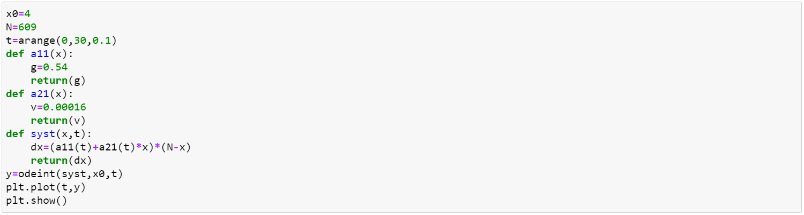
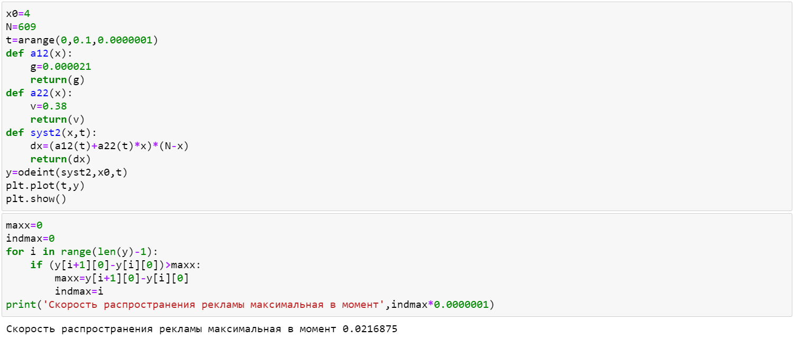
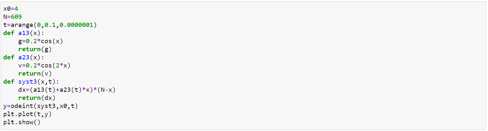
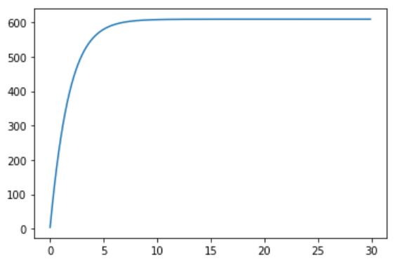
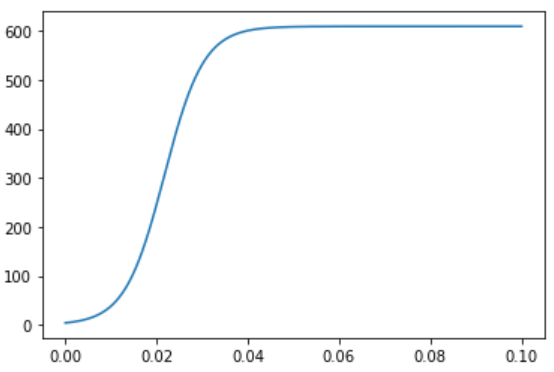
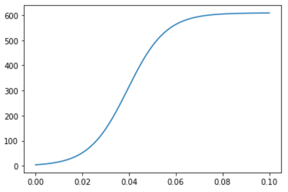

---
## Front matter
lang: "ru"
title: Лабораторная работа № 7
author: Ли Тимофей Александрович, НФИбд-01-18

## Formatting
toc: false
slide_level: 2
theme: metropolis
header-includes: 
 - \metroset{progressbar=frametitle,sectionpage=progressbar,numbering=fraction}
 - '\makeatletter'
 - '\beamer@ignorenonframefalse'
 - '\makeatother'
aspectratio: 43
section-titles: true
---

# Цель работы

## Цель работы

- Изучить модель распространения рекламы, построить графики распространения рекламы для трех случаев, для второго случая также найти момент времени, в который скорость распространения рекламы будет наибольшей.

# Задачи

## Задачи

- изучить теорию о модели распространения рекламы
- реализовать программный код для 32 варианта

# Ход работы

## Описание решения

{ #fig:001 width=80%}

## Программный код для первого случая

{ #fig:002 }

## Программный код для второго случая

{ #fig:003 }

## Программный код для третьего случая

{ #fig:004 }

## График для первого случая

{ #fig:005 }

## График для второго случая

{ #fig:006 }

## График для третьего случая

{ #fig:007 }

# Выводы

  - Изучил модель распространения рекламы
  - Реализовал программный код для поставленной задачи

