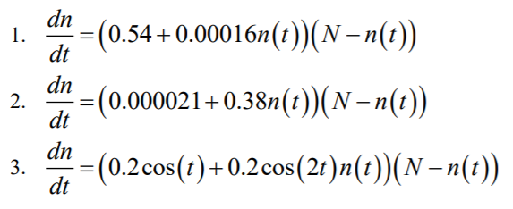
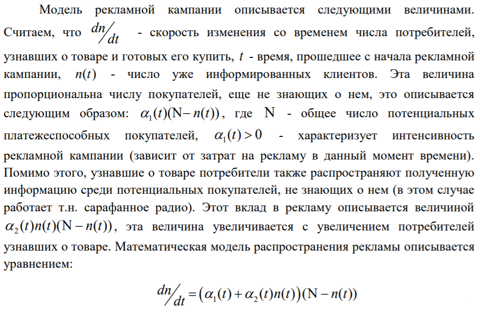
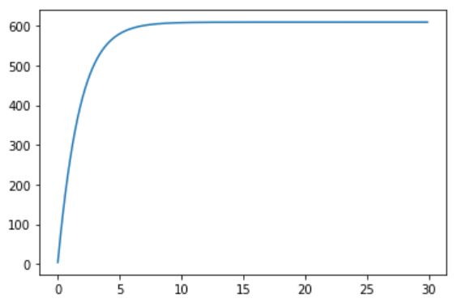
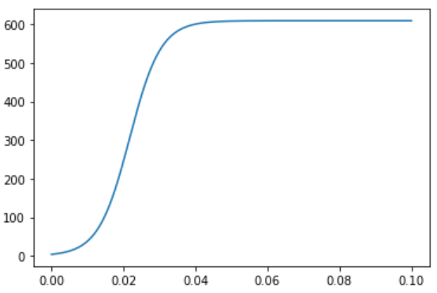
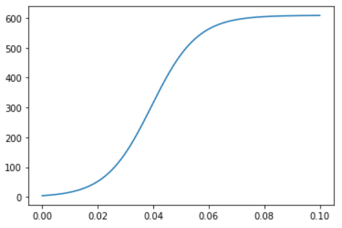
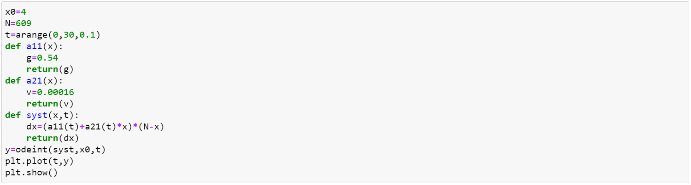
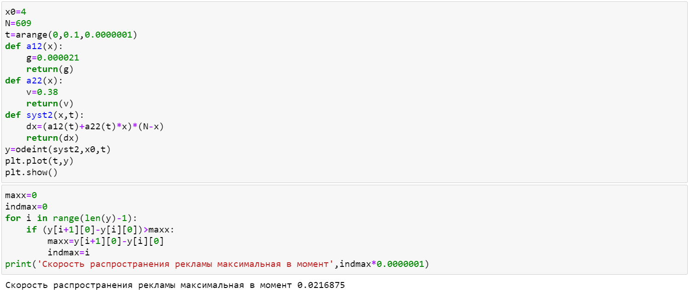
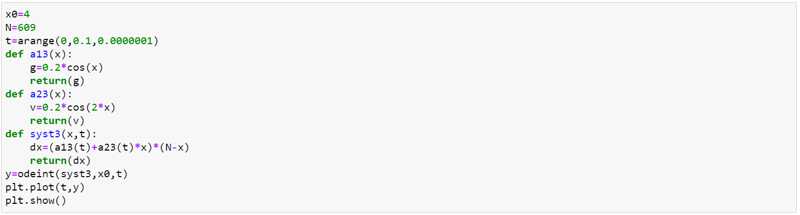


---
# Front matter
lang: "ru"
title: "Лабораторная работа №7"
subtitle: "Эффективность рекламы"
author: "Ли Тимофей Александрович"

# Formatting
toc-title: "Содержание"
toc: true # Table of contents
toc_depth: 2
lof: true # List of figures
fontsize: 12pt
linestretch: 1.5
papersize: a4paper
documentclass: scrreprt
mainfont: PT Serif
romanfont: PT Serif
sansfont: PT Sans
monofont: Fira Code
mainfontoptions: Ligatures=TeX
romanfontoptions: Ligatures=TeX
sansfontoptions: Ligatures=TeX,Scale=MatchLowercase
monofontoptions: Scale=MatchLowercase
indent: true
pdf-engine: xelatex
header-includes:
  - \linepenalty=10 # the penalty added to the badness of each line within a paragraph (no associated penalty node) Increasing the value makes tex try to have fewer lines in the paragraph.
  - \interlinepenalty=0 # value of the penalty (node) added after each line of a paragraph.
  - \hyphenpenalty=50 # the penalty for line breaking at an automatically inserted hyphen
  - \exhyphenpenalty=50 # the penalty for line breaking at an explicit hyphen
  - \binoppenalty=700 # the penalty for breaking a line at a binary operator
  - \relpenalty=500 # the penalty for breaking a line at a relation
  - \clubpenalty=150 # extra penalty for breaking after first line of a paragraph
  - \widowpenalty=150 # extra penalty for breaking before last line of a paragraph
  - \displaywidowpenalty=50 # extra penalty for breaking before last line before a display math
  - \brokenpenalty=100 # extra penalty for page breaking after a hyphenated line
  - \predisplaypenalty=10000 # penalty for breaking before a display
  - \postdisplaypenalty=0 # penalty for breaking after a display
  - \floatingpenalty = 20000 # penalty for splitting an insertion (can only be split footnote in standard LaTeX)
  - \raggedbottom # or \flushbottom
  - \usepackage{float} # keep figures where there are in the text
  - \floatplacement{figure}{H} # keep figures where there are in the text
---

# Цель работы

Изучить модель распространения рекламы, построить графики распространения рекламы для трех случаев, для второго случая также найти момент времени, в который скорость распространения рекламы будет наибольшей.

# Задание
Вариант 32

Постройте график распространения рекламы, математическая модель которой описывается следующим уравнением: (рис. -@fig:001):

{ #fig:001 width=60% }

При этом объем аудитории N=609, в начальный момент о товаре знает 4 человек. Для случая 2 определите в какой момент времени скорость распространения рекламы будет иметь максимальное значение.

# Выполнение лабораторной работы

## Решение задачи:

(рис. -@fig:002):

{ #fig:002 }

График для первого случая (рис. -@fig:003):

{ #fig:003 }

График для второго случая (рис. -@fig:004):

{ #fig:004 }

График для третьего случая (рис. -@fig:005):

{ #fig:005 }

## Построение модели распространения рекламы

Программный код для первого случая (рис. -@fig:006):

{ #fig:006 }

Программный код для второго случая (рис. -@fig:007):

{ #fig:007 }

Программный код для третьего случая (рис. -@fig:008):

{ #fig:008 }

# Выводы

В ходе лабораторной работы я изучил модель модель распространения рекламы, а также построил необходимые графики.
