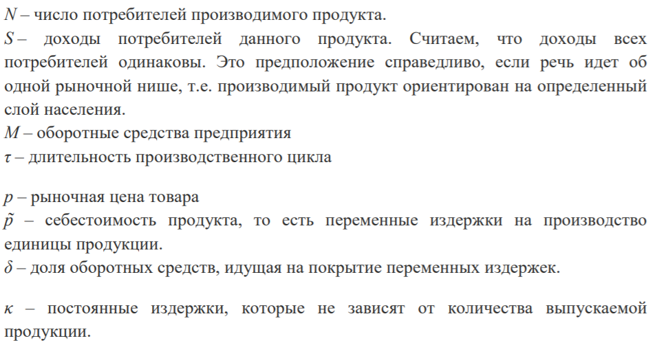
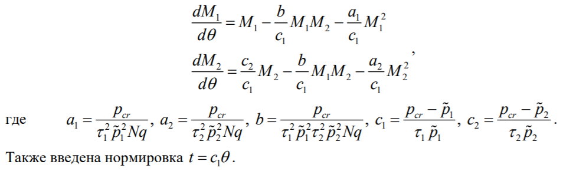
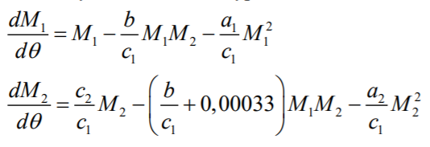
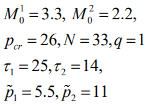
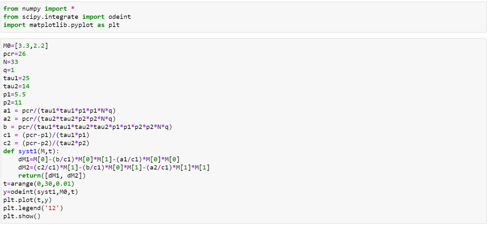
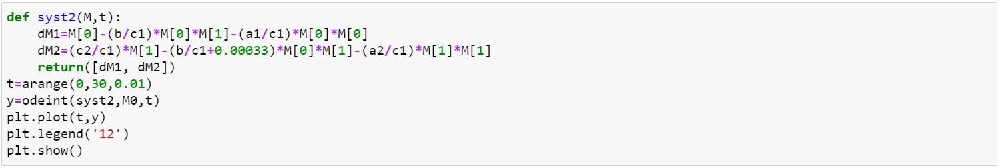
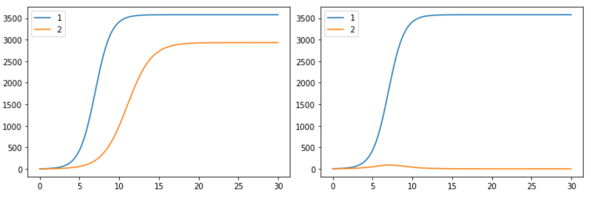

---
## Front matter
lang: "ru"
title: Лабораторная работа № 8
author: Ли Тимофей Александрович, НФИбд-01-18

## Formatting
toc: false
slide_level: 2
theme: metropolis
header-includes: 
 - \metroset{progressbar=frametitle,sectionpage=progressbar,numbering=fraction}
 - '\makeatletter'
 - '\beamer@ignorenonframefalse'
 - '\makeatother'
aspectratio: 43
section-titles: true
---

# Цель работы

## Цель работы

- Изучить модель конкуренции двух фирм, построить графики изменения оборотных средств двух фирм для двух случаев.

# Задачи

## Задачи

- изучить теорию о модели конкуренции двух фирм
- реализовать программный код для 32 варианта

# Ход работы

## Описание решения

Введем обозначения:

{ #fig:001 }

## Описание решения

Случай 1. Рассмотрим две фирмы, производящие взаимозаменяемые товары одинакового качества и находящиеся в одной рыночной нише. Считаем, что в рамках нашей модели конкурентная борьба ведётся только рыночными методами. То есть,  конкуренты могут влиять на противника путем изменения параметров своего производства: себестоимость, время цикла, но не могут прямо вмешиваться в ситуацию на рынке («назначать» цену или влиять на потребителей каким-либо иным способом.) Будем считать, что постоянные издержки пренебрежимо малы, и в модели учитывать не будем. В этом случае динамика изменения объемов продаж фирмы 1 и фирмы 2 описывается следующей системой уравнений: (рис. -@fig:002):

## Описание решения

{ #fig:002 }

## Описание решения

Случай 2. Рассмотрим модель, когда, помимо экономического фактора влияния (изменение себестоимости, производственного цикла, использование кредита и т.п.), используются еще и социально-психологические факторы – формирование общественного предпочтения одного товара другому, не зависимо от их качества и цены. В этом случае взаимодействие двух фирм будет зависеть друг от друга, соответственно коэффициент перед M1xM2 будет отличаться. Пусть в рамках рассматриваемой модели динамика изменения объемов продаж фирмы 1 и фирмы 2 описывается следующей системой уравнений: (рис. -@fig:003):

## Описание решения

{ #fig:003 }

## Описание решения

Для обоих случаев рассмотрим задачу со следующими начальными условиями и параметрами: (рис. -@fig:004):

{ #fig:004 }

## Программный код для первого случая

{ #fig:005 }

## Программный код для второго случая

{ #fig:006 }

## Результаты

{ #fig:007 }

# Выводы

  - Изучил модель конкуренции двух фирм
  - Реализовал программный код для поставленной задачи

