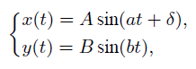
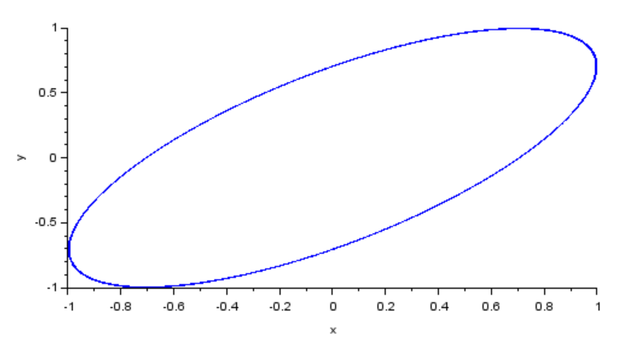
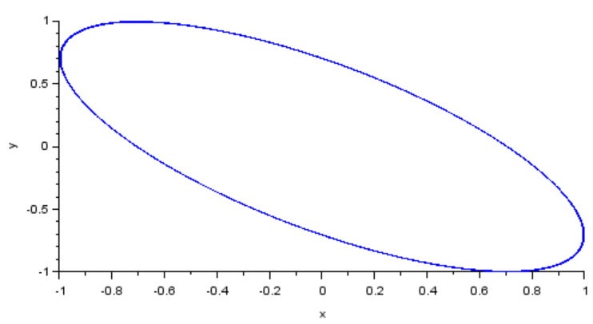
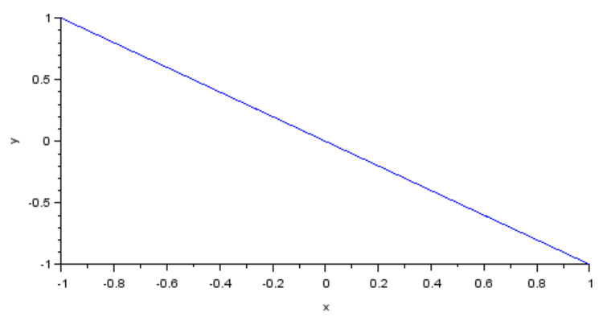
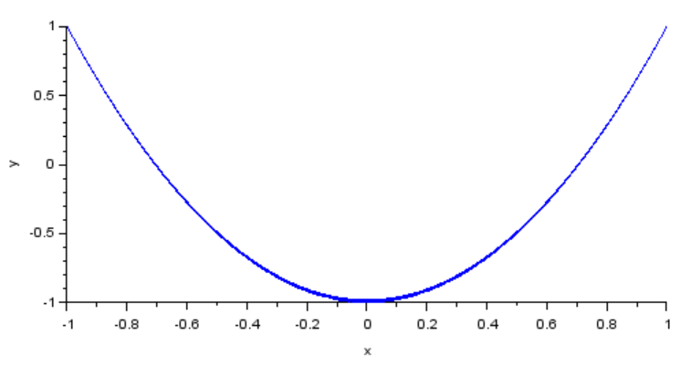
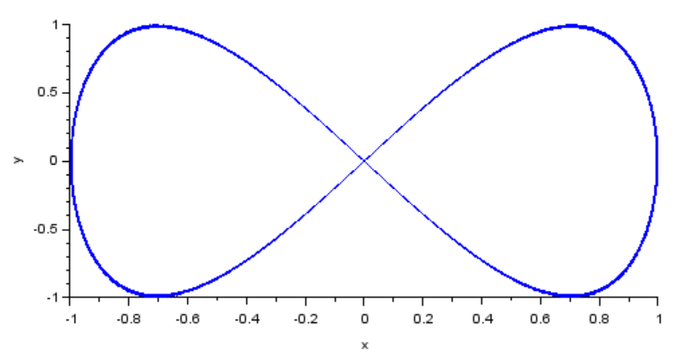
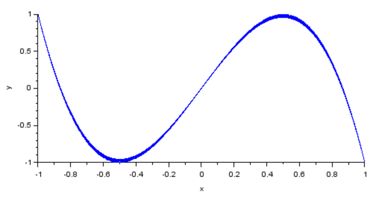
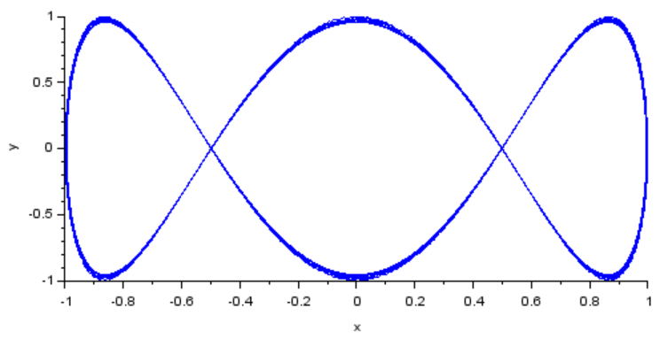
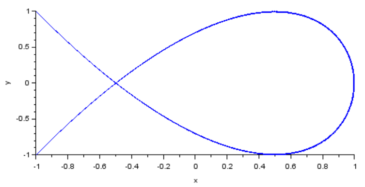
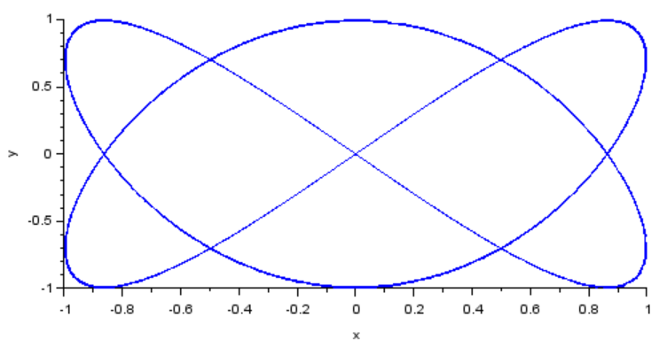

---
## Front matter
lang: "ru"
title: Упражнение
author: Ли Тимофей Александрович, НФИбд-01-18

## Formatting
toc: false
slide_level: 2
theme: metropolis
header-includes: 
 - \metroset{progressbar=frametitle,sectionpage=progressbar,numbering=fraction}
 - '\makeatletter'
 - '\beamer@ignorenonframefalse'
 - '\makeatother'
aspectratio: 43
section-titles: true
---

# Цель работы

Ознакомиться с xcos, построить кривую Лиссажу для разных значений амплитуды, частоты и фазы. 

# Выполнение лабораторной работы

## Модель

Модель кривой Лиссажу имеет следующий вид: (рис. -@fig:001):

{ #fig:001 }

Здесь A,B -- амплитуды колебаний, a,b -- частоты, а дельта - сдвиг фаз.

## Ход работы

Сначала реализовал модель в xcos. Полученная модель: (рис. -@fig:002)

{ #fig:002 width=80%}

## Пункт 1

Для амплитуд A=b+1 и частот a=b=2 построил графики со значениями дельта 0, pi/4, pi/2, 3pi/4, pi.

Первый график: (рис. -@fig:003)

{ #fig:003 }

## Пункт 1

Второй график: (рис. -@fig:004)

{ #fig:004 }

## Пункт 1

Третий график: (рис. -@fig:005)

{ #fig:005 }

## Пункт 1

Четвертый график: (рис. -@fig:006)

{ #fig:006 }

## Пункт 1

Пятый график: (рис. -@fig:007)

{ #fig:007 }

## Пункт 2

Для амплитуд A=B=1 и частот a=2, b=4 построил графики со значениями дельта 0, pi/4, pi/2, 3pi/4, pi.

Первый график: (рис. -@fig:008)

{ #fig:008 }

## Пункт 2

Второй график: (рис. -@fig:009)

{ #fig:009 }

## Пункт 2

Третий график: (рис. -@fig:010)

{ #fig:010 }

## Пункт 2

Четвертый график: (рис. -@fig:011)

{ #fig:011 }

## Пункт 2

Пятый график: (рис. -@fig:012)

{ #fig:012 }

## Пункт 3

Для амплитуд A=B=1 и частот a=2, b=6 построил графики со значениями дельта 0, pi/4, pi/2, 3pi/4, pi.

Первый график: (рис. -@fig:013)

{ #fig:013 }

## Пункт 3

Второй график: (рис. -@fig:014)

{ #fig:014 }

## Пункт 3

Третий график: (рис. -@fig:015)

{ #fig:015 }

## Пункт 3

Четвертый график: (рис. -@fig:016)

{ #fig:016 }

## Пункт 3

Пятый график: (рис. -@fig:017)

{ #fig:017 }

## Пункт 4

Для амплитуд A=B=1 и частот a=2, b=3 построил графики со значениями дельта 0, pi/4, pi/2, 3pi/4, pi.

Первый график: (рис. -@fig:018)

{ #fig:018 }

## Пункт 4

Второй график: (рис. -@fig:009)

{ #fig:019 }

## Пункт 4

Третий график: (рис. -@fig:020)

{ #fig:020 }

## Пункт 4

Четвертый график: (рис. -@fig:021)

{ #fig:021 }

## Пункт 4

Пятый график: (рис. -@fig:022)

{ #fig:022 }

# Выводы

Ознакомился с xcos и выполнил задание.