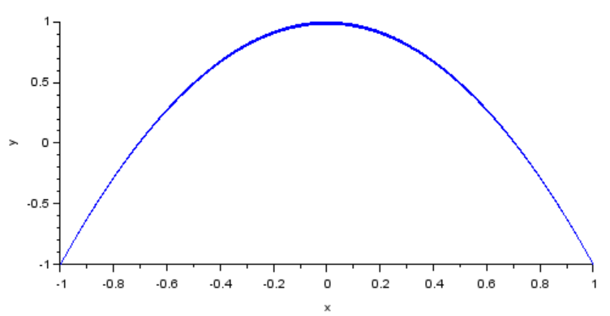

---
# Front matter
lang: "ru"
title: "Упражнение"
subtitle: "Кривая Лиссажу"
author: "Ли Тимофей Александрович"

# Formatting
toc-title: "Содержание"
toc: true # Table of contents
toc_depth: 2
lof: true # List of figures
fontsize: 12pt
linestretch: 1.5
papersize: a4paper
documentclass: scrreprt
mainfont: PT Serif
romanfont: PT Serif
sansfont: PT Sans
monofont: Fira Code
mainfontoptions: Ligatures=TeX
romanfontoptions: Ligatures=TeX
sansfontoptions: Ligatures=TeX,Scale=MatchLowercase
monofontoptions: Scale=MatchLowercase
indent: true
pdf-engine: xelatex
header-includes:
  - \linepenalty=10 # the penalty added to the badness of each line within a paragraph (no associated penalty node) Increasing the value makes tex try to have fewer lines in the paragraph.
  - \interlinepenalty=0 # value of the penalty (node) added after each line of a paragraph.
  - \hyphenpenalty=50 # the penalty for line breaking at an automatically inserted hyphen
  - \exhyphenpenalty=50 # the penalty for line breaking at an explicit hyphen
  - \binoppenalty=700 # the penalty for breaking a line at a binary operator
  - \relpenalty=500 # the penalty for breaking a line at a relation
  - \clubpenalty=150 # extra penalty for breaking after first line of a paragraph
  - \widowpenalty=150 # extra penalty for breaking before last line of a paragraph
  - \displaywidowpenalty=50 # extra penalty for breaking before last line before a display math
  - \brokenpenalty=100 # extra penalty for page breaking after a hyphenated line
  - \predisplaypenalty=10000 # penalty for breaking before a display
  - \postdisplaypenalty=0 # penalty for breaking after a display
  - \floatingpenalty = 20000 # penalty for splitting an insertion (can only be split footnote in standard LaTeX)
  - \raggedbottom # or \flushbottom
  - \usepackage{float} # keep figures where there are in the text
  - \floatplacement{figure}{H} # keep figures where there are in the text
---

# Цель работы

Ознакомиться с xcos, построить кривую Лиссажу для разных значений амплитуды, частоты и фазы. 

# Выполнение лабораторной работы

## Модель

Модель кривой Лиссажу имеет следующий вид: (рис. -@fig:001):

{ #fig:001 }

Здесь A,B -- амплитуды колебаний, a,b -- частоты, а дельта - сдвиг фаз.

## Ход работы

Сначала реализовал модель в xcos. Полученная модель: (рис. -@fig:002)

{ #fig:002 }

## Пункт 1

Для амплитуд A=b+1 и частот a=b=2 построил графики со значениями дельта 0, pi/4, pi/2, 3pi/4, pi.

Первый график: (рис. -@fig:003)

{ #fig:003 }

Второй график: (рис. -@fig:004)

{ #fig:004 }

Третий график: (рис. -@fig:005)

{ #fig:005 }

Четвертый график: (рис. -@fig:006)

{ #fig:006 }

Пятый график: (рис. -@fig:007)

{ #fig:007 }

## Пункт 2

Для амплитуд A=B=1 и частот a=2, b=4 построил графики со значениями дельта 0, pi/4, pi/2, 3pi/4, pi.

Первый график: (рис. -@fig:008)

{ #fig:008 }

Второй график: (рис. -@fig:009)

{ #fig:009 }

Третий график: (рис. -@fig:010)

{ #fig:010 }

Четвертый график: (рис. -@fig:011)

{ #fig:011 }

Пятый график: (рис. -@fig:012)

{ #fig:012 }

## Пункт 3

Для амплитуд A=B=1 и частот a=2, b=6 построил графики со значениями дельта 0, pi/4, pi/2, 3pi/4, pi.

Первый график: (рис. -@fig:013)

{ #fig:013 }

Второй график: (рис. -@fig:014)

{ #fig:014 }

Третий график: (рис. -@fig:015)

{ #fig:015 }

Четвертый график: (рис. -@fig:016)

{ #fig:016 }

Пятый график: (рис. -@fig:017)

{ #fig:017 }

## Пункт 4

Для амплитуд A=B=1 и частот a=2, b=3 построил графики со значениями дельта 0, pi/4, pi/2, 3pi/4, pi.

Первый график: (рис. -@fig:018)

{ #fig:018 }

Второй график: (рис. -@fig:009)

{ #fig:019 }

Третий график: (рис. -@fig:020)

{ #fig:020 }

Четвертый график: (рис. -@fig:021)

{ #fig:021 }

Пятый график: (рис. -@fig:022)

{ #fig:022 }

# Выводы

Ознакомился с xcos и выполнил задание.