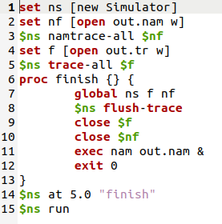
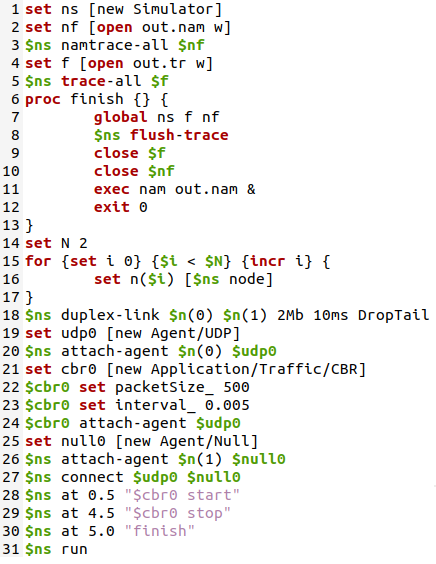
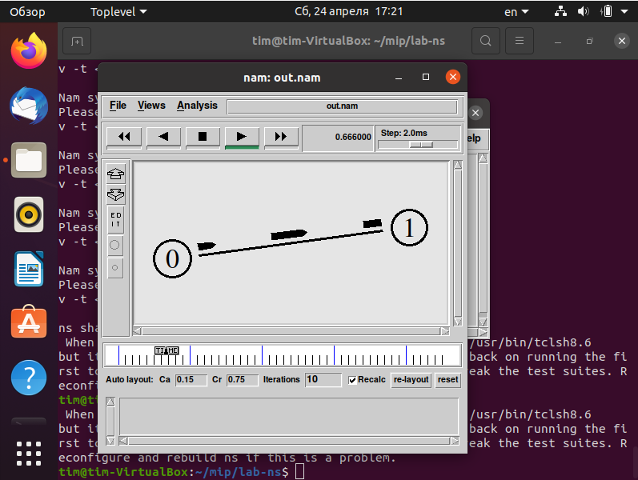
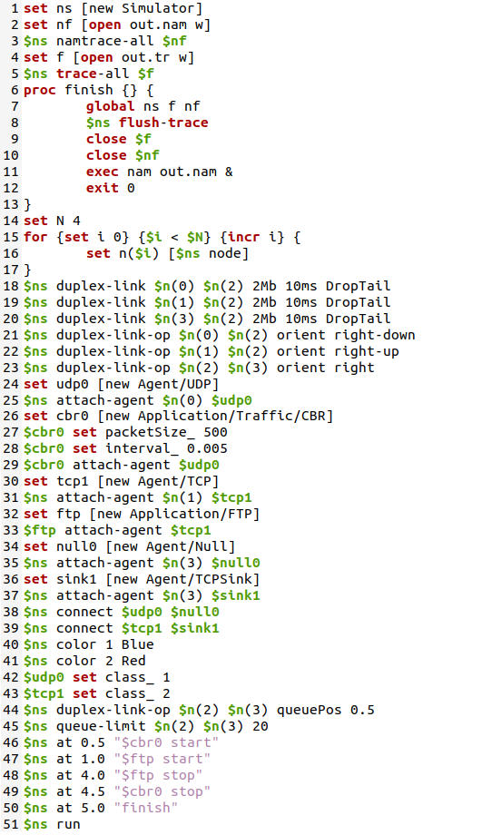
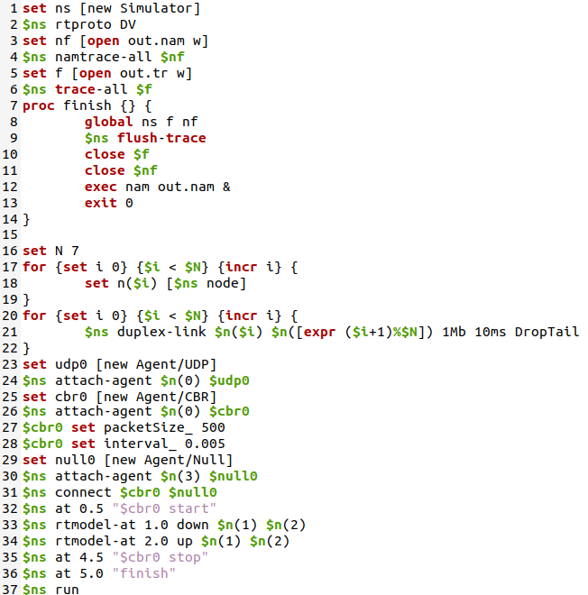
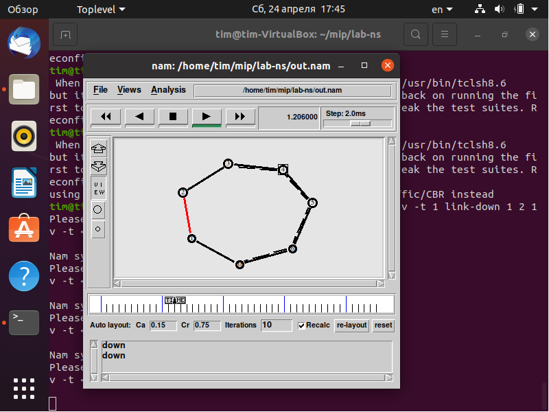
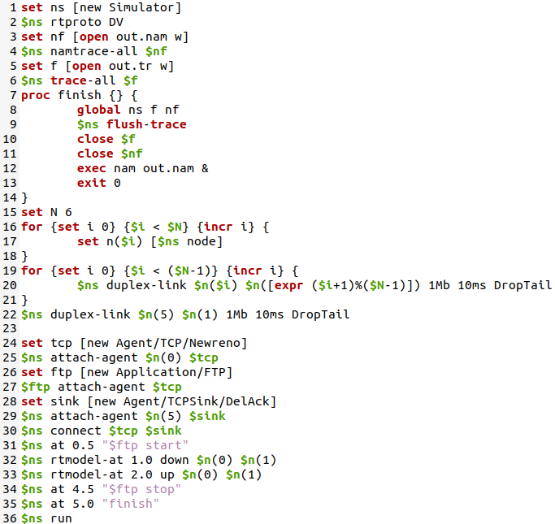
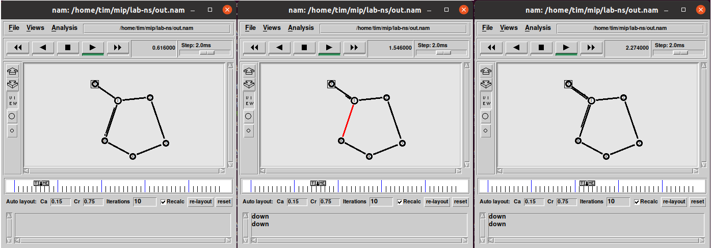

---
## Front matter
lang: "ru"
title: Лабораторная работа № 8
author: Ли Тимофей Александрович, НФИбд-01-18

## Formatting
toc: false
slide_level: 2
theme: metropolis
header-includes: 
 - \metroset{progressbar=frametitle,sectionpage=progressbar,numbering=fraction}
 - '\makeatletter'
 - '\beamer@ignorenonframefalse'
 - '\makeatother'
aspectratio: 43
section-titles: true
---

# Цель работы

## Цель работы

 - Приобретение навыков моделирования сетей передачи данных с помощью средства имитационного моделирования NS-2, а также анализ полученных результатов моделирования.

# Задачи

## Задачи

 - Сделать примеры заданий по NS-2
 - Выполнить задание

# Ход работы

## 1.1	Шаблон сценария для NS-2

Установил виртуальную машину с ОС Ubuntu, на нее установил Nam и Ns2. Затем, в рабочем каталоге создал папку mip для лабораторных работ, а в ней папку lab-ns. Создал файл shablon.tclи написал в нем следующий код (рис. -@fig:001):

{ #fig:001 }

## 1.2 Простой пример описания топологии сети, состоящей из двух узлов и одного соединения

Задача: требуется смоделировать сеть передачи данных, состоящую
из двух узлов, соединённых дуплексной линией связи с полосой пропускания 2
Мб/с и задержкой 10 мс, очередью с обслуживанием типа DropTail. От одного узла
к другому по протоколу UDP осуществляется передача пакетов, размером 500 байт,
с постоянной скоростью 200 пакетов в секунду.

Для решения задачи скопировал содержимое shablon.tcl в example1.tcl и написал следующий код: (рис. -@fig:002)

## 1.2 Простой пример описания топологии сети, состоящей из двух узлов и одного соединения

{ #fig:002 }

## 1.2 Простой пример описания топологии сети, состоящей из двух узлов и одного соединения

Получилась следующая модель: (рис. -@fig:003)

{ #fig:003 }

## 1.3 Пример с усложненной топологией сети

Задача: требуется построить модель по следующим критериям:

 - сеть состоит из 4 узлов (n0, n1, n2, n3);
 - между узлами n0 и n2, n1 и n2 установлено дуплексное соединение с пропускной способностью 2 Мбит/с и задержкой 10 мс;
 - между узлами n2 и n3 установлено дуплексное соединение с пропускной способностью 1,7 Мбит/с и задержкой 20 мс;
 - каждый узел использует очередь с дисциплиной DropTail для накопления пакетов, максимальный размер которой составляет 10;
 - TCP-источник на узле n0 подключается к TCP-приёмнику на узле n3 (по-умолчанию, максимальный размер пакета, который TCP-агент может генерировать, равняется 1KByte)
 - TCP-приёмник генерирует и отправляет ACK пакеты отправителю и откидывает полученные пакеты;

## 1.3 Пример с усложненной топологией сети

 - UDP-агент, который подсоединён к узлу n1, подключён к null-агенту на узле n3 (null-агент просто откидывает пакеты);
 - генераторы трафика ftp и cbr прикреплены к TCP и UDP агентам соответственно;
 - генератор cbr генерирует пакеты размером 1 Кбайт со скоростью 1 Мбит/с;
 - работа cbr начинается в 0,1 секунду и прекращается в 4,5 секунды, а ftp начинает работать в 1,0 секунду и прекращает в 4,0 секунды.

Для решения задачи скопировал содержимое shablon.tcl в example2.tcl и написал следующий код: (рис. -@fig:004)

## 1.3 Пример с усложненной топологией сети

{ #fig:004 }

## 1.3 Пример с усложненной топологией сети

Результат: (рис. -@fig:005)

{ #fig:005 }

## 1.4 Пример с кольцевой топологией сети

Задача: требуется построить модель передачи данных по сети с кольцевой топологией и динамической маршрутизацией пакетов:

 - сеть состоит из 7 узлов, соединённых в кольцо;
 - данные передаются от узла n(0) к узлу n(3) по кратчайшему пути;
 - с 1 по 2 секунду модельного времени происходит разрыв соединения между узлами n(1) и n(2);
 - при разрыве соединения маршрут передачи данных должен измениться на резервный.

Для решения задачи скопировал содержимое shablon.tcl в example3.tcl и написал следующий код: (рис. -@fig:006)

## 1.4 Пример с кольцевой топологией сети

{ #fig:006 }

## 1.4 Пример с кольцевой топологией сети

Результат: (рис. -@fig:007)

{ #fig:007 }

## Упражнение

Задача: внести следующие изменения в реализацию примера с кольцевой топологией сети:

 - топология сети должна соответствовать представленному образцу
 - передача данных должна осуществляться от узла n(0) до узла n(5) по кратчайшему пути в течение 5 секунд модельного времени;
 - передача данных должна идти по протоколу TCP (тип Newreno), на принимающей стороне используется TCPSink-объект типа DelAck; поверх TCP работает протокол FTP с 0,5 до 4,5 секунд модельного времени;
 - с 1 по 2 секунду модельного времени происходит разрыв соединения между узлами n(0) и n(1);
 - при разрыве соединения маршрут передачи данных должен измениться на резервный, после восстановления соединения пакеты снова должны пойти по кратчайшему пути.
 
Для решения задачи скопировал содержимое example3.tcl в lab1.tcl и написал следующий код: (рис. -@fig:009)

## Упражнение

{ #fig:008 }

## Упражнение

Результат: (рис. -@fig:009)

{ #fig:009 }

# Выводы

 - Приобрел навыки моделирования сетей передачи данных с помощью средства имитационного моделирования NS-2
 - Проанализировал полученные результаты моделирования.

