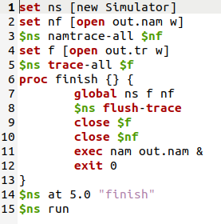
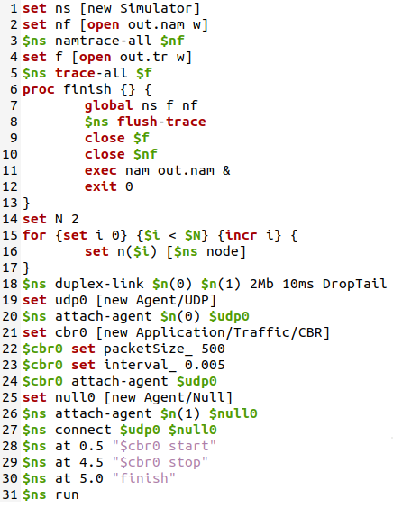
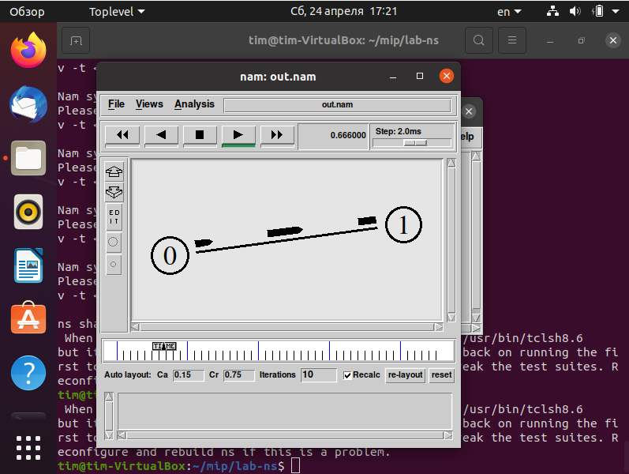
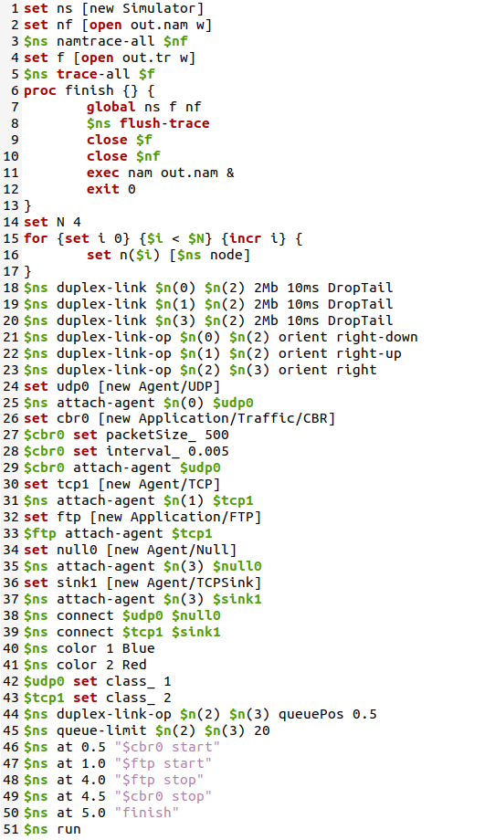
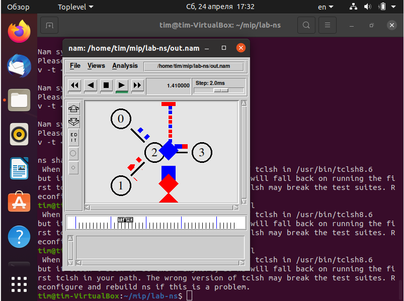
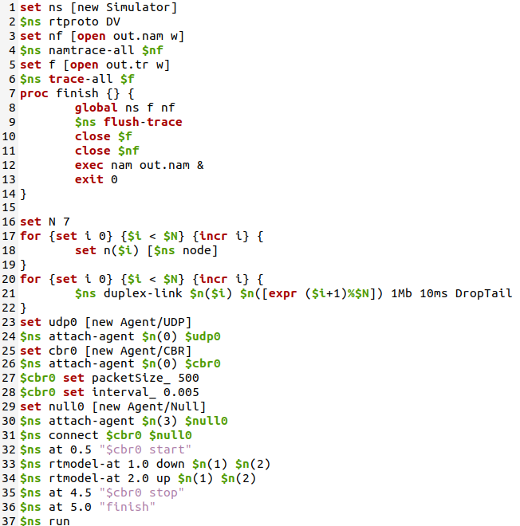
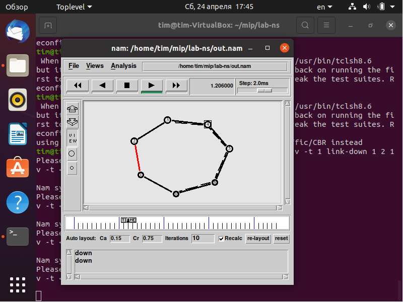
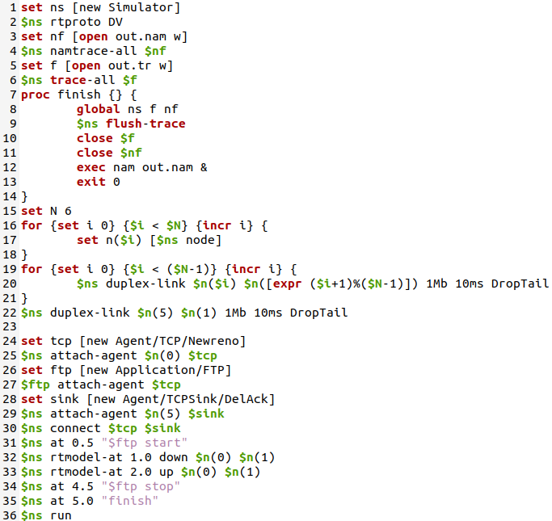
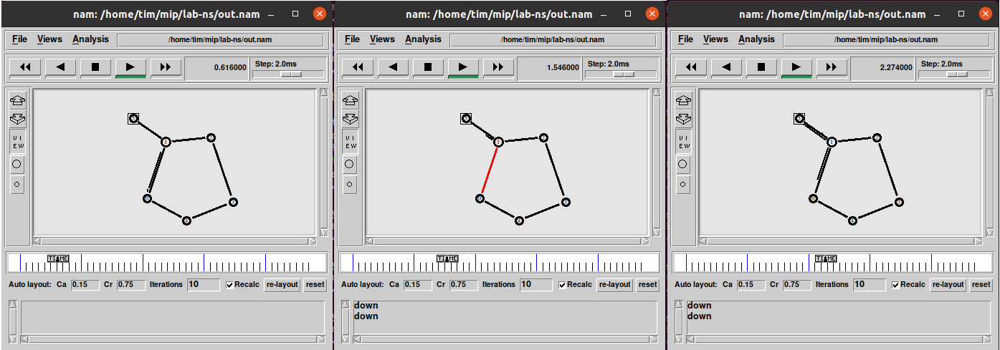

---
# Front matter
lang: "ru"
title: "Лабораторная работа №1"
subtitle: "Простые модели компьютерной сети"
author: "Ли Тимофей Александрович"

# Formatting
toc-title: "Содержание"
toc: true # Table of contents
toc_depth: 2
lof: true # List of figures
fontsize: 12pt
linestretch: 1.5
papersize: a4paper
documentclass: scrreprt
mainfont: PT Serif
romanfont: PT Serif
sansfont: PT Sans
monofont: Fira Code
mainfontoptions: Ligatures=TeX
romanfontoptions: Ligatures=TeX
sansfontoptions: Ligatures=TeX,Scale=MatchLowercase
monofontoptions: Scale=MatchLowercase
indent: true
pdf-engine: xelatex
header-includes:
  - \linepenalty=10 # the penalty added to the badness of each line within a paragraph (no associated penalty node) Increasing the value makes tex try to have fewer lines in the paragraph.
  - \interlinepenalty=0 # value of the penalty (node) added after each line of a paragraph.
  - \hyphenpenalty=50 # the penalty for line breaking at an automatically inserted hyphen
  - \exhyphenpenalty=50 # the penalty for line breaking at an explicit hyphen
  - \binoppenalty=700 # the penalty for breaking a line at a binary operator
  - \relpenalty=500 # the penalty for breaking a line at a relation
  - \clubpenalty=150 # extra penalty for breaking after first line of a paragraph
  - \widowpenalty=150 # extra penalty for breaking before last line of a paragraph
  - \displaywidowpenalty=50 # extra penalty for breaking before last line before a display math
  - \brokenpenalty=100 # extra penalty for page breaking after a hyphenated line
  - \predisplaypenalty=10000 # penalty for breaking before a display
  - \postdisplaypenalty=0 # penalty for breaking after a display
  - \floatingpenalty = 20000 # penalty for splitting an insertion (can only be split footnote in standard LaTeX)
  - \raggedbottom # or \flushbottom
  - \usepackage{float} # keep figures where there are in the text
  - \floatplacement{figure}{H} # keep figures where there are in the text
---

# Цель работы

Приобретение навыков моделирования сетей передачи данных с помощью средства имитационного моделирования NS-2, а также анализ полученных результатов моделирования.

# Задание

Сделать примеры заданий по NS-2, а также выполнить задание. 

# Выполнение лабораторной работы

## 1.1	Шаблон сценария для NS-2

Установил виртуальную машину с ОС Ubuntu, на нее установил Nam и Ns2. Затем, в рабочем каталоге создал папку mip для лабораторных работ, а в ней папку lab-ns. Создал файл shablon.tclи написал в нем следующий код (рис. -@fig:001):

{ #fig:001 }

## 1.2 Простой пример описания топологии сети, состоящей из двух узлов и одного соединения

Задача: требуется смоделировать сеть передачи данных, состоящую
из двух узлов, соединённых дуплексной линией связи с полосой пропускания 2
Мб/с и задержкой 10 мс, очередью с обслуживанием типа DropTail. От одного узла
к другому по протоколу UDP осуществляется передача пакетов, размером 500 байт,
с постоянной скоростью 200 пакетов в секунду.

Для решения задачи скопировал содержимое shablon.tcl в example1.tcl и написал следующий код: (рис. -@fig:002)

{ #fig:002 }

Получилась следующая модель: (рис. -@fig:003)

{ #fig:003 }

## 1.3 Пример с усложненной топологией сети

Задача: требуется построить модель по следующим критериям:

 - сеть состоит из 4 узлов (n0, n1, n2, n3);
 - между узлами n0 и n2, n1 и n2 установлено дуплексное соединение с пропускной способностью 2 Мбит/с и задержкой 10 мс;
 - между узлами n2 и n3 установлено дуплексное соединение с пропускной способностью 1,7 Мбит/с и задержкой 20 мс;
 - каждый узел использует очередь с дисциплиной DropTail для накопления пакетов, максимальный размер которой составляет 10;
 - TCP-источник на узле n0 подключается к TCP-приёмнику на узле n3 (по-умолчанию, максимальный размер пакета, который TCP-агент может генерировать, равняется 1KByte)
 - TCP-приёмник генерирует и отправляет ACK пакеты отправителю и откидывает полученные пакеты;
 - UDP-агент, который подсоединён к узлу n1, подключён к null-агенту на узле n3 (null-агент просто откидывает пакеты);
 - генераторы трафика ftp и cbr прикреплены к TCP и UDP агентам соответственно;
 - генератор cbr генерирует пакеты размером 1 Кбайт со скоростью 1 Мбит/с;
 - работа cbr начинается в 0,1 секунду и прекращается в 4,5 секунды, а ftp начинает работать в 1,0 секунду и прекращает в 4,0 секунды.

Для решения задачи скопировал содержимое shablon.tcl в example2.tcl и написал следующий код: (рис. -@fig:004)

{ #fig:004 }

Результат: (рис. -@fig:005)

{ #fig:005 }

## 1.4 Пример с кольцевой топологией сети

Задача: требуется построить модель передачи данных по сети с кольцевой топологией и динамической маршрутизацией пакетов:

 - сеть состоит из 7 узлов, соединённых в кольцо;
 - данные передаются от узла n(0) к узлу n(3) по кратчайшему пути;
 - с 1 по 2 секунду модельного времени происходит разрыв соединения между узлами n(1) и n(2);
 - при разрыве соединения маршрут передачи данных должен измениться на резервный.

Для решения задачи скопировал содержимое shablon.tcl в example3.tcl и написал следующий код: (рис. -@fig:006)

{ #fig:006 }

Результат: (рис. -@fig:007)

{ #fig:007 }

## Упражнение

Задача: внести следующие изменения в реализацию примера с кольцевой топологией сети:

 - топология сети должна соответствовать представленному образцу
 - передача данных должна осуществляться от узла n(0) до узла n(5) по кратчайшему пути в течение 5 секунд модельного времени;
 - передача данных должна идти по протоколу TCP (тип Newreno), на принимающей стороне используется TCPSink-объект типа DelAck; поверх TCP работает протокол FTP с 0,5 до 4,5 секунд модельного времени;
 - с 1 по 2 секунду модельного времени происходит разрыв соединения между узлами n(0) и n(1);
 - при разрыве соединения маршрут передачи данных должен измениться на резервный, после восстановления соединения пакеты снова должны пойти по кратчайшему пути.
 
Для решения задачи скопировал содержимое example3.tcl в lab1.tcl и написал следующий код: (рис. -@fig:009)

{ #fig:008 }

Результат: (рис. -@fig:009)

{ #fig:009 }

# Выводы

Приобрел навыки моделирования сетей передачи данных с помощью средства имитационного моделирования NS-2, а также проанализировал полученные результаты моделирования.