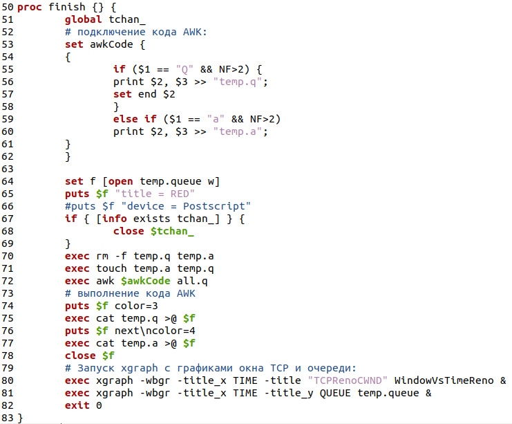
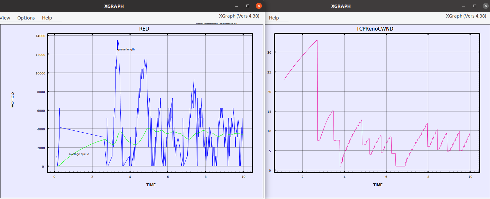
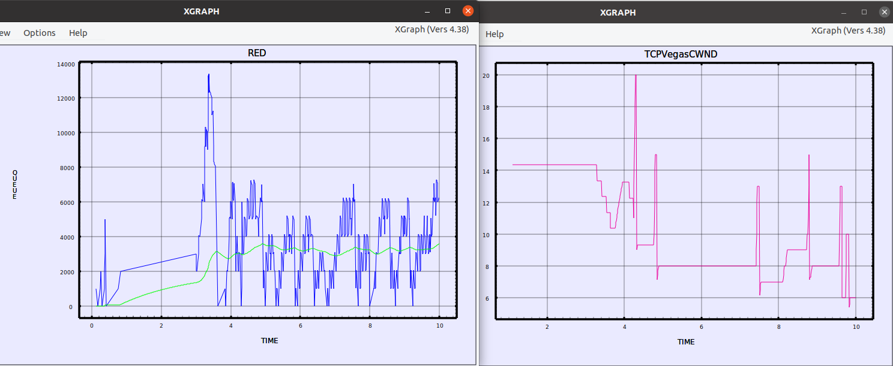

---
## Front matter
lang: "ru"
title: Лабораторная работа № 2
author: Ли Тимофей Александрович, НФИбд-01-18

## Formatting
toc: false
slide_level: 2
theme: metropolis
header-includes: 
 - \metroset{progressbar=frametitle,sectionpage=progressbar,numbering=fraction}
 - '\makeatletter'
 - '\beamer@ignorenonframefalse'
 - '\makeatother'
aspectratio: 43
section-titles: true
---

# Цель работы

## Цель работы

Исследовать протокол TCP и алгоритм управления очередью RED с помощью средства имитационного моделирования NS-2, а также с использованием приложения для построения графиков XGRAPH.

# Ход работы

## 2.2	Пример с дисциплиной RED

Описание моделируемой сети:

 - сеть состоит из 6 узлов;
 - между всеми узлами установлено дуплексное соединение с различными пропускной способностью и задержкой 10 мс (см. рис. 2.4);
 - узел r1 использует очередь с дисциплиной RED для накопления пакетов, максимальный размер которой составляет 25;
 - TCP-источники на узлах s1 и s2 подключаются к TCP-приёмнику на узле s3;
 - генераторы трафика FTP прикреплены к TCP-агентам.
 
 Требуется разработать сценарий, реализующий модель, построить в Xgraph график изменения TCP-окна, график изменения длины очереди и средней длины очереди.

## 2.2	Пример с дисциплиной RED

Для решения задачи создал файл example01.tcl и написал следующий код: (рис. -@fig:001):

{ #fig:001 }

## 2.2	Пример с дисциплиной RED

Далее, внес изменения в код, чтобы он правильно работал в моей версии Xgraph (рис. -@fig:002)

{ #fig:002 }

## 2.2	Пример с дисциплиной RED

Получились такие графики размера окна TCP и размера и очереди соответственно: (рис. -@fig:003)

{ #fig:003 }

## Упражнение

- Измените в модели на узле s1 тип протокола TCP с Reno на NewReno, затем на Vegas. Сравните и поясните результаты.
- Внесите изменения при отображении окон с графиками (измените цвет фона, цвет траекторий, подписи к осям, подпись траектории в легенде).

Для начала я решил сделать вторую часть упражнения, чтобы упростить восприятие графиков. Для этого я внес следующие изменения в процедуру finish: (рис. -@fig:004)

## Упражнение

{ #fig:004 }

## Упражнение

Теперь в 74 и 76 строках я задаю цвет линий, обозначающих моментальный и средний размер очереди соответственно.
В 80 и 81 строках теги -wbgr означают цвет фона (по идее, белый, но по факту у меня отображается как сиреневый), теги -title_x, -title_y и -title обозначают подписи осей x и y и всего графика соответственно.
Я не нашел, как добавить легенду к графику в моей версии xgraph, поэтому подписи к траекториям добавил вручную на графики с помощью меню edit:Attach Text-note to Data.

## Упражнение

Результат: (рис. -@fig:005)

{ #fig:005 }

## Упражнение

Для выполнения первого пункта упражнения заменил в 19 строке кода TCP/Reno на TCP/Newreno, а затем на TCP/Vegas. Получились следующие графики для TCP/Newreno: (рис. -@fig:006)

{ #fig:006 }

## Упражнение

и для TCP/Vegas: (рис. -@fig:007)

{ #fig:007 }

## Упражнение

График размера окна TCP для Reno обусловлен алгоритмом Reno, суть которого заключается в том, что при пропадании пакета по тайм-ауту размер окна уменьшается на единицу, а при получении сообщения о недоставке пакета значение окна уменьшается в два раза.
Изменение графиков в случае использования типа NewReno обусловлено тем, что эта модель использует алгоритм Fast Retransmit и Fast Recovery (быстрая повторная пересылка и быстрое восстановление).
TCP/Vegas контролирует размер окна путем мониторирования отправителем времени доставки для пакетов, посланных ранее. Если обнаруживается увеличение этого времени, система узнает, что сеть приближается к перегрузке и сокращает ширину окна.
Если же время уменьшается, то отправитель определит, что сеть преодолела перегрузку, и увеличит размер окна. Так, размер окна будет стремиться к требуемому значению.

# Выводы

 - Исследовал протокол TCP и алгоритм управления очередью RED с помощью NS-2 и Xgraph.