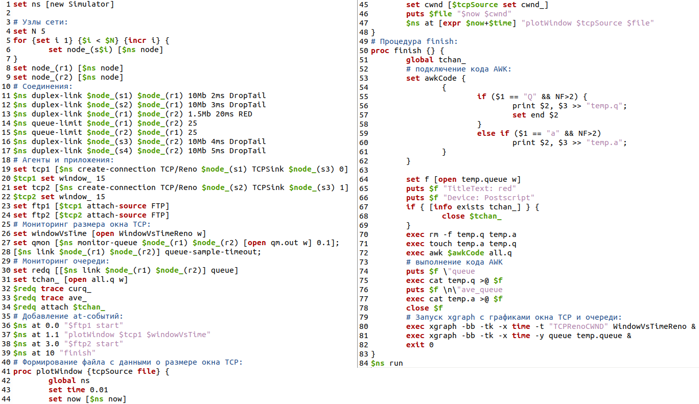
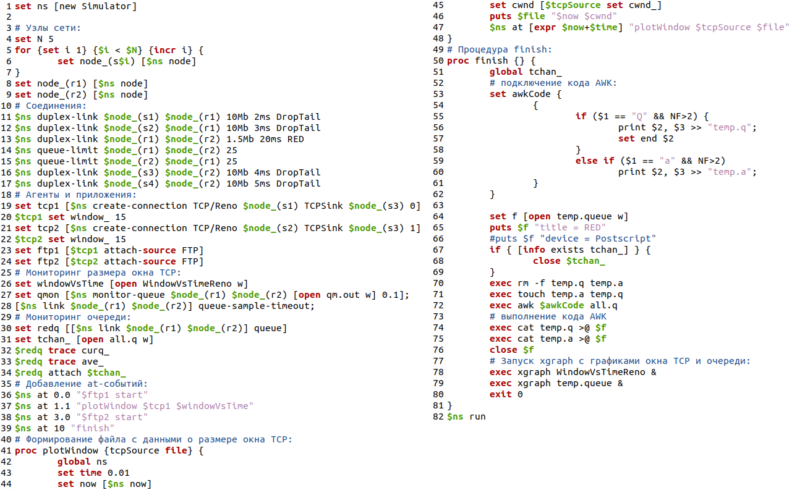
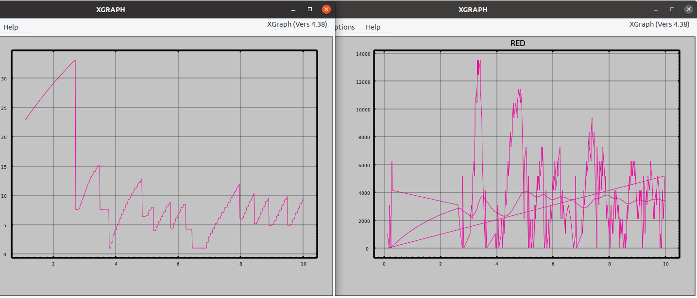
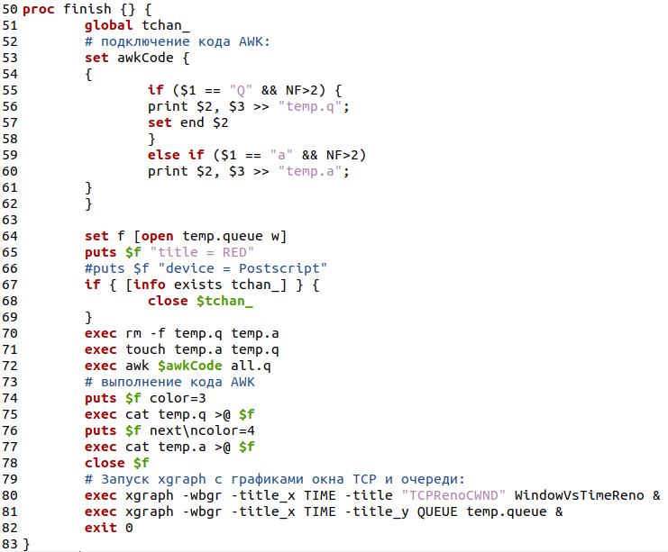
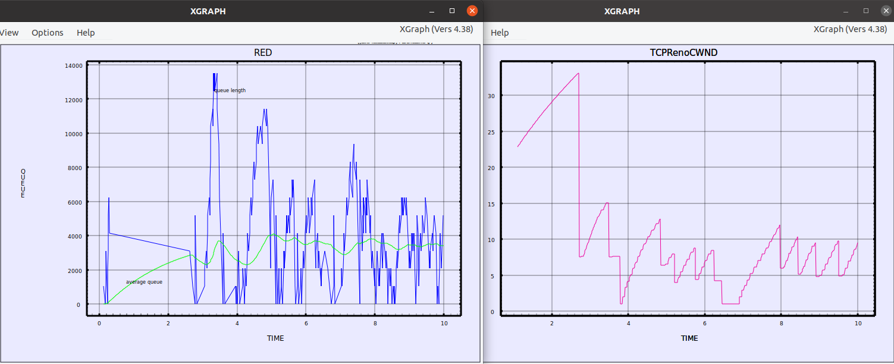
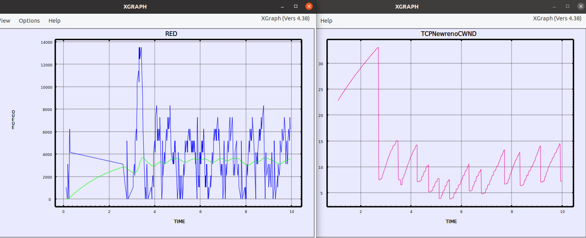
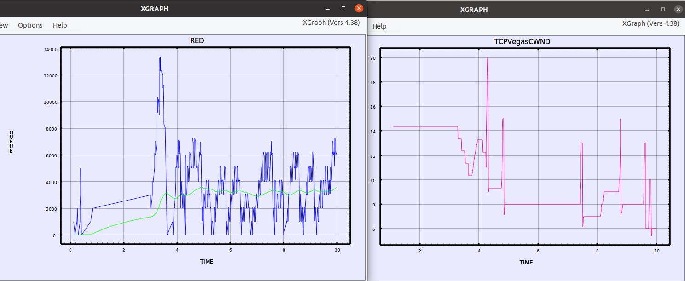


---
# Front matter
lang: "ru"
title: "Лабораторная работа №2"
subtitle: "Исследование протокола TCP и алгоритма управления очередью RED"
author: "Ли Тимофей Александрович"

# Formatting
toc-title: "Содержание"
toc: true # Table of contents
toc_depth: 2
lof: true # List of figures
fontsize: 12pt
linestretch: 1.5
papersize: a4paper
documentclass: scrreprt
mainfont: PT Serif
romanfont: PT Serif
sansfont: PT Sans
monofont: Fira Code
mainfontoptions: Ligatures=TeX
romanfontoptions: Ligatures=TeX
sansfontoptions: Ligatures=TeX,Scale=MatchLowercase
monofontoptions: Scale=MatchLowercase
indent: true
pdf-engine: xelatex
header-includes:
  - \linepenalty=10 # the penalty added to the badness of each line within a paragraph (no associated penalty node) Increasing the value makes tex try to have fewer lines in the paragraph.
  - \interlinepenalty=0 # value of the penalty (node) added after each line of a paragraph.
  - \hyphenpenalty=50 # the penalty for line breaking at an automatically inserted hyphen
  - \exhyphenpenalty=50 # the penalty for line breaking at an explicit hyphen
  - \binoppenalty=700 # the penalty for breaking a line at a binary operator
  - \relpenalty=500 # the penalty for breaking a line at a relation
  - \clubpenalty=150 # extra penalty for breaking after first line of a paragraph
  - \widowpenalty=150 # extra penalty for breaking before last line of a paragraph
  - \displaywidowpenalty=50 # extra penalty for breaking before last line before a display math
  - \brokenpenalty=100 # extra penalty for page breaking after a hyphenated line
  - \predisplaypenalty=10000 # penalty for breaking before a display
  - \postdisplaypenalty=0 # penalty for breaking after a display
  - \floatingpenalty = 20000 # penalty for splitting an insertion (can only be split footnote in standard LaTeX)
  - \raggedbottom # or \flushbottom
  - \usepackage{float} # keep figures where there are in the text
  - \floatplacement{figure}{H} # keep figures where there are in the text
---

# Цель работы

Исследовать протокол TCP и алгоритм управления очередью RED с помощью средства имитационного моделирования NS-2, а также с использованием приложения для построения графиков XGRAPH.

# Выполнение лабораторной работы

## 2.2	Пример с дисциплиной RED

Описание моделируемой сети:

 - сеть состоит из 6 узлов;
 - между всеми узлами установлено дуплексное соединение с различными пропускной способностью и задержкой 10 мс (см. рис. 2.4);
 - узел r1 использует очередь с дисциплиной RED для накопления пакетов, максимальный размер которой составляет 25;
 - TCP-источники на узлах s1 и s2 подключаются к TCP-приёмнику на узле s3;
 - генераторы трафика FTP прикреплены к TCP-агентам.
 
 Требуется разработать сценарий, реализующий модель, построить в Xgraph график изменения TCP-окна, график изменения длины очереди и средней длины очереди.

Для решения задачи создал файл example01.tcl и написал следующий код: (рис. -@fig:001):

{ #fig:001 }

Далее, внес изменения в код, чтобы он правильно работал в моей версии Xgraph (рис. -@fig:002)

{ #fig:002 }

Получились такие графики размера окна TCP и размера и очереди соответственно: (рис. -@fig:003)

{ #fig:003 }

## Упражнение

- Измените в модели на узле s1 тип протокола TCP с Reno на NewReno, затем на Vegas. Сравните и поясните результаты.
- Внесите изменения при отображении окон с графиками (измените цвет фона, цвет траекторий, подписи к осям, подпись траектории в легенде).

Для начала я решил сделать вторую часть упражнения, чтобы упростить восприятие графиков. Для этого я внес следующие изменения в процедуру finish: (рис. -@fig:004)

{ #fig:004 }

Теперь в 74 и 76 строках я задаю цвет линий, обозначающих моментальный и средний размер очереди соответственно.
В 80 и 81 строках теги -wbgr означают цвет фона (по идее, белый, но по факту у меня отображается как сиреневый), теги -title_x, -title_y и -title обозначают подписи осей x и y и всего графика соответственно.
Я не нашел, как добавить легенду к графику в моей версии xgraph, поэтому подписи к траекториям добавил вручную на графики с помощью меню edit:Attach Text-note to Data.
Результат: (рис. -@fig:005)

{ #fig:005 }

Для выполнения первого пункта упражнения заменил в 19 строке кода TCP/Reno на TCP/Newreno, а затем на TCP/Vegas. Получились следующие графики для TCP/Newreno: (рис. -@fig:006)

{ #fig:006 }

и для TCP/Vegas: (рис. -@fig:007)

{ #fig:007 }

График размера окна TCP для Reno обусловлен алгоритмом Reno, суть которого заключается в том, что при пропадании пакета по тайм-ауту размер окна уменьшается на единицу, а при получении сообщения о недоставке пакета значение окна уменьшается в два раза.
Изменение графиков в случае использования типа NewReno обусловлено тем, что эта модель использует алгоритм Fast Retransmit и Fast Recovery (быстрая повторная пересылка и быстрое восстановление).
TCP/Vegas контролирует размер окна путем мониторирования отправителем времени доставки для пакетов, посланных ранее. Если обнаруживается увеличение этого времени, система узнает, что сеть приближается к перегрузке и сокращает ширину окна.
Если же время уменьшается, то отправитель определит, что сеть преодолела перегрузку, и увеличит размер окна. Так, размер окна будет стремиться к требуемому значению.

# Выводы

Исследовал протокол TCP и алгоритм управления очередью RED с помощью NS-2 и Xgraph.