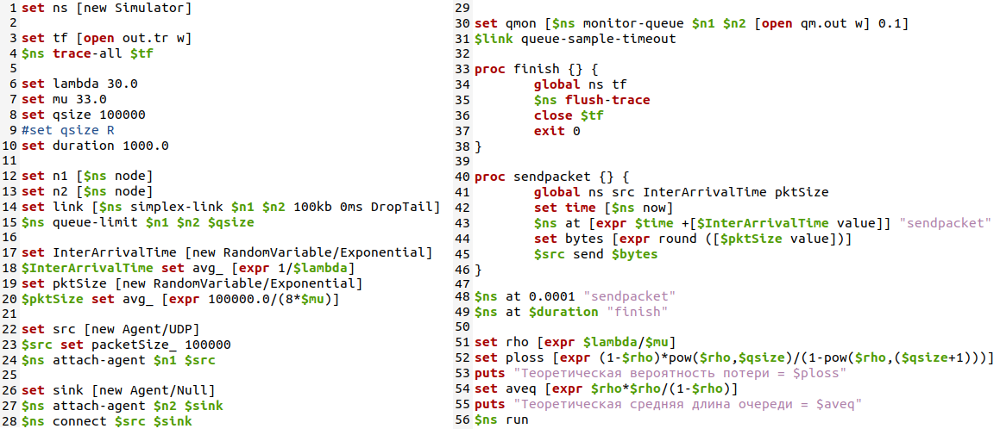
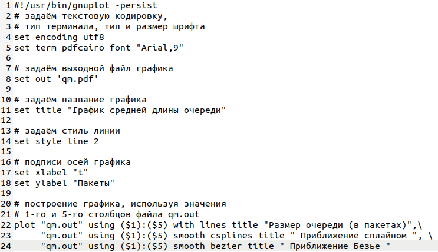

---
## Front matter
lang: "ru"
title: Лабораторная работа № 3
author: Ли Тимофей Александрович, НФИбд-01-18

## Formatting
toc: false
slide_level: 2
theme: metropolis
header-includes: 
 - \metroset{progressbar=frametitle,sectionpage=progressbar,numbering=fraction}
 - '\makeatletter'
 - '\beamer@ignorenonframefalse'
 - '\makeatother'
aspectratio: 43
section-titles: true
---

# Цель работы

## Цель работы

Исследовать стохастические процессы с помощью средства имитационного моделирования NS-2, а также с использованием приложения для построения графиков GNUplot.

# Ход работы

## Пример реализации модели на NS-2

Создал файл example.tcl и написал следующий код: (рис. -@fig:001):

{ #fig:001 }

## Пример реализации модели на NS-2

Далее создал файл graph_plot с помощью команды touch graph_plot. Открыл его на редактирование и добавил следующий код  (рис. -@fig:002)

{ #fig:002 }

## Пример реализации модели на NS-2

Далее сделал graph_plot исполняемым (команда chmod), далее провел компиляцию example.rcl и выполнил graph.plot с помощью gnuplot: (рис. -@fig:003)

## Пример реализации модели на NS-2

{ #fig:003 width=80%}

## Пример реализации модели на NS-2

В результате был создан файл qm.pdf, содержащий результаты моделирования в виде графика средней длины очереди: (рис. -@fig:004)

{ #fig:004 }

# Выводы

Исследовал стохастические процессы с помощью NS-2 и GNUplot.