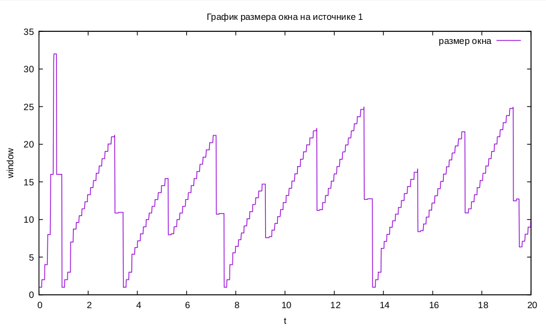

---
## Front matter
lang: "ru"
title: Лабораторная работа № 4
author: Ли Тимофей Александрович, НФИбд-01-18

## Formatting
toc: false
slide_level: 2
theme: metropolis
header-includes: 
 - \metroset{progressbar=frametitle,sectionpage=progressbar,numbering=fraction}
 - '\makeatletter'
 - '\beamer@ignorenonframefalse'
 - '\makeatother'
aspectratio: 43
section-titles: true
---

# Цель работы

## Цель работы

Выполнить задание, закрепить навыки владения NS-2, Nam, Xgraph, GNUplot.

# Ход работы

## Выполнение задания

Описание моделируемой сети:

 - сеть состоит из N TCP-источников, N TCP-приёмников, двух маршрутизаторов R1 и R2 между источниками и приёмниками (N — не менее 20);
 - между TCP-источниками и первым маршрутизатором установлены дуплексные соединения с пропускной способностью 100 Мбит/с и задержкой 20 мс очередью типа DropTail;
 - между TCP-приёмниками и вторым маршрутизатором установлены дуплексные соединения с пропускной способностью 100 Мбит/с и задержкой 20 мс очередью типа DropTail;
 - между маршрутизаторами установлено симплексное соединение (R1–R2) с пропускной способностью 20 Мбит/с и задержкой 15 мс очередью типа RED, размером буфера 300 пакетов; в обратную сторону — симплексное соединение (R2–R1) с пропускной способностью 15 Мбит/с и задержкой 20 мс очередь типа DropTail;

## Выполнение задания

 - данные передаются по протоколу FTP поверх TCPReno;
 - параметры алгоритма RED: qmin = 75, qmax = 150, qw = 0; 002, pmax = 0:1;
 - максимальный размер TCP-окна 32; размер передаваемого пакета 500 байт; время моделирования — не менее 20 единиц модельного времени.

## Выполнение задания

Задание:

1. Для приведённой схемы разработать имитационную модель в пакете NS-2.
2. Построить график изменения размера окна TCP (в Xgraph и в GNUPlot);
3. Построить график изменения длины очереди и средней длины очереди на первом маршрутизаторе.
4. Оформить отчёт о выполненной работе.

Для решения задачи создал файл lab4.tcl и написал следующий код: (рис. -@fig:001):

## Выполнение задания

{ #fig:001 }

## Выполнение задания

При выполнении этого кода открылся Nam с нужной нам моделью, а также Xgraph с необходимыми графиками. Модель в Nam: (рис. -@fig:002)

{ #fig:002 }

## Выполнение задания

График размера очереди (и среднего): (рис. -@fig:003)

{ #fig:003 }

## Выполнение задания

Графики размера окна TCP: (рис. -@fig:004)

{ #fig:004 }

## Выполнение задания

Затем создал файл graph_plot и написал в него следующий код: (рис. -@fig:005)

{ #fig:005 }

## Выполнение задания

Сделал этот файл исполняемым с помощью команды chmod, выполнил его командой gnuplot ./graph_plot и получил следующие графики:

график длины и средней длины очереди: (рис. -@fig:006)

{ #fig:006 }

## Выполнение задания

график размера окна на первом источнике: (рис. -@fig:007)

{ #fig:007 }

## Выполнение задания

график размера окна на всех источниках: (рис. -@fig:008)

{ #fig:008 }

# Выводы

Выполнил задание, закрепил навыки владения NS-2, Nam, Xgraph, GNUplot.