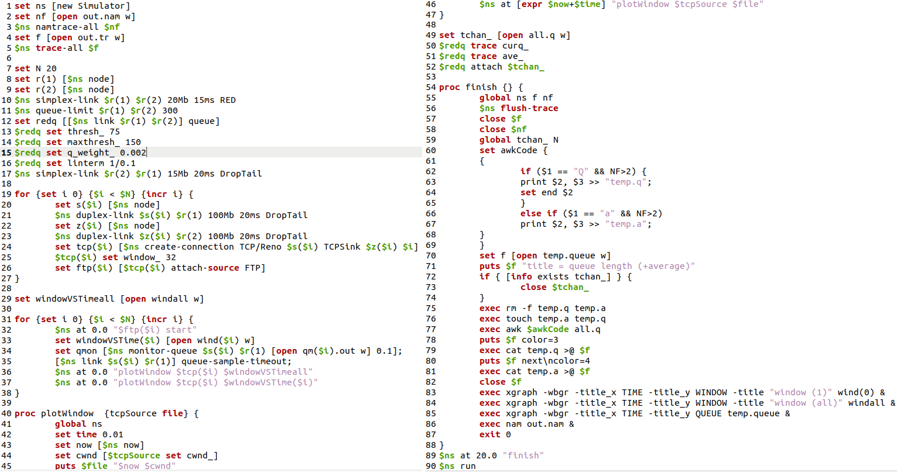
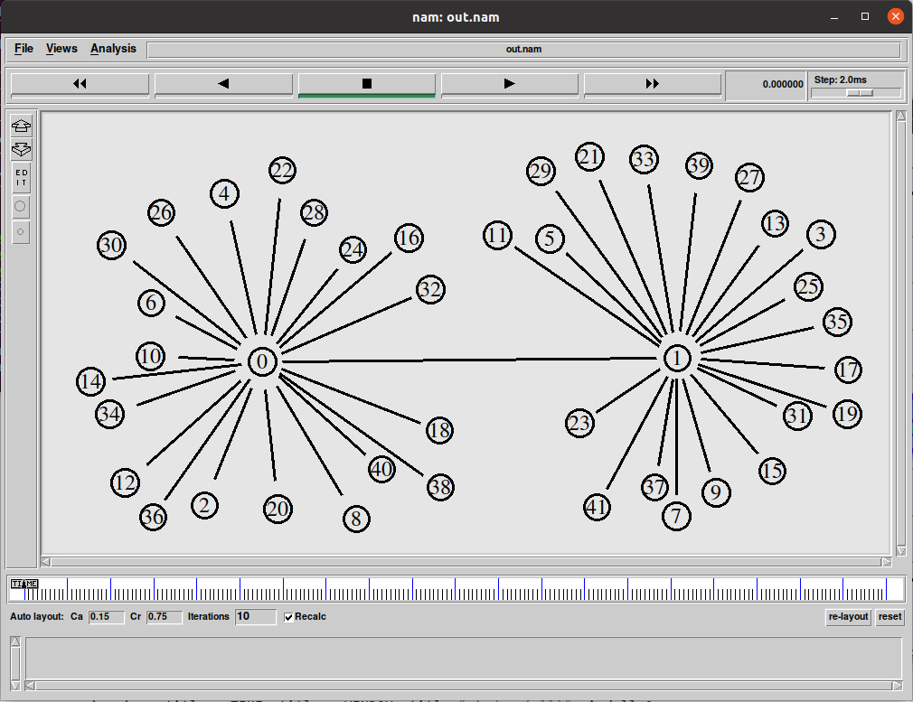
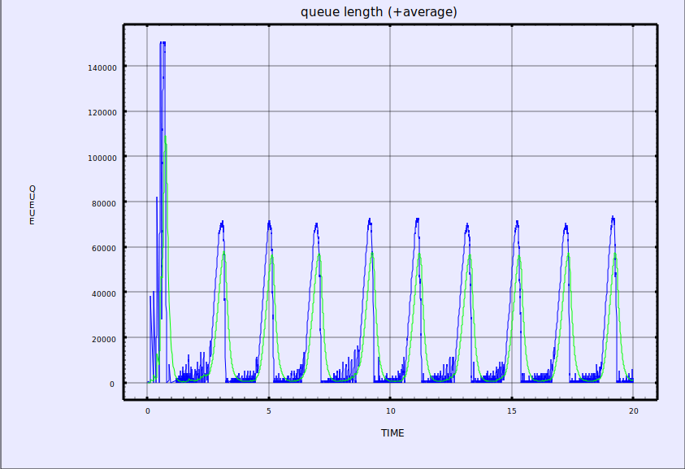
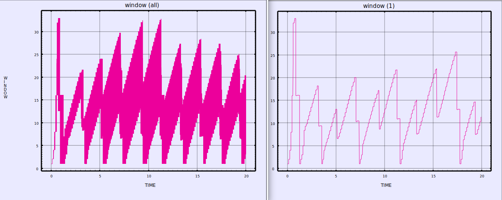
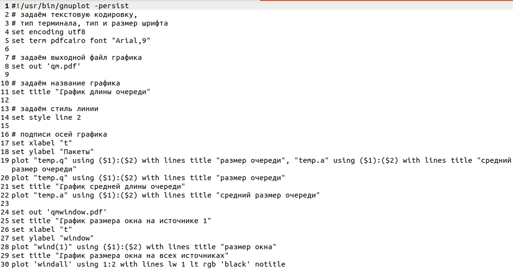
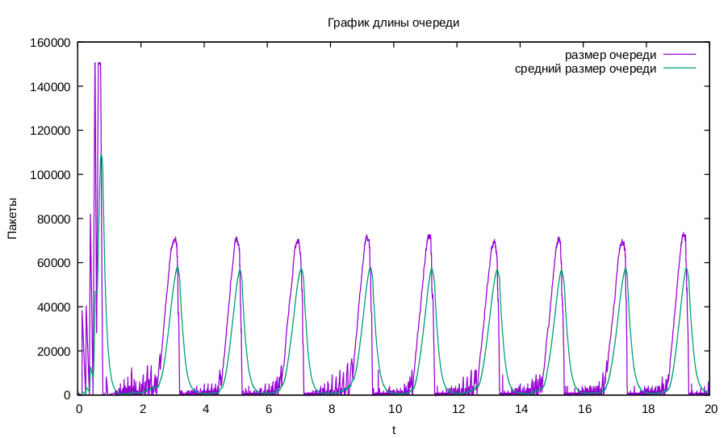
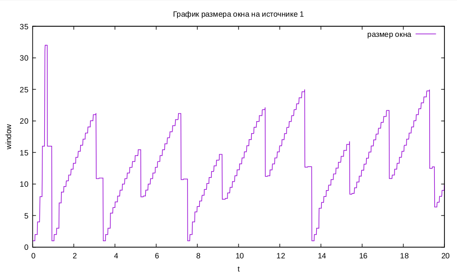
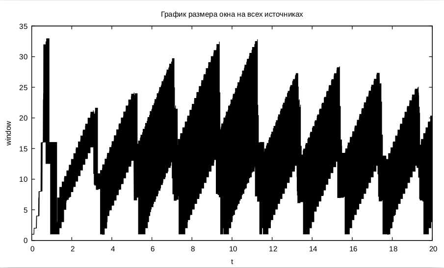


---
# Front matter
lang: "ru"
title: "Лабораторная работа №4"
subtitle: "Задание для самостоятельного выполнения"
author: "Ли Тимофей Александрович"

# Formatting
toc-title: "Содержание"
toc: true # Table of contents
toc_depth: 2
lof: true # List of figures
fontsize: 12pt
linestretch: 1.5
papersize: a4paper
documentclass: scrreprt
mainfont: PT Serif
romanfont: PT Serif
sansfont: PT Sans
monofont: Fira Code
mainfontoptions: Ligatures=TeX
romanfontoptions: Ligatures=TeX
sansfontoptions: Ligatures=TeX,Scale=MatchLowercase
monofontoptions: Scale=MatchLowercase
indent: true
pdf-engine: xelatex
header-includes:
  - \linepenalty=10 # the penalty added to the badness of each line within a paragraph (no associated penalty node) Increasing the value makes tex try to have fewer lines in the paragraph.
  - \interlinepenalty=0 # value of the penalty (node) added after each line of a paragraph.
  - \hyphenpenalty=50 # the penalty for line breaking at an automatically inserted hyphen
  - \exhyphenpenalty=50 # the penalty for line breaking at an explicit hyphen
  - \binoppenalty=700 # the penalty for breaking a line at a binary operator
  - \relpenalty=500 # the penalty for breaking a line at a relation
  - \clubpenalty=150 # extra penalty for breaking after first line of a paragraph
  - \widowpenalty=150 # extra penalty for breaking before last line of a paragraph
  - \displaywidowpenalty=50 # extra penalty for breaking before last line before a display math
  - \brokenpenalty=100 # extra penalty for page breaking after a hyphenated line
  - \predisplaypenalty=10000 # penalty for breaking before a display
  - \postdisplaypenalty=0 # penalty for breaking after a display
  - \floatingpenalty = 20000 # penalty for splitting an insertion (can only be split footnote in standard LaTeX)
  - \raggedbottom # or \flushbottom
  - \usepackage{float} # keep figures where there are in the text
  - \floatplacement{figure}{H} # keep figures where there are in the text
---

# Цель работы

Выполнить задание, закрепить навыки владения NS-2, Nam, Xgraph, GNUplot.

# Выполнение лабораторной работы

Описание моделируемой сети:

 - сеть состоит из N TCP-источников, N TCP-приёмников, двух маршрутизаторов R1 и R2 между источниками и приёмниками (N — не менее 20);
 - между TCP-источниками и первым маршрутизатором установлены дуплексные соединения с пропускной способностью 100 Мбит/с и задержкой 20 мс очередью типа DropTail;
 - между TCP-приёмниками и вторым маршрутизатором установлены дуплексные соединения с пропускной способностью 100 Мбит/с и задержкой 20 мс очередью типа DropTail;
 - между маршрутизаторами установлено симплексное соединение (R1–R2) с пропускной способностью 20 Мбит/с и задержкой 15 мс очередью типа RED, размером буфера 300 пакетов; в обратную сторону — симплексное соединение (R2–R1) с пропускной способностью 15 Мбит/с и задержкой 20 мс очередь типа DropTail;
 - данные передаются по протоколу FTP поверх TCPReno;
 - параметры алгоритма RED: qmin = 75, qmax = 150, qw = 0; 002, pmax = 0:1;
 - максимальный размер TCP-окна 32; размер передаваемого пакета 500 байт; время моделирования — не менее 20 единиц модельного времени.

Задание:

1. Для приведённой схемы разработать имитационную модель в пакете NS-2.
2. Построить график изменения размера окна TCP (в Xgraph и в GNUPlot);
3. Построить график изменения длины очереди и средней длины очереди на первом маршрутизаторе.
4. Оформить отчёт о выполненной работе.

Для решения задачи создал файл lab4.tcl и написал следующий код: (рис. -@fig:001):

{ #fig:001 }

При выполнении этого кода открылся Nam с нужной нам моделью, а также Xgraph с необходимыми графиками. Модель в Nam: (рис. -@fig:002)

{ #fig:002 }

График размера очереди (и среднего): (рис. -@fig:003)

{ #fig:003 }

Графики размера окна TCP: (рис. -@fig:004)

{ #fig:004 }

Затем создал файл graph_plot и написал в него следующий код: (рис. -@fig:005)

{ #fig:005 }

Сделал этот файл исполняемым с помощью команды chmod, выполнил его командой gnuplot ./graph_plot и получил следующие графики:

график длины и средней длины очереди: (рис. -@fig:006)

{ #fig:006 }

график размера окна на первом источнике: (рис. -@fig:007)

{ #fig:007 }

график размера окна на всех источниках: (рис. -@fig:008)

{ #fig:008 }

Поскольку данная работа не имеет теоретического введения помимо прошлых лабораторных работ и является просто практическим заданием, считаю, что анализ результатов не требуется.

# Выводы

Выполнил задание, закрепил навыки владения NS-2, Nam, Xgraph, GNUplot.