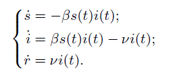
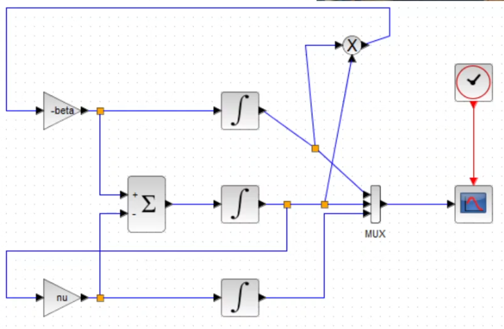
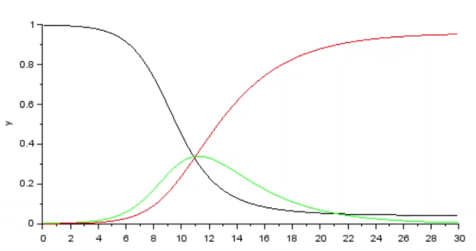
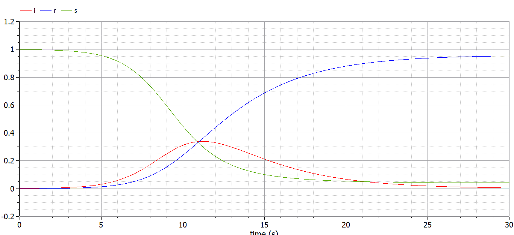
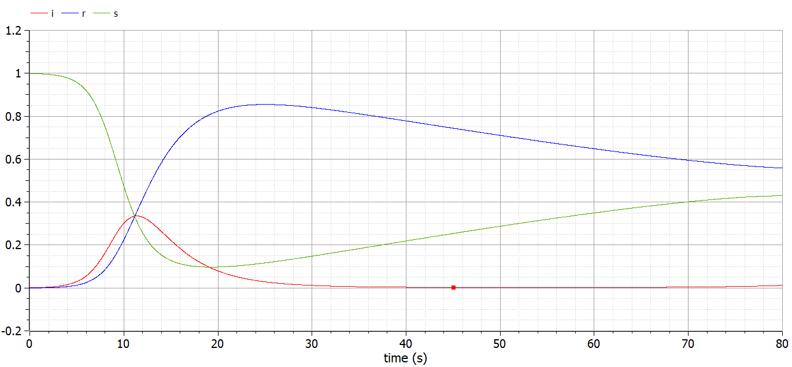
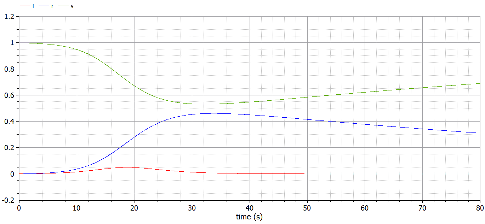

---
## Front matter
lang: "ru"
title: Лабораторная работа № 5
author: Ли Тимофей Александрович, НФИбд-01-18

## Formatting
toc: false
slide_level: 2
theme: metropolis
header-includes: 
 - \metroset{progressbar=frametitle,sectionpage=progressbar,numbering=fraction}
 - '\makeatletter'
 - '\beamer@ignorenonframefalse'
 - '\makeatother'
aspectratio: 43
section-titles: true
---

# Цель работы

## Цель работы

Изучить модель SIR, выполнить примеры и упражнения в scilab и openmodelica. 

# Ход работы

Сразу отмечу, что при начале работы с openmodelica у меня возник конфликт библиотек, из-за чего далее я не использую xcos с блоком modelica.

## Выполнение задания

Модель SIR имеет следующий вид: (рис. -@fig:001):

{ #fig:001 }

Здесь бета=скорость заражения, ню=скорость выздоровления, S,I,R=здоровые, болеющие и переболевшие особи соответственно. N=S+I+R=общее чисто популяции.

## Выполнение задания

Сначала реализовал модель в xcos. Полученная модель: (рис. -@fig:002)

{ #fig:002 }

## Выполнение задания

Результат моделирования: (рис. -@fig:003)

{ #fig:003 }

## Выполнение задания

Затем реализовал модель в xcos с помощью блока modelica. Модель: (рис. -@fig:004)

{ #fig:004 }

## Выполнение задания

Результат: (рис. -@fig:005)

{ #fig:005 }

## Выполнение задания

Далее открыл OMEdit и построил данную модель в нем: (рис. -@fig:006)

{ #fig:006 }

## Выполнение задания

график: (рис. -@fig:007)

{ #fig:007 }

## Выполнение задания

Далее реализовал модель с добавлением коэффициента мю. Относительно модели из теоретического описания работы я изменил N-s(t) на i(t)+r(t).

Полученная модель и график в xcos: (рис. -@fig:008)

{ #fig:008 }

## Выполнение задания

Модель в omedit: (рис. -@fig:009)

{ #fig:009 }

## Выполнение задания

график: (рис. -@fig:010)

{ #fig:010 }

## Выполнение задания

Затем попробовал менять значение мю. График при мю=0.1: (рис. -@fig:011)

{ #fig:011 }

## Выполнение задания

График при мю=0.25: (рис. -@fig:012)

{ #fig:012 }

## Выполнение задания

График при мю=0.5: (рис. -@fig:013)

{ #fig:013 }

## Выполнение задания

Как видим, при малых значениях мю, график похож на график модели без учёта мю. Больше особей переболевает и становятся резистентными, чем умирает и рождается. Эпидемический порог при этом оказывается примерно в одной и той же точке. Видно, что число не болевших после эпидемии будет увеличиваться, а переболевших уменьшаться из-за добавления мю. Однако, примерно когда мю превышает 0.1, ситуация начинает меняться: не болевших особей остаётся всё больше с возрастанием коэффициента, а переболевших и болеющих всё меньше. Эпидемический порог, по сути, не существует при больших мю.

## Выполнение задания

Попробуем также поменять другие параметры. Например, при бета=1,ню=0.7,мю=0.01 получим такой график: (рис. -@fig:014)

{ #fig:014 }

## Выполнение задания

При увеличении скорости выздоровления график числа переболевших будет расти быстрее, а болеющих уменьшаться быстрее, соответственно. Порог достигнут не будет. А после эпидемии вступит в силу естественный прирост населения.

## Выполнение задания

При бета=4,ню=0.03,мю=0.01 график такой: (рис. -@fig:015)

{ #fig:015 }

## Выполнение задания

Видно, что из-за большой скорости заражения очень резко возрастёт число болеющих и снизится не болевших, а потом, так как скорость выздоровления невысокая, постепенно снизится число болеющих и возрастёт резистентных. 

# Выводы

Выполнил задание, изучил модель эпидемии SIR.