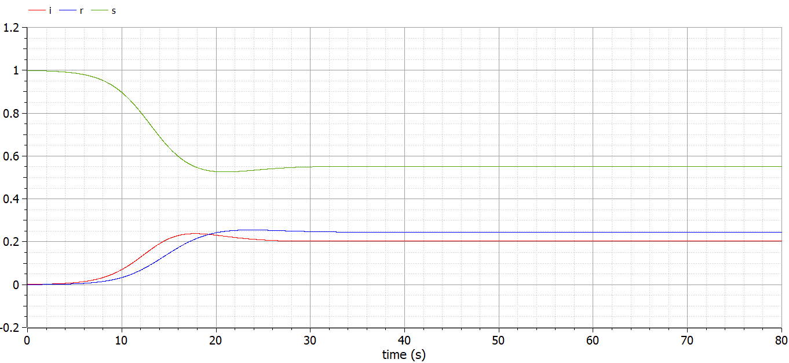

---
# Front matter
lang: "ru"
title: "Лабораторная работа №5"
subtitle: "Модель эпидемии SIR"
author: "Ли Тимофей Александрович"

# Formatting
toc-title: "Содержание"
toc: true # Table of contents
toc_depth: 2
lof: true # List of figures
fontsize: 12pt
linestretch: 1.5
papersize: a4paper
documentclass: scrreprt
mainfont: PT Serif
romanfont: PT Serif
sansfont: PT Sans
monofont: Fira Code
mainfontoptions: Ligatures=TeX
romanfontoptions: Ligatures=TeX
sansfontoptions: Ligatures=TeX,Scale=MatchLowercase
monofontoptions: Scale=MatchLowercase
indent: true
pdf-engine: xelatex
header-includes:
  - \linepenalty=10 # the penalty added to the badness of each line within a paragraph (no associated penalty node) Increasing the value makes tex try to have fewer lines in the paragraph.
  - \interlinepenalty=0 # value of the penalty (node) added after each line of a paragraph.
  - \hyphenpenalty=50 # the penalty for line breaking at an automatically inserted hyphen
  - \exhyphenpenalty=50 # the penalty for line breaking at an explicit hyphen
  - \binoppenalty=700 # the penalty for breaking a line at a binary operator
  - \relpenalty=500 # the penalty for breaking a line at a relation
  - \clubpenalty=150 # extra penalty for breaking after first line of a paragraph
  - \widowpenalty=150 # extra penalty for breaking before last line of a paragraph
  - \displaywidowpenalty=50 # extra penalty for breaking before last line before a display math
  - \brokenpenalty=100 # extra penalty for page breaking after a hyphenated line
  - \predisplaypenalty=10000 # penalty for breaking before a display
  - \postdisplaypenalty=0 # penalty for breaking after a display
  - \floatingpenalty = 20000 # penalty for splitting an insertion (can only be split footnote in standard LaTeX)
  - \raggedbottom # or \flushbottom
  - \usepackage{float} # keep figures where there are in the text
  - \floatplacement{figure}{H} # keep figures where there are in the text
---

# Цель работы

Изучить модель SIR, выполнить примеры и упражнения в scilab и openmodelica. 

# Выполнение лабораторной работы

Сразу отмечу, что при начале работы с openmodelica у меня возник конфликт библиотек, из-за чего далее я не использую xcos с блоком modelica.

## Модель

Модель SIR имеет следующий вид: (рис. -@fig:001):

{ #fig:001 }

Здесь бета=скорость заражения, ню=скорость выздоровления, S,I,R=здоровые, болеющие и переболевшие особи соответственно. N=S+I+R=общее чисто популяции.

## Ход работы

Сначала реализовал модель в xcos. Полученная модель: (рис. -@fig:002)

{ #fig:002 }

Результат моделирования: (рис. -@fig:003)

{ #fig:003 }

Затем реализовал модель в xcos с помощью блока modelica. Модель: (рис. -@fig:004)

{ #fig:004 }

Результат: (рис. -@fig:005)

{ #fig:005 }

Далее открыл OMEdit и построил данную модель в нем: (рис. -@fig:006)

{ #fig:006 }

график: (рис. -@fig:007)

{ #fig:007 }

Далее реализовал модель с добавлением коэффициента мю. Относительно модели из теоретического описания работы я изменил N-s(t) на i(t)+r(t).

Полученная модель и график в xcos: (рис. -@fig:008)

{ #fig:008 }

Модель в omedit: (рис. -@fig:009)

{ #fig:009 }

график: (рис. -@fig:010)

{ #fig:010 }

Затем попробовал менять значение мю. График при мю=0.1: (рис. -@fig:011)

{ #fig:011 }

График при мю=0.25: (рис. -@fig:012)

{ #fig:012 }

График при мю=0.5: (рис. -@fig:013)

{ #fig:013 }

Как видим, при малых значениях мю (при близких к нулю), график очевидно похож на график модели без учёта этого коэффициента. В популяции больше особей переболевает и становятся резистентными, чем умирает и рождается. Эпидемический порог при этом оказывается примерно в одной и той же точке. Видно, что число не болевших после эпидемии будет увеличиваться, а переболевших уменьшаться из-за добавления смертности и рождаемости. Однако, примерно когда мю превышает 0.1, ситуация начинает меняться: не болевших особей остаётся всё больше с возрастанием коэффициента, а переболевших и болеющих всё меньше. Эпидемический порог (то есть, точка, где все три графика пересекутся) вообще, по сути, не существует при больших мю.

Попробуем также поменять другие параметры. Например, при бета=1,ню=0.7,мю=0.01 получим такой график: (рис. -@fig:014)

{ #fig:014 }

При увеличении скорости выздоровления график числа переболевших будет расти быстрее, а болеющих уменьшаться быстрее, соответственно. Порог достигнут не будет. А после эпидемии вступит в силу естественный прирост населения.

При бета=4,ню=0.03,мю=0.01 график такой: (рис. -@fig:015)

{ #fig:015 }

Видно, что из-за большой скорости заражения очень резко возрастёт число болеющих и снизится не болевших, а потом, так как скорость выздоровления невысокая, постепенно снизится число болеющих и возрастёт резистентных. 

# Выводы

Выполнил задание, изучил модель эпидемии SIR.