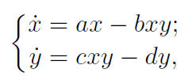
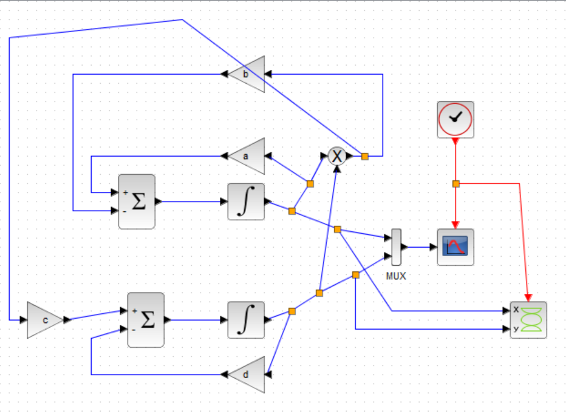
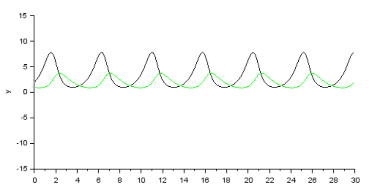
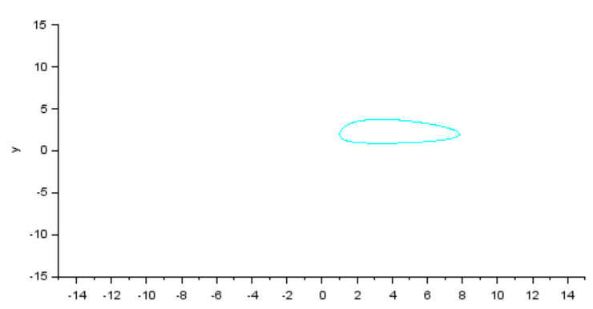
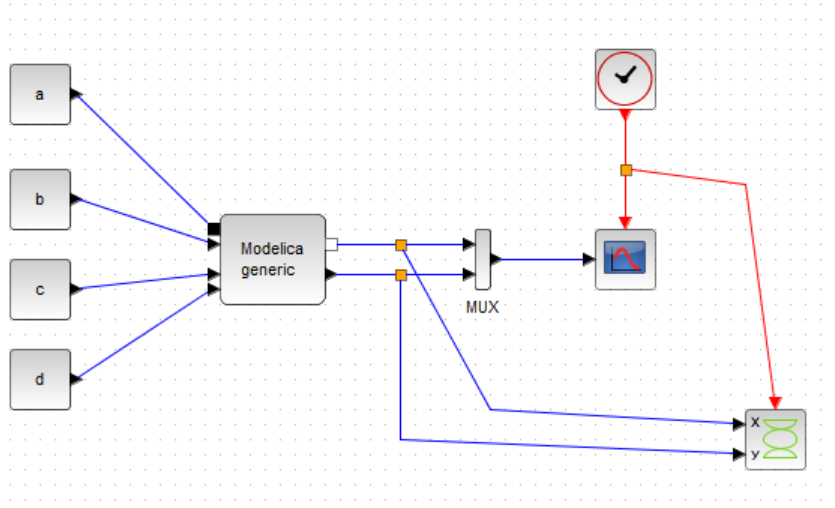
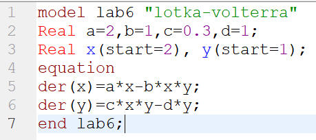
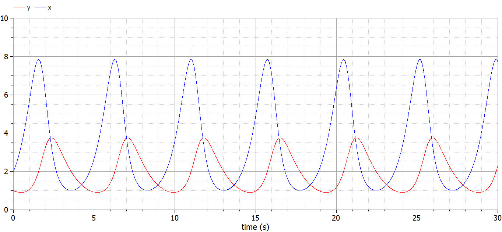
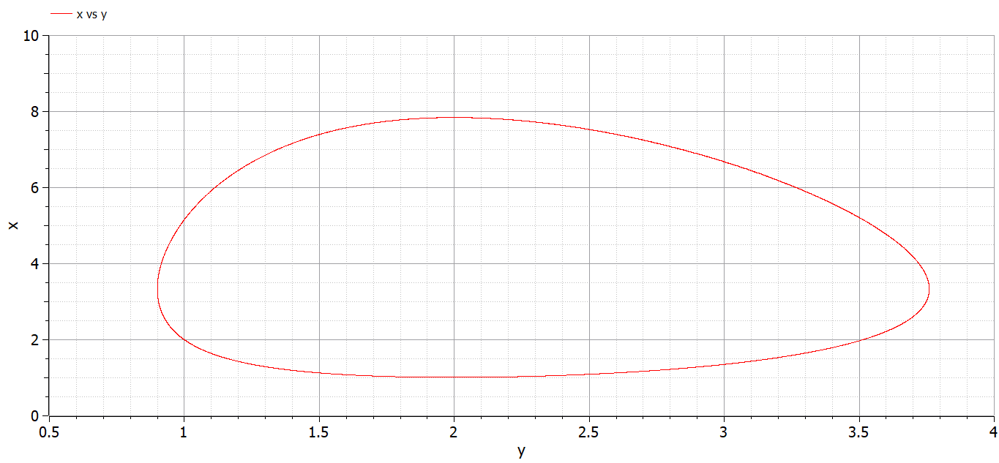

---
## Front matter
lang: "ru"
title: Лабораторная работа № 6
author: Ли Тимофей Александрович, НФИбд-01-18

## Formatting
toc: false
slide_level: 2
theme: metropolis
header-includes: 
 - \metroset{progressbar=frametitle,sectionpage=progressbar,numbering=fraction}
 - '\makeatletter'
 - '\beamer@ignorenonframefalse'
 - '\makeatother'
aspectratio: 43
section-titles: true
---

# Цель работы

## Цель работы

Изучить модель "Хищник-жертва", реализовать ее с помощью xcos и openmodelica. 

# Выполнение лабораторной работы

## Ход работы

Сразу отмечу, что в лабораторной работе №5 при начале работы с openmodelica у меня возник конфликт библиотек, из-за чего у меня не строятся графики в xcos с блоком modelica. Я создал в нем модель, но график вывести не могу.

Модель "Хищник-жертва" имеет следующий вид: (рис. -@fig:001):

{ #fig:001 }

Здесь x и y отображают численность жертв и хищников, коэффициенты a,b -- рождаемость и убыль жертв, c,d -- рождаемость и убыль хищников.

## Ход работы

Сначала реализовал модель в xcos при a=2, b=1, c=0.3, d=1. Полученная модель: (рис. -@fig:002)

{ #fig:002 width=70% }

## Ход работы

Результат моделирования: (рис. -@fig:003)

{ #fig:003 }

## Ход работы

Фазовый портрет: (рис. -@fig:004)

{ #fig:004 }

## Ход работы

Затем, я сделал модель в xcos с блоком modelica (но не смог вывести график из-за конфликта ПО). Модель: (рис. -@fig:005)

{ #fig:005 }

## Ход работы

Далее открыл OMEdit и построил данную модель в нем: (рис. -@fig:006)

{ #fig:006 }

## Ход работы

График: (рис. -@fig:007)

{ #fig:007 }

## Ход работы

Фазовый портрет: (рис. -@fig:008)

{ #fig:008 }

# Выводы

Выполнил задание, изучил модель "Хищник-жертва".