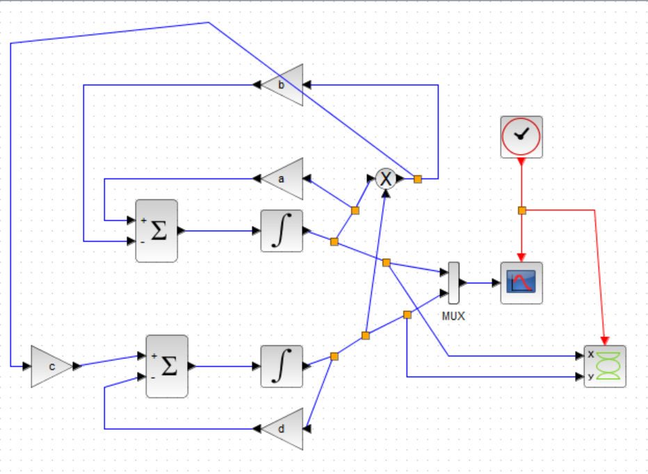
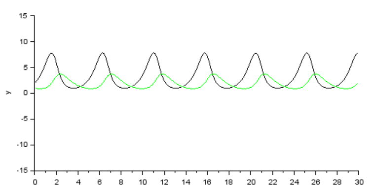

---
# Front matter
lang: "ru"
title: "Лабораторная работа №6"
subtitle: "Модель хищник-жертва"
author: "Ли Тимофей Александрович"

# Formatting
toc-title: "Содержание"
toc: true # Table of contents
toc_depth: 2
lof: true # List of figures
fontsize: 12pt
linestretch: 1.5
papersize: a4paper
documentclass: scrreprt
mainfont: PT Serif
romanfont: PT Serif
sansfont: PT Sans
monofont: Fira Code
mainfontoptions: Ligatures=TeX
romanfontoptions: Ligatures=TeX
sansfontoptions: Ligatures=TeX,Scale=MatchLowercase
monofontoptions: Scale=MatchLowercase
indent: true
pdf-engine: xelatex
header-includes:
  - \linepenalty=10 # the penalty added to the badness of each line within a paragraph (no associated penalty node) Increasing the value makes tex try to have fewer lines in the paragraph.
  - \interlinepenalty=0 # value of the penalty (node) added after each line of a paragraph.
  - \hyphenpenalty=50 # the penalty for line breaking at an automatically inserted hyphen
  - \exhyphenpenalty=50 # the penalty for line breaking at an explicit hyphen
  - \binoppenalty=700 # the penalty for breaking a line at a binary operator
  - \relpenalty=500 # the penalty for breaking a line at a relation
  - \clubpenalty=150 # extra penalty for breaking after first line of a paragraph
  - \widowpenalty=150 # extra penalty for breaking before last line of a paragraph
  - \displaywidowpenalty=50 # extra penalty for breaking before last line before a display math
  - \brokenpenalty=100 # extra penalty for page breaking after a hyphenated line
  - \predisplaypenalty=10000 # penalty for breaking before a display
  - \postdisplaypenalty=0 # penalty for breaking after a display
  - \floatingpenalty = 20000 # penalty for splitting an insertion (can only be split footnote in standard LaTeX)
  - \raggedbottom # or \flushbottom
  - \usepackage{float} # keep figures where there are in the text
  - \floatplacement{figure}{H} # keep figures where there are in the text
---

# Цель работы

Изучить модель "Хищник-жертва", реализовать ее с помощью xcos и openmodelica. 

# Выполнение лабораторной работы

Сразу отмечу, что в лабораторной работе №5 при начале работы с openmodelica у меня возник конфликт библиотек, из-за чего у меня не строятся графики в xcos с блоком modelica. Я создал в нем модель, но график вывести не могу.

## Модель

Модель "Хищник-жертва" имеет следующий вид: (рис. -@fig:001):

{ #fig:001 }

Здесь x и y отображают численность жертв и хищников, коэффициенты a,b -- рождаемость и убыль жертв, c,d -- рождаемость и убыль хищников.

## Ход работы

Сначала реализовал модель в xcos при a=2, b=1, c=0.3, d=1. Полученная модель: (рис. -@fig:002)

{ #fig:002 }

Результат моделирования: (рис. -@fig:003)

{ #fig:003 }

Фазовый портрет: (рис. -@fig:004)

{ #fig:004 }

Затем, я сделал модель в xcos с блоком modelica (но не смог вывести график из-за конфликта ПО). Модель: (рис. -@fig:005)

{ #fig:005 }

Далее открыл OMEdit и построил данную модель в нем: (рис. -@fig:006)

{ #fig:006 }

График: (рис. -@fig:007)

{ #fig:007 }

Фазовый портрет: (рис. -@fig:008)

{ #fig:008 }

# Выводы

Выполнил задание, изучил модель "Хищник-жертва".