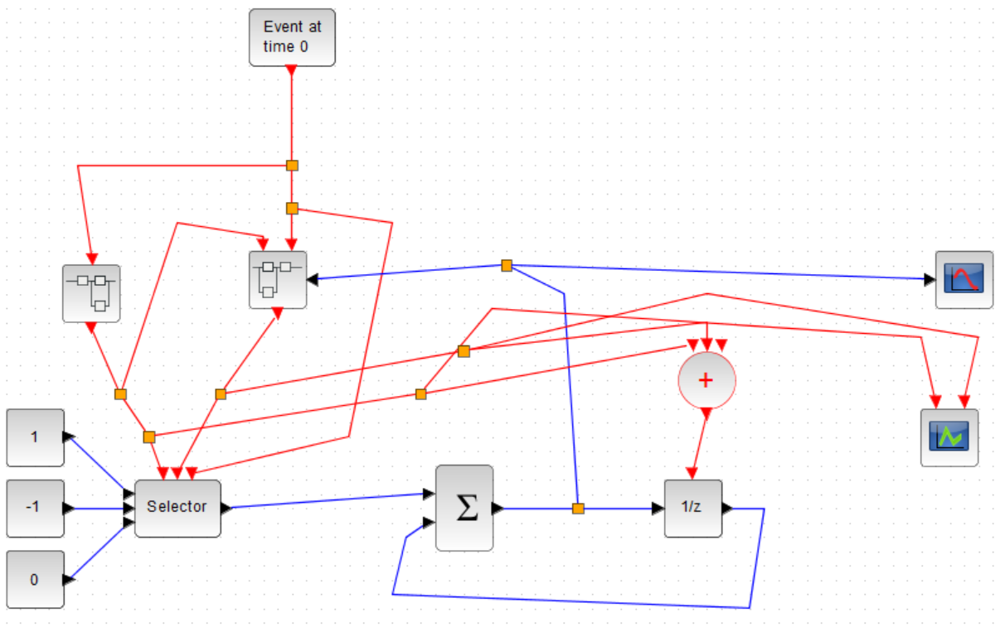
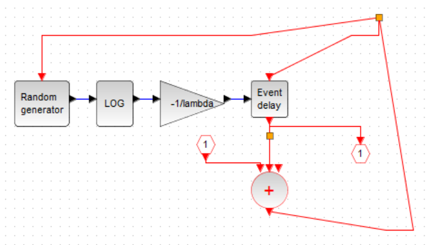
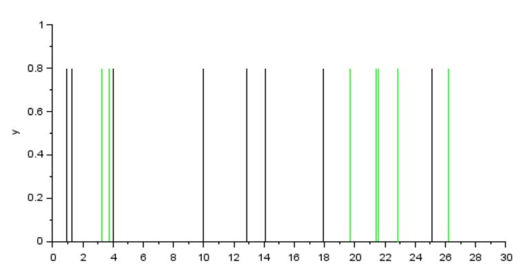

---
## Front matter
lang: "ru"
title: Лабораторная работа № 7
author: Ли Тимофей Александрович, НФИбд-01-18

## Formatting
toc: false
slide_level: 2
theme: metropolis
header-includes: 
 - \metroset{progressbar=frametitle,sectionpage=progressbar,numbering=fraction}
 - '\makeatletter'
 - '\beamer@ignorenonframefalse'
 - '\makeatother'
aspectratio: 43
section-titles: true
---

# Цель работы

## Цель работы

Изучить модель массового обслуживания с 1 прибором и бесконечной очередью, реализовать ее с помощью xcos.

# Выполнение лабораторной работы

## Ход работы

В данной модели берем лямбда=0.3, мю=0.35 и z0=6.

Создал модель в xcos: (рис. -@fig:001):

{ #fig:001 width=70%}

## Ход работы

В модели использованы два суперблока, отвечающие за поступление и обработку заявок. Суперблок моделирования поступления заявок: (рис. -@fig:002)

{ #fig:002 }

## Ход работы

Суперблок моделирования обработки заявок: (рис. -@fig:003)

{ #fig:003 width=60%}

## Ход работы

Полученный график поступления и обработки заявок (черный и зеленый цвета соответственно): (рис. -@fig:004)

{ #fig:004 }

## Ход работы

График длины очереди: (рис. -@fig:005)

{ #fig:005 }

# Выводы

Выполнил задание, изучил модель массового обслуживания.