---
## Front matter
lang: "ru"
title: Лабораторная работа № 8
author: Ли Тимофей Александрович, НФИбд-01-18

## Formatting
toc: false
slide_level: 2
theme: metropolis
header-includes: 
 - \metroset{progressbar=frametitle,sectionpage=progressbar,numbering=fraction}
 - '\makeatletter'
 - '\beamer@ignorenonframefalse'
 - '\makeatother'
aspectratio: 43
section-titles: true
---

# Цель работы

## Цель работы

Изучить модель Модель TCP/AQM, реализовать ее с помощью xcos и openmodelica. 

# Выполнение лабораторной работы

## Модель

Модель Модель TCP/AQM имеет следующий вид: (рис. -@fig:001):

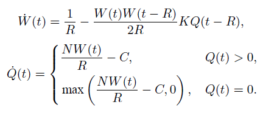{ #fig:001 }

где W(t) — средний размер TCP-окна (в пакетах), Q(t) — средний размер очереди (в пакетах), R(t) — время двойного оборота (Round Trip Time, сек.), C — скорость обработки пакетов в очереди (пакетов в секунду), N(t) — число TCP-сессий, p=KQ(t) — вероятностная функция сброса (отметки на сброс) пакета.

## Ход работы

Сначала реализовал модель в xcos. Полученная модель: (рис. -@fig:002)

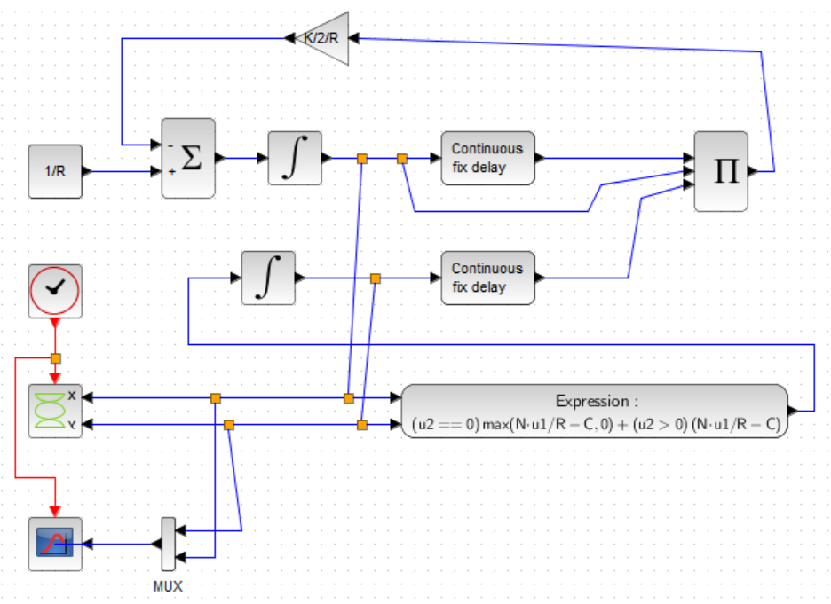{ #fig:002 width=70%}

## Ход работы

График размера окна (зеленый) и размера очереди (черный): (рис. -@fig:003)

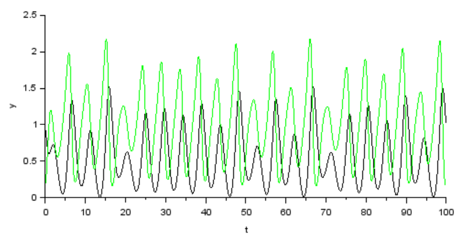{ #fig:003 }

## Ход работы

Фазовый портрет: (рис. -@fig:004)

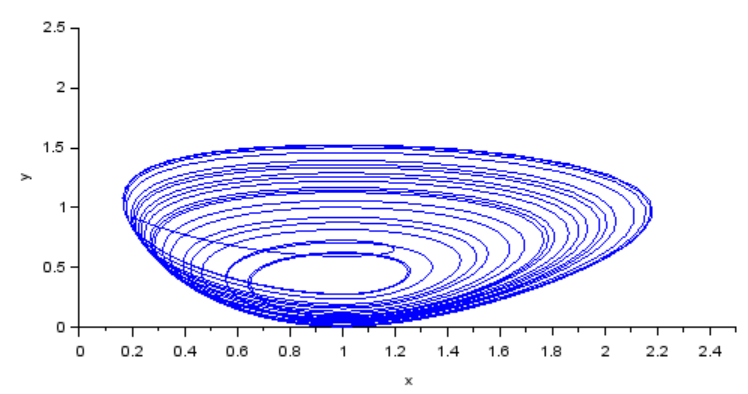{ #fig:004 }

## Ход работы

График размера окна и размера очереди при C=0.9: (рис. -@fig:005)

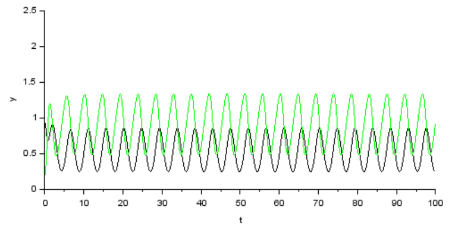{ #fig:005 }

## Ход работы

Фазовый портрет при C=0.9: (рис. -@fig:006)

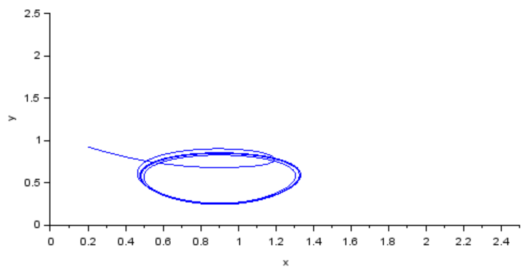{ #fig:006 }

## Ход работы

Потом реализовал модель в openmodelica: (рис. -@fig:007)

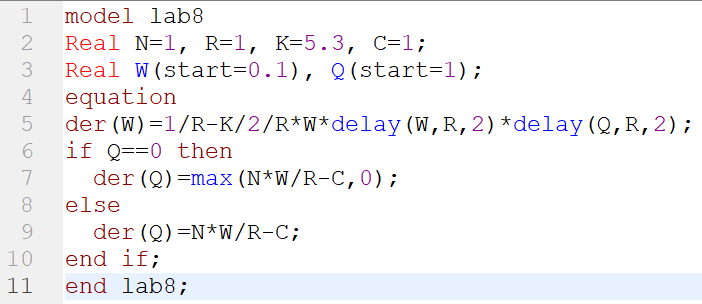{ #fig:007 }

## Ход работы

График размера окна и размера очереди: (рис. -@fig:008)

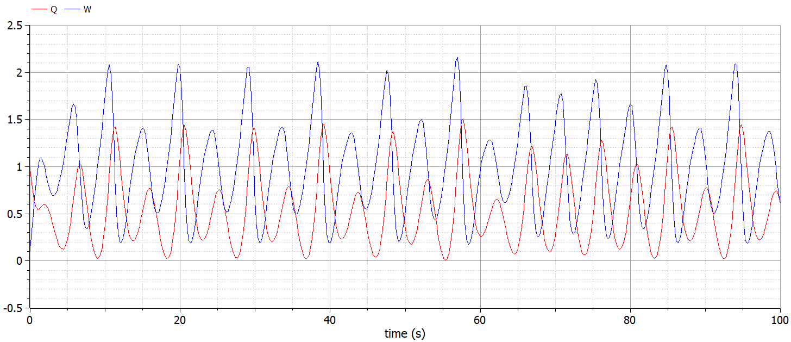{ #fig:008 }

## Ход работы

Фазовый портрет: (рис. -@fig:009)

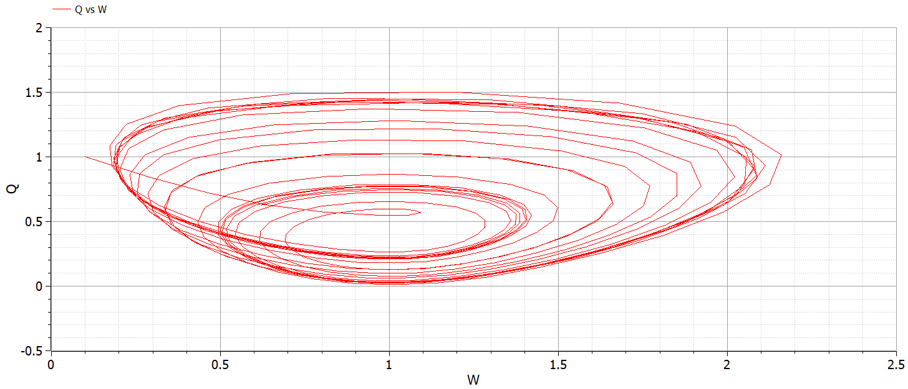{ #fig:009 }

## Ход работы

График размера окна и размера очереди при C=0.9: (рис. -@fig:010)

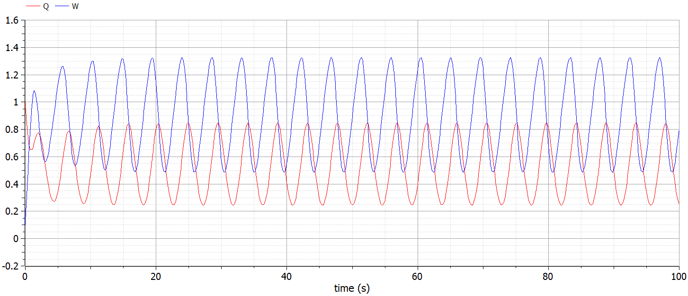{ #fig:010 }

## Ход работы

Фазовый портрет при C=0.9: (рис. -@fig:011)

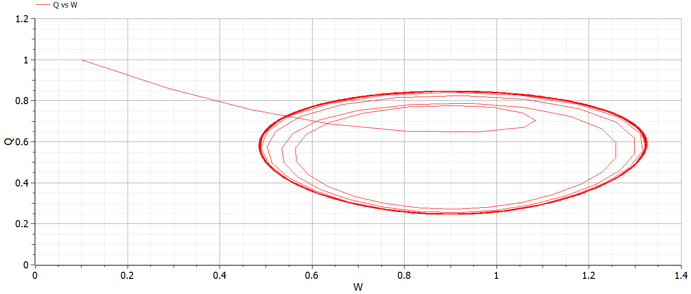{ #fig:011 }

## Ход работы

Как видим, при уменьшении скорости обработки очереди размер окна и очереди изменяется более равномерно, пики значений находятся на одном уровне для каждого из наблюдаемых параметров. Также выравнивается и фазовый портрет.

# Выводы

Выполнил задание, изучил модель TCP/AQM.