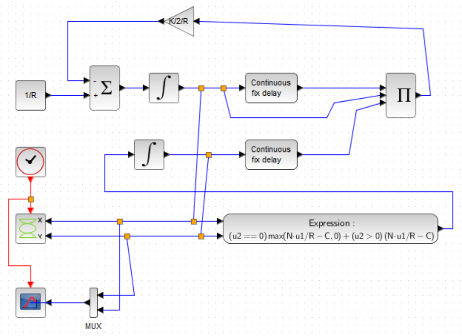
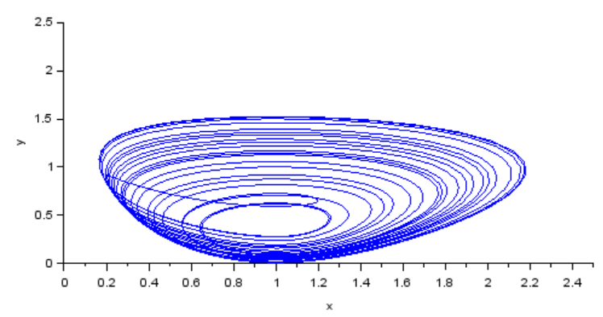
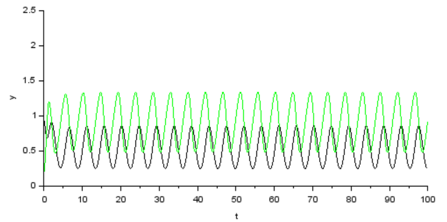
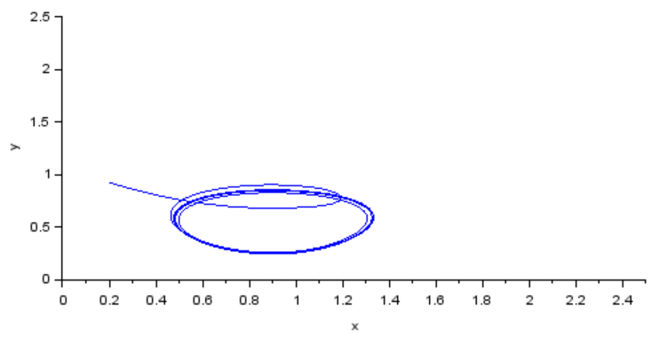
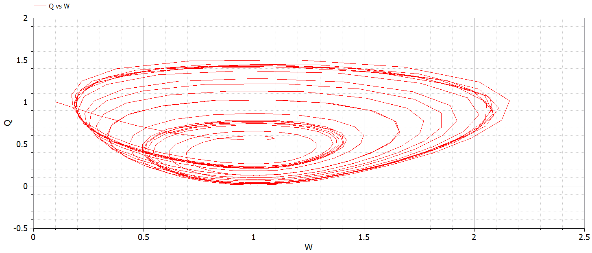
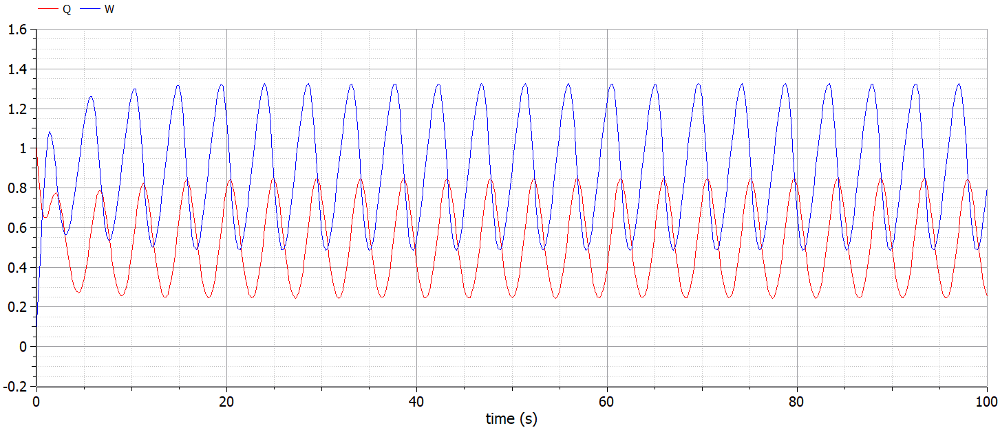
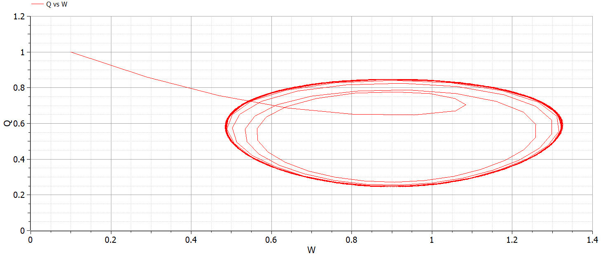

---
# Front matter
lang: "ru"
title: "Лабораторная работа №8"
subtitle: "Модель Модель TCP/AQM"
author: "Ли Тимофей Александрович"

# Formatting
toc-title: "Содержание"
toc: true # Table of contents
toc_depth: 2
lof: true # List of figures
fontsize: 12pt
linestretch: 1.5
papersize: a4paper
documentclass: scrreprt
mainfont: PT Serif
romanfont: PT Serif
sansfont: PT Sans
monofont: Fira Code
mainfontoptions: Ligatures=TeX
romanfontoptions: Ligatures=TeX
sansfontoptions: Ligatures=TeX,Scale=MatchLowercase
monofontoptions: Scale=MatchLowercase
indent: true
pdf-engine: xelatex
header-includes:
  - \linepenalty=10 # the penalty added to the badness of each line within a paragraph (no associated penalty node) Increasing the value makes tex try to have fewer lines in the paragraph.
  - \interlinepenalty=0 # value of the penalty (node) added after each line of a paragraph.
  - \hyphenpenalty=50 # the penalty for line breaking at an automatically inserted hyphen
  - \exhyphenpenalty=50 # the penalty for line breaking at an explicit hyphen
  - \binoppenalty=700 # the penalty for breaking a line at a binary operator
  - \relpenalty=500 # the penalty for breaking a line at a relation
  - \clubpenalty=150 # extra penalty for breaking after first line of a paragraph
  - \widowpenalty=150 # extra penalty for breaking before last line of a paragraph
  - \displaywidowpenalty=50 # extra penalty for breaking before last line before a display math
  - \brokenpenalty=100 # extra penalty for page breaking after a hyphenated line
  - \predisplaypenalty=10000 # penalty for breaking before a display
  - \postdisplaypenalty=0 # penalty for breaking after a display
  - \floatingpenalty = 20000 # penalty for splitting an insertion (can only be split footnote in standard LaTeX)
  - \raggedbottom # or \flushbottom
  - \usepackage{float} # keep figures where there are in the text
  - \floatplacement{figure}{H} # keep figures where there are in the text
---

# Цель работы

Изучить модель Модель TCP/AQM, реализовать ее с помощью xcos и openmodelica. 

# Выполнение лабораторной работы

## Модель

Модель Модель TCP/AQM имеет следующий вид: (рис. -@fig:001):

{ #fig:001 }

где W(t) — средний размер TCP-окна (в пакетах), Q(t) — средний размер очереди (в пакетах), R(t) — время двойного оборота (Round Trip Time, сек.), C — скорость обработки пакетов в очереди (пакетов в секунду), N(t) — число TCP-сессий, p=KQ(t) — вероятностная функция сброса (отметки на сброс) пакета.

## Ход работы

Сначала реализовал модель в xcos. Полученная модель: (рис. -@fig:002)

{ #fig:002 }

Получил следующие графики:

 - График размера окна (зеленый) и размера очереди (черный): (рис. -@fig:003)

{ #fig:003 }

 - Фазовый портрет: (рис. -@fig:004)

{ #fig:004 }

Затем я сменил в контексте значение C на 0.9 и получил следующие графики:

 - График размера окна и размера очереди: (рис. -@fig:005)

{ #fig:005 }

 - Фазовый портрет: (рис. -@fig:006)

{ #fig:006 }

Потом реализовал модель в openmodelica: (рис. -@fig:007)

{ #fig:007 }

 - График размера окна и размера очереди: (рис. -@fig:008)

{ #fig:008 }

 - Фазовый портрет: (рис. -@fig:009)

{ #fig:009 }

Сменил C на 0.9 и получил:

 - График размера окна и размера очереди: (рис. -@fig:010)

{ #fig:010 }

 - Фазовый портрет: (рис. -@fig:011)

{ #fig:011 }

Как видим, при уменьшении скорости обработки очереди размер окна и очереди изменяется более равномерно, пики значений находятся на одном уровне для каждого из наблюдаемых параметров. Также выравнивается и фазовый портрет.

# Выводы

Выполнил задание, изучил модель TCP/AQM.