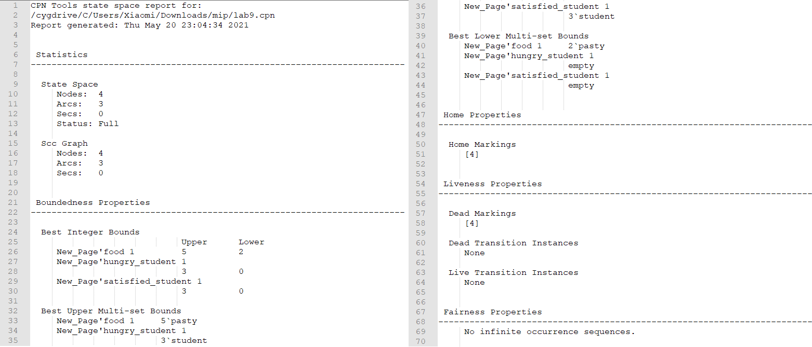

---
## Front matter
lang: "ru"
title: Лабораторная работа № 9
author: Ли Тимофей Александрович, НФИбд-01-18

## Formatting
toc: false
slide_level: 2
theme: metropolis
header-includes: 
 - \metroset{progressbar=frametitle,sectionpage=progressbar,numbering=fraction}
 - '\makeatletter'
 - '\beamer@ignorenonframefalse'
 - '\makeatother'
aspectratio: 43
section-titles: true
---

# Цель работы

## Цель работы

Изучить модель "Накорми студента", реализовать ее с помощью cpntools. 

# Выполнение лабораторной работы

## Ход работы

Построил сеть в cpntools согласно видео-примеру: (рис. -@fig:001):

{ #fig:001 }

## Ход работы

Запустил симуляцию. Последний шаг: (рис. -@fig:002)

{ #fig:002 }

## Ход работы

Посчитал пространство состояний, посчитал граф, отобразил узлы графа: (рис. -@fig:003)

{ #fig:003 }

## Ход работы

После этого сохранил отчет о пространстве состояний: (рис. -@fig:004)

{ #fig:004 }

# Выводы

Выполнил задание, изучил модель "Накорми студента".