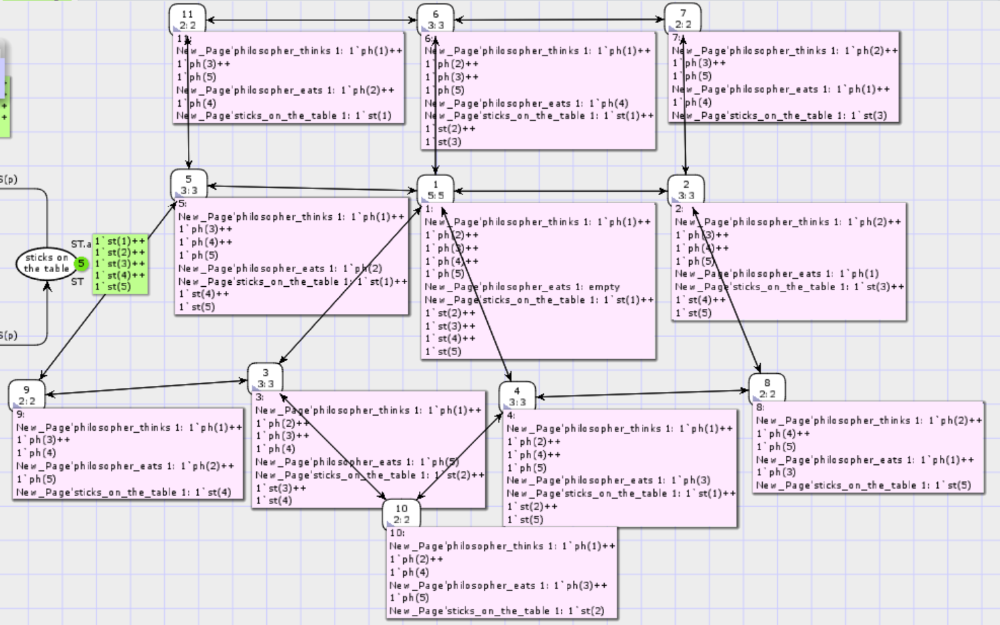

---
# Front matter
lang: "ru"
title: "Лабораторная работа №10"
subtitle: "Модель Обедающие мудрецы"
author: "Ли Тимофей Александрович"

# Formatting
toc-title: "Содержание"
toc: true # Table of contents
toc_depth: 2
lof: true # List of figures
fontsize: 12pt
linestretch: 1.5
papersize: a4paper
documentclass: scrreprt
mainfont: PT Serif
romanfont: PT Serif
sansfont: PT Sans
monofont: Fira Code
mainfontoptions: Ligatures=TeX
romanfontoptions: Ligatures=TeX
sansfontoptions: Ligatures=TeX,Scale=MatchLowercase
monofontoptions: Scale=MatchLowercase
indent: true
pdf-engine: xelatex
header-includes:
  - \linepenalty=10 # the penalty added to the badness of each line within a paragraph (no associated penalty node) Increasing the value makes tex try to have fewer lines in the paragraph.
  - \interlinepenalty=0 # value of the penalty (node) added after each line of a paragraph.
  - \hyphenpenalty=50 # the penalty for line breaking at an automatically inserted hyphen
  - \exhyphenpenalty=50 # the penalty for line breaking at an explicit hyphen
  - \binoppenalty=700 # the penalty for breaking a line at a binary operator
  - \relpenalty=500 # the penalty for breaking a line at a relation
  - \clubpenalty=150 # extra penalty for breaking after first line of a paragraph
  - \widowpenalty=150 # extra penalty for breaking before last line of a paragraph
  - \displaywidowpenalty=50 # extra penalty for breaking before last line before a display math
  - \brokenpenalty=100 # extra penalty for page breaking after a hyphenated line
  - \predisplaypenalty=10000 # penalty for breaking before a display
  - \postdisplaypenalty=0 # penalty for breaking after a display
  - \floatingpenalty = 20000 # penalty for splitting an insertion (can only be split footnote in standard LaTeX)
  - \raggedbottom # or \flushbottom
  - \usepackage{float} # keep figures where there are in the text
  - \floatplacement{figure}{H} # keep figures where there are in the text
---

# Цель работы

Изучить модель "Обедающие мудрецы", реализовать ее с помощью cpntools. 

# Выполнение лабораторной работы

## Ход работы

Построил сеть в cpntools согласно примеру: (рис. -@fig:001):

{ #fig:001 }

Запустил симуляцию. В ходе симуляции максимальное число едящих философов -- 2. Пример: (рис. -@fig:002)

{ #fig:002 }

Посчитал пространство состояний, посчитал граф, отобразил узлы графа: (рис. -@fig:003)

{ #fig:003 }

После этого сохранил отчет о пространстве состояний: (рис. -@fig:004)

{ #fig:004 }

В разделе статистики видим, что в графе 11 узлов и 30 ребер. Компонента связности одна, поскольку из каждого узла, можно попасть в каждый. В свойствах ограниченности в числовых значениях видим, что одновременно есть могут от 0 до 2 философов, думать от 3 до 5, а палочек на столе лежать может от 5 до 1. По мультимножеству определяем, что каждый философ может поесть, подумать и каждая палочка может быть задействована. Все маркировки являются домашними, потому что каждая достижима из каждой. отсюда же имеем отсутствие мёртвых маркировок – из всех есть переходы, мёртвых переходов – все можно задействовать, и все переходы живые – какой бы ни была маркировка, существует доступная последовательность смены маркировок, в которой «живой» переход будет задействован. В разделе свойств справедливости видим, что любая бесконечная последовательность содержит бесконечное число переходов взять палочки и положить палочки. Переходов с другими типами справедливости нет.

# Выводы

Выполнил задание, изучил модель "Обедающие мудрецы".