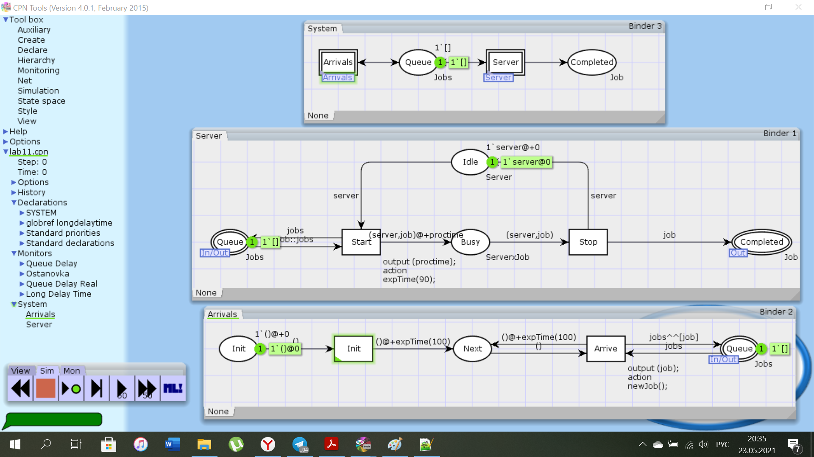
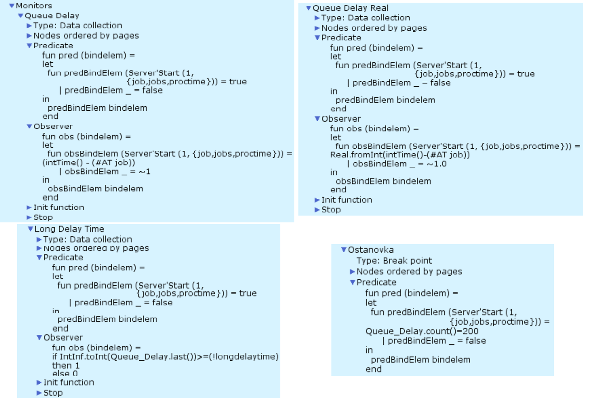
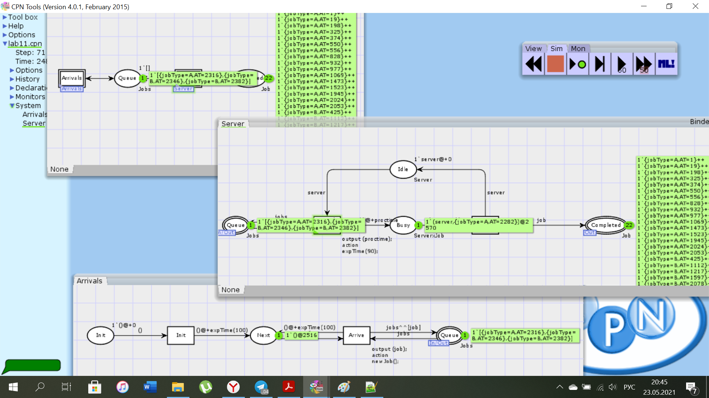
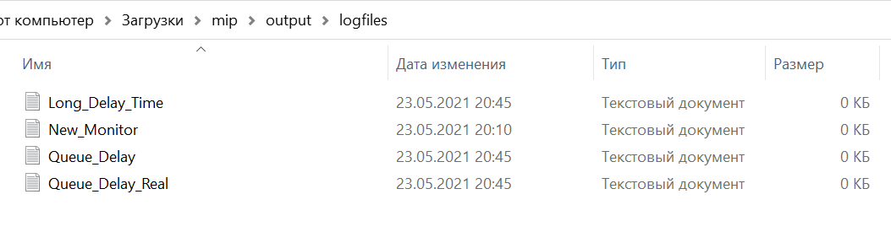
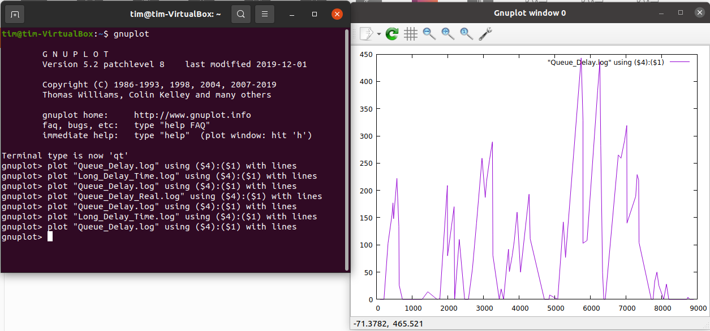
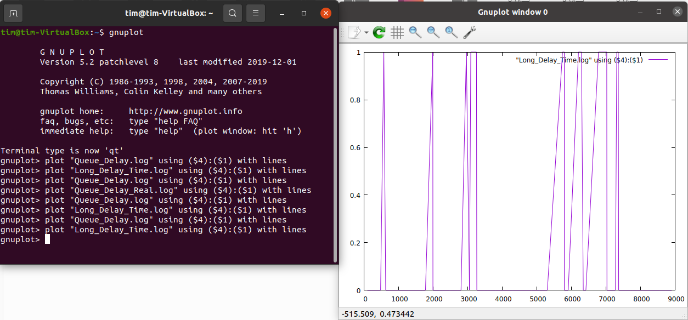

---
## Front matter
lang: "ru"
title: Лабораторная работа № 11
author: Ли Тимофей Александрович, НФИбд-01-18

## Formatting
toc: false
slide_level: 2
theme: metropolis
header-includes: 
 - \metroset{progressbar=frametitle,sectionpage=progressbar,numbering=fraction}
 - '\makeatletter'
 - '\beamer@ignorenonframefalse'
 - '\makeatother'
aspectratio: 43
section-titles: true
---

# Цель работы

## Цель работы

Изучить модель СМО М/М/1, реализовать ее с помощью cpntools. 

# Выполнение лабораторной работы

## Ход работы

Построил модель в cpntools: (рис. -@fig:001):

{ #fig:001 width=80%}

## Ход работы

Добавил брейкпоинт Ostanovka и мониторы Queue Delay, Queue Delay Real, Long Delay Time: (рис. -@fig:002)

{ #fig:002 width=80%}

## Ход работы

Запустил симуляцию: (рис. -@fig:003)

{ #fig:003 width=80%}

## Ход работы

В результате создается директория output/logfiles с логами: (рис. -@fig:004)

{ #fig:004 }

## Ход работы

Затем я запустил ВМ, чтобы построить график изменения задержки очереди и график, показывающий, в какое время задержки превышали заданное значение (200). Первый график в gnuplot: (рис. -@fig:005)

{ #fig:005 }

## Ход работы

 и второй: (рис. -@fig:006)

{ #fig:006 }

# Выводы

Выполнил задание, изучил модель СМО М/М/1.