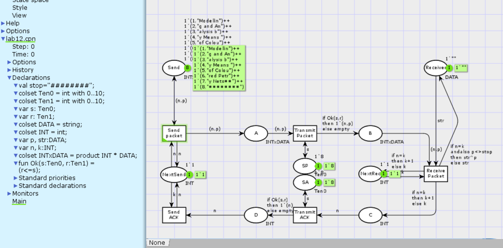
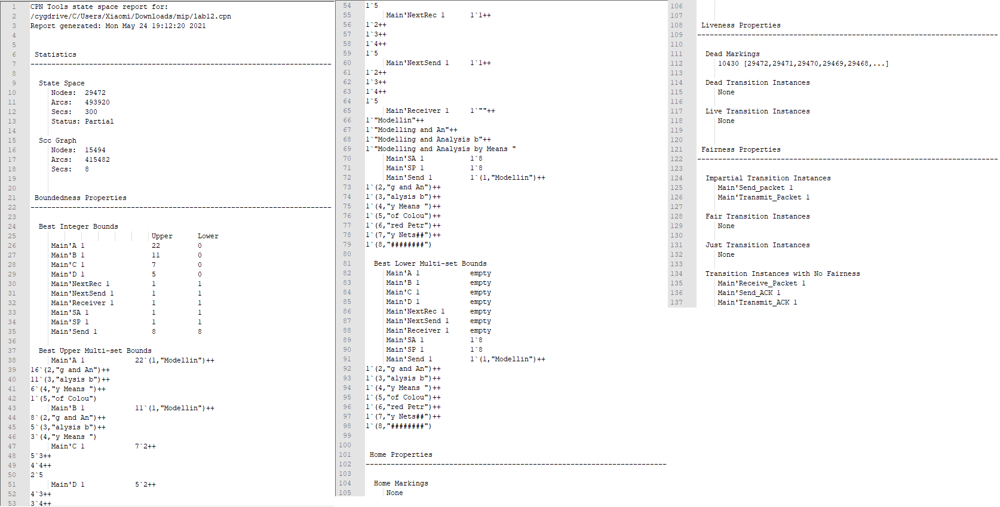

---
## Front matter
lang: "ru"
title: Лабораторная работа № 12
author: Ли Тимофей Александрович, НФИбд-01-18

## Formatting
toc: false
slide_level: 2
theme: metropolis
header-includes: 
 - \metroset{progressbar=frametitle,sectionpage=progressbar,numbering=fraction}
 - '\makeatletter'
 - '\beamer@ignorenonframefalse'
 - '\makeatother'
aspectratio: 43
section-titles: true
---

# Цель работы

Смоделировать простой протокол передачи данных с помощью cpntools, анализировать отчет по пространству состояний. 

# Выполнение лабораторной работы

Построил модель в cpntools: (рис. -@fig:001):

{ #fig:001 }

# Выполнение лабораторной работы

Подсчитал пространство состояний (частично), подсчитал граф, сохранил отчет о пространстве состояний: (рис. -@fig:002)

{ #fig:002 }

# Выполнение лабораторной работы

Частично составил граф пространства состояний: (рис. -@fig:003)

{ #fig:003 }

# Выводы

Выполнил задание, смоделировал простой протокол передачи данных.