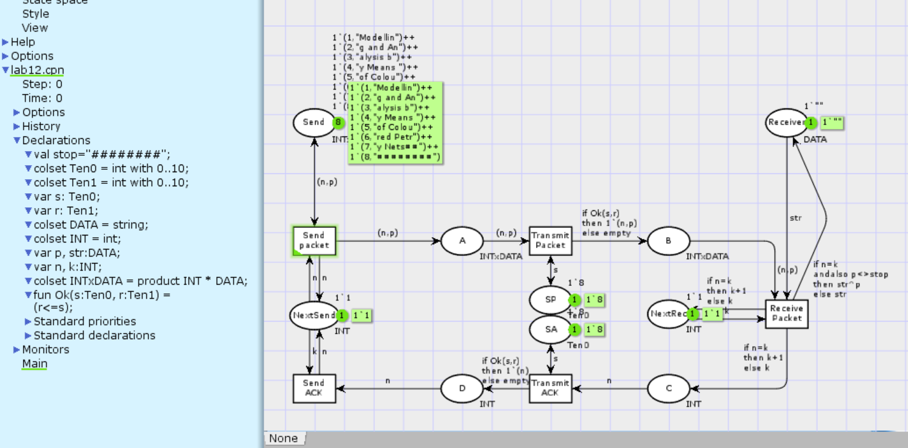
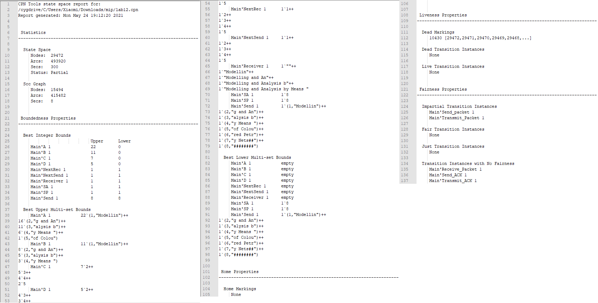
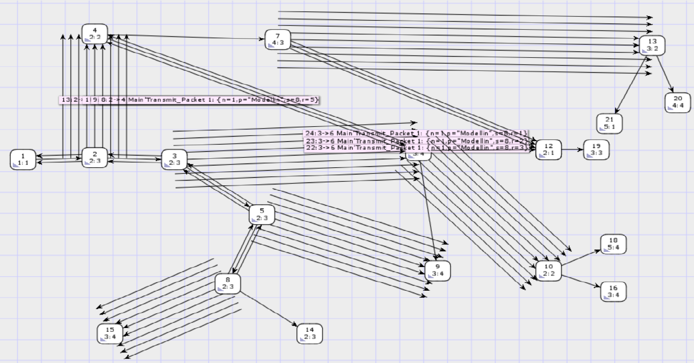


---
# Front matter
lang: "ru"
title: "Лабораторная работа №12"
subtitle: "Пример моделирования простого протокола передачи данных"
author: "Ли Тимофей Александрович"

# Formatting
toc-title: "Содержание"
toc: true # Table of contents
toc_depth: 2
lof: true # List of figures
fontsize: 12pt
linestretch: 1.5
papersize: a4paper
documentclass: scrreprt
mainfont: PT Serif
romanfont: PT Serif
sansfont: PT Sans
monofont: Fira Code
mainfontoptions: Ligatures=TeX
romanfontoptions: Ligatures=TeX
sansfontoptions: Ligatures=TeX,Scale=MatchLowercase
monofontoptions: Scale=MatchLowercase
indent: true
pdf-engine: xelatex
header-includes:
  - \linepenalty=10 # the penalty added to the badness of each line within a paragraph (no associated penalty node) Increasing the value makes tex try to have fewer lines in the paragraph.
  - \interlinepenalty=0 # value of the penalty (node) added after each line of a paragraph.
  - \hyphenpenalty=50 # the penalty for line breaking at an automatically inserted hyphen
  - \exhyphenpenalty=50 # the penalty for line breaking at an explicit hyphen
  - \binoppenalty=700 # the penalty for breaking a line at a binary operator
  - \relpenalty=500 # the penalty for breaking a line at a relation
  - \clubpenalty=150 # extra penalty for breaking after first line of a paragraph
  - \widowpenalty=150 # extra penalty for breaking before last line of a paragraph
  - \displaywidowpenalty=50 # extra penalty for breaking before last line before a display math
  - \brokenpenalty=100 # extra penalty for page breaking after a hyphenated line
  - \predisplaypenalty=10000 # penalty for breaking before a display
  - \postdisplaypenalty=0 # penalty for breaking after a display
  - \floatingpenalty = 20000 # penalty for splitting an insertion (can only be split footnote in standard LaTeX)
  - \raggedbottom # or \flushbottom
  - \usepackage{float} # keep figures where there are in the text
  - \floatplacement{figure}{H} # keep figures where there are in the text
---

# Цель работы

Смоделировать простой протокол передачи данных с помощью cpntools, анализировать отчет по пространству состояний. 

# Выполнение лабораторной работы

## Ход работы

Построил модель в cpntools: (рис. -@fig:001):

{ #fig:001 }

Подсчитал пространство состояний (частично), подсчитал граф, сохранил отчет о пространстве состояний. Полное пространство состояний в нашей модели очень большое, поэтому пространство подсчитано частично, и отчет также составлен по подсчитанной части. Отчет: (рис. -@fig:002)

{ #fig:002 }

Видим, что рассчитано не всё пространство состояний (partial). Видим, что максимальное и минимальное число фишек в некоторых позициях одинаково, это те позиции, которые в каждом переходе, где задействованы, получают и отдают 1 фишку. На промежуточных позициях можно заметить закономерность, что кол-во фишек уменьшается от A к D. Это происходит потому, что на позицию А может приходить сколько угодно фишек по переходу отправить пакет, на В приходят не все из них из-за потерь. На С фишек ещё меньше, наверное, из-за того, что переход в данном фрагменте отчёта срабатывал реже, а на D меньше, чем на С из-за потерь. Домашних маркировок в данном подпространстве состояний нет. Есть мёртвые маркировки, по номерам видим, что это последние вычисленные маркировки, значит, для них просто не были рассчитаны переходы из них. По идее модели, выходы должны быть из всех маркировок, кроме финальной, которая и была бы единственной мёртвой в полностью вычисленном пространстве. Отсутствие мёртвых и живых переходов одинаково для вычисленного подпространства и пространства в целом. Все переходы задействованы в тот или иной момент, а по окончании моделирования ни один не доступен. В свойствах справедливости обозначено, что любая бесконечная последовательность содержит переходы отправить пакет и передать пакет. Переходы получить пакет, отправить подтверждение и переслать подтверждение – переходы без справедливости, то есть, есть бесконечная последовательность смены маркировок, где они с какого-то момента доступны, но не обязательно происходят.

Частично составил граф пространства состояний: (рис. -@fig:003)

{ #fig:003 }

Во многих местах по несколько стрелок из одной вершины в другую. Можно увидеть, что они различаются значением r, то есть, одинаковые смены маркировок происходят при разных значениях r, т. к. при всех этих r функция Ok выдаёт одинаковые результаты.

# Выводы

Выполнил задание, смоделировал простой протокол передачи данных.