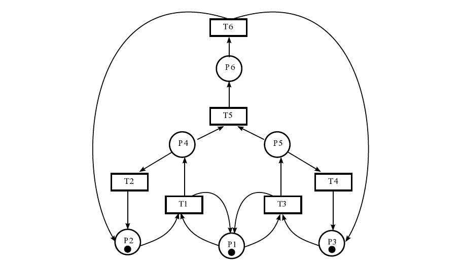
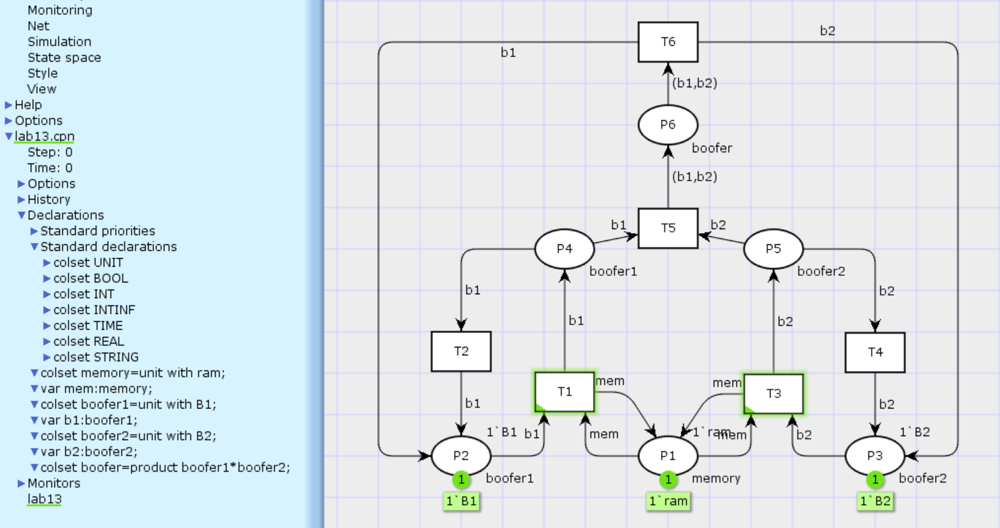
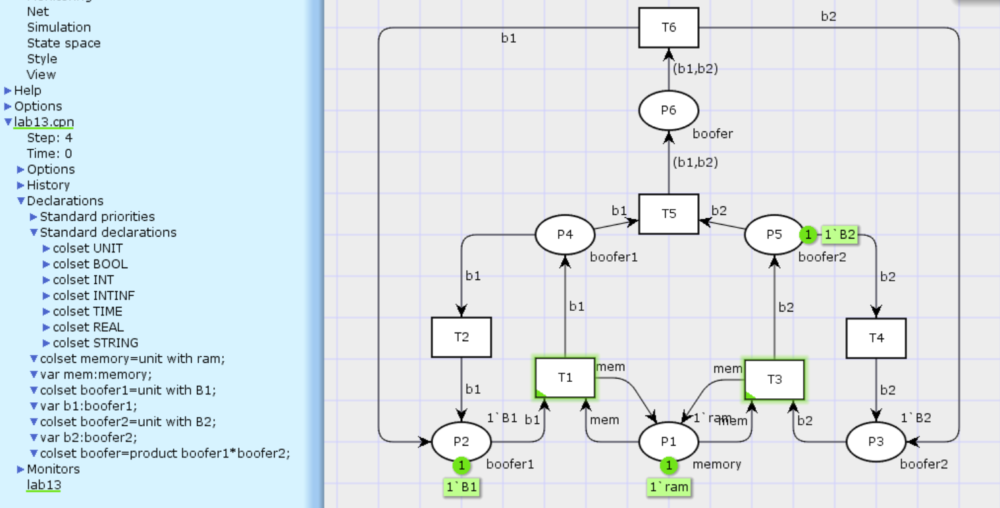
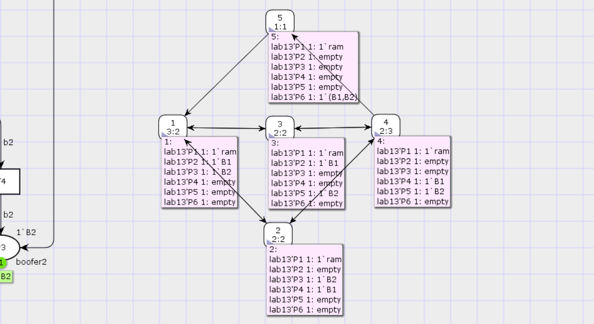

---
## Front matter
lang: "ru"
title: Лабораторная работа № 13
author: Ли Тимофей Александрович, НФИбд-01-18

## Formatting
toc: false
slide_level: 2
theme: metropolis
header-includes: 
 - \metroset{progressbar=frametitle,sectionpage=progressbar,numbering=fraction}
 - '\makeatletter'
 - '\beamer@ignorenonframefalse'
 - '\makeatother'
aspectratio: 43
section-titles: true
---

# Цель работы

Изучить и проанализировать представленную модель, реализовать ее, проанализировать пространство состояний. 

# Модель

Данная модель следующий вид: (рис. -@fig:001):

{ #fig:001 }

# Ход работы

Построил дерево достижимости: (рис. -@fig:002)

{ #fig:002 }

# Ход работы

Пострил модель в cpntools: (рис. -@fig:003)

{ #fig:003 }

# Ход работы

Запустил симуляцию: (рис. -@fig:004)

{ #fig:004 }

# Ход работы

симуляция: (рис. -@fig:005)

{ #fig:005 }

# Ход работы

симуляция: (рис. -@fig:006)

{ #fig:006 }

# Ход работы

симуляция: (рис. -@fig:007)

{ #fig:007 }

# Ход работы

Составил отчет о пространстве состояний: (рис. -@fig:008)

{ #fig:008 }

# Ход работы

Далее построил граф пространства состояний: (рис. -@fig:009)

{ #fig:009 }

# Выводы

Построил и проанализировал представленную сеть Петри.