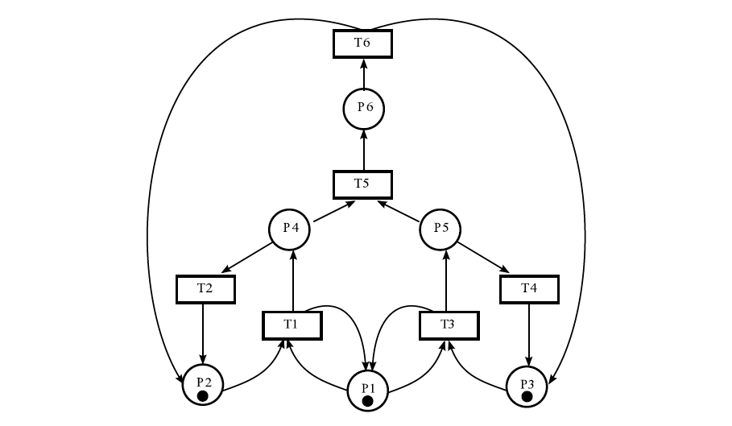
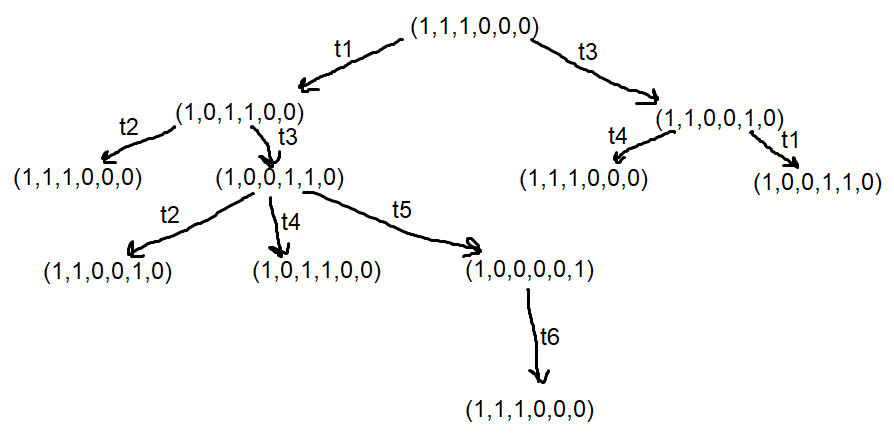
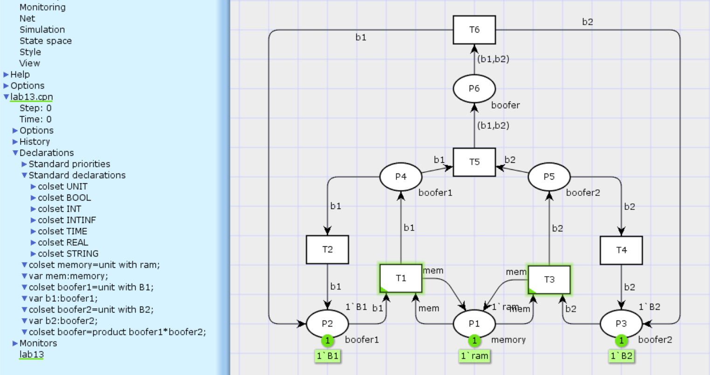
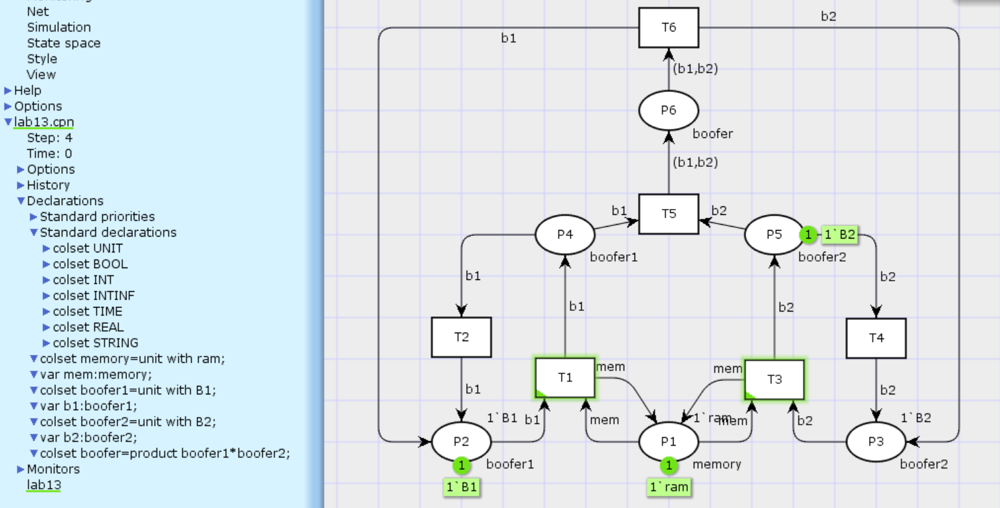
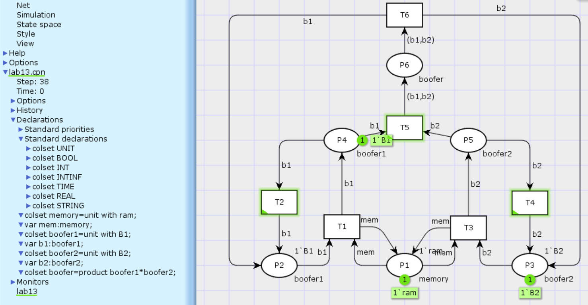
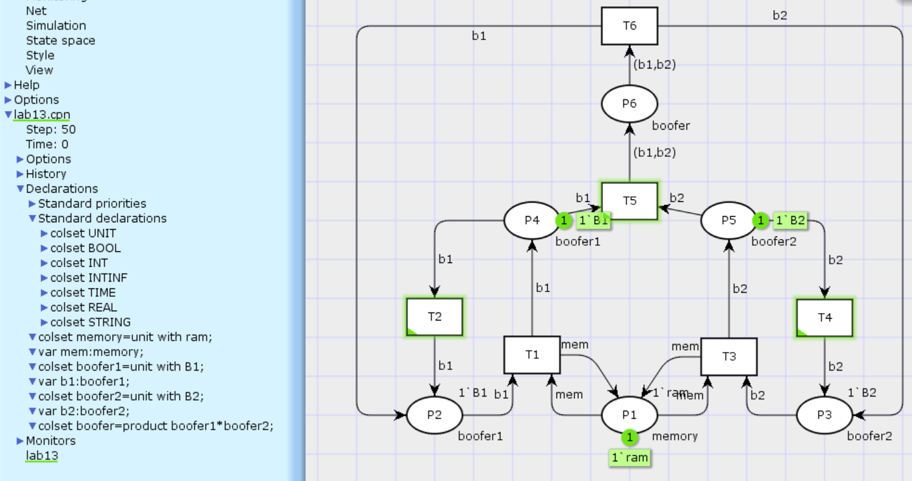
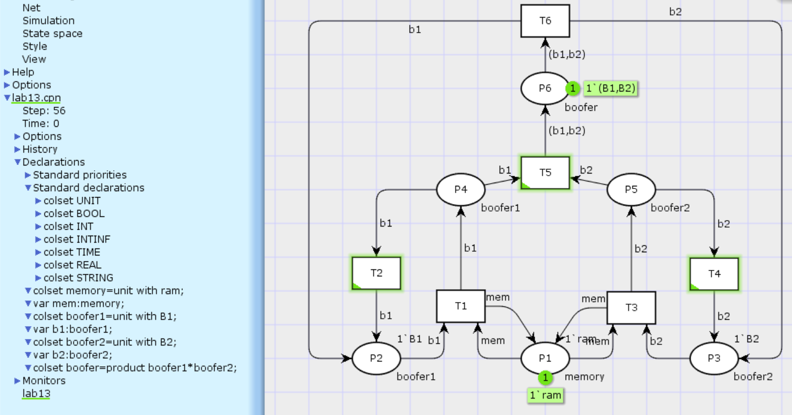
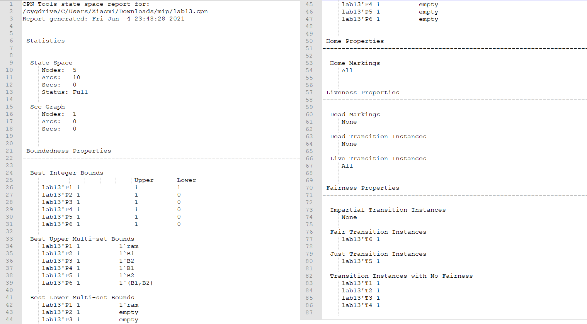
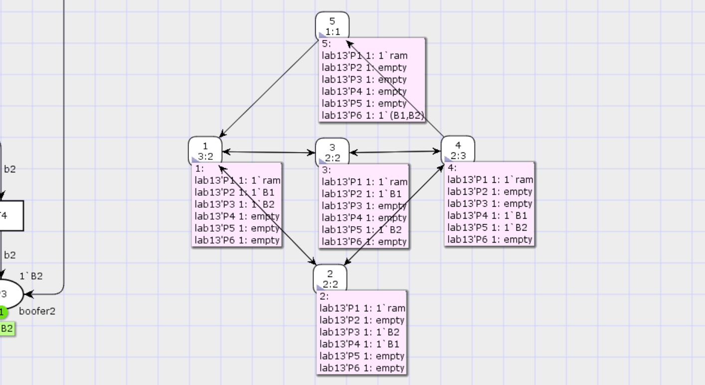


---
# Front matter
lang: "ru"
title: "Лабораторная работа №13"
subtitle: "Задание для самостоятельного выполнения"
author: "Ли Тимофей Александрович"

# Formatting
toc-title: "Содержание"
toc: true # Table of contents
toc_depth: 2
lof: true # List of figures
fontsize: 12pt
linestretch: 1.5
papersize: a4paper
documentclass: scrreprt
mainfont: PT Serif
romanfont: PT Serif
sansfont: PT Sans
monofont: Fira Code
mainfontoptions: Ligatures=TeX
romanfontoptions: Ligatures=TeX
sansfontoptions: Ligatures=TeX,Scale=MatchLowercase
monofontoptions: Scale=MatchLowercase
indent: true
pdf-engine: xelatex
header-includes:
  - \linepenalty=10 # the penalty added to the badness of each line within a paragraph (no associated penalty node) Increasing the value makes tex try to have fewer lines in the paragraph.
  - \interlinepenalty=0 # value of the penalty (node) added after each line of a paragraph.
  - \hyphenpenalty=50 # the penalty for line breaking at an automatically inserted hyphen
  - \exhyphenpenalty=50 # the penalty for line breaking at an explicit hyphen
  - \binoppenalty=700 # the penalty for breaking a line at a binary operator
  - \relpenalty=500 # the penalty for breaking a line at a relation
  - \clubpenalty=150 # extra penalty for breaking after first line of a paragraph
  - \widowpenalty=150 # extra penalty for breaking before last line of a paragraph
  - \displaywidowpenalty=50 # extra penalty for breaking before last line before a display math
  - \brokenpenalty=100 # extra penalty for page breaking after a hyphenated line
  - \predisplaypenalty=10000 # penalty for breaking before a display
  - \postdisplaypenalty=0 # penalty for breaking after a display
  - \floatingpenalty = 20000 # penalty for splitting an insertion (can only be split footnote in standard LaTeX)
  - \raggedbottom # or \flushbottom
  - \usepackage{float} # keep figures where there are in the text
  - \floatplacement{figure}{H} # keep figures where there are in the text
---

# Цель работы

Изучить и проанализировать представленную модель, реализовать ее, проанализировать пространство состояний. 

# Выполнение лабораторной работы

## Модель

Данная модель следующий вид: (рис. -@fig:001):

{ #fig:001 }

## Ход работы

Построил дерево достижимости: (рис. -@fig:002)

{ #fig:002 }

По построенному дереву определил свойства сети:

 - Сеть безопасная, т.к. в каждой позиции может находиться не более одной фишки.
 - По той же причине сеть ограничена.
 - Сеть не сохраняющая, поскольку число фишек в ней меняется (после переходов t5 и t6).
 - Тупиков в сети нет, поскольку все переходы могут быть запущены.

Пострил модель в cpntools: (рис. -@fig:003)

{ #fig:003 }

Запустил симуляцию: (рис. -@fig:004)

{ #fig:004 }

симуляция: (рис. -@fig:005)

{ #fig:005 }

симуляция: (рис. -@fig:006)

{ #fig:006 }

симуляция: (рис. -@fig:007)

{ #fig:007 }

Составил отчет о пространстве состояний: (рис. -@fig:008)

{ #fig:008 }

Пространство состояний содержит 5 узлов. Оно является сильно связным, поскольку содержит 1 сильно компоненту связности.

Свойства ограниченности: позиция, представляющая оперативную память (P1), всегда содержит 1 фишку, остальные могут содержать от 0 до 1 фишки. Это соответствует результату анализа сети с помощью построения дерева.

Все маркировки домашние, так как достижимы из всех остальных. Нет мёртвых маркировок, т.к. из всех есть переходы. Нет мёртвых переходов, т.к. все могут быть задействованы.

Все переходы живые – нет маркировки, по достижении которой какой-то из них не сможет быть потом задействован.

Свойства справедливости: нет переходов со свойством impartial, т.к. для любого перехода есть бесконечная последовательность переходов, где данный переход не задействован. Переход t6 fair, т.к. задействуется всегда, когда доступен. Переход t5 just, так как всегда срабатывает для получения последовательности смены маркировок, в которую включена определённая маркировка (пятая). Остальные переходы имеют тип no fairness, потому что не обязательно будут срабатывать, даже если окажутся доступны, и маркировки, к которым они приводят, можно получить другими путями.

Далее построил граф пространства состояний: (рис. -@fig:009)

{ #fig:009 }

# Выводы

Построил и проанализировал представленную сеть Петри.