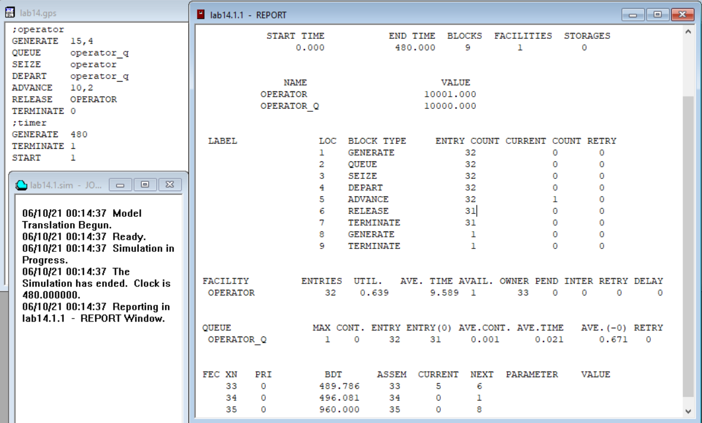
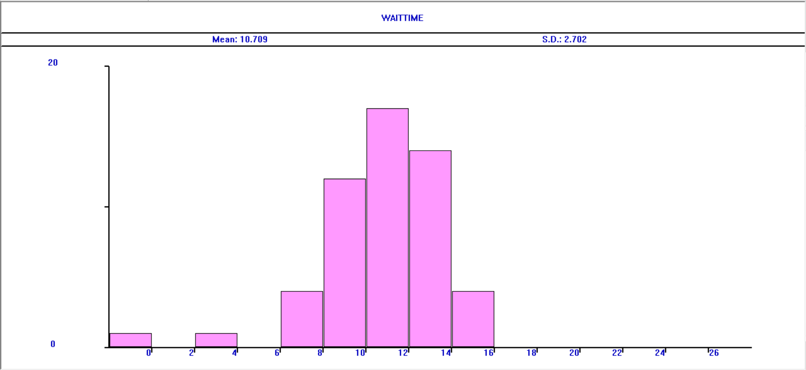
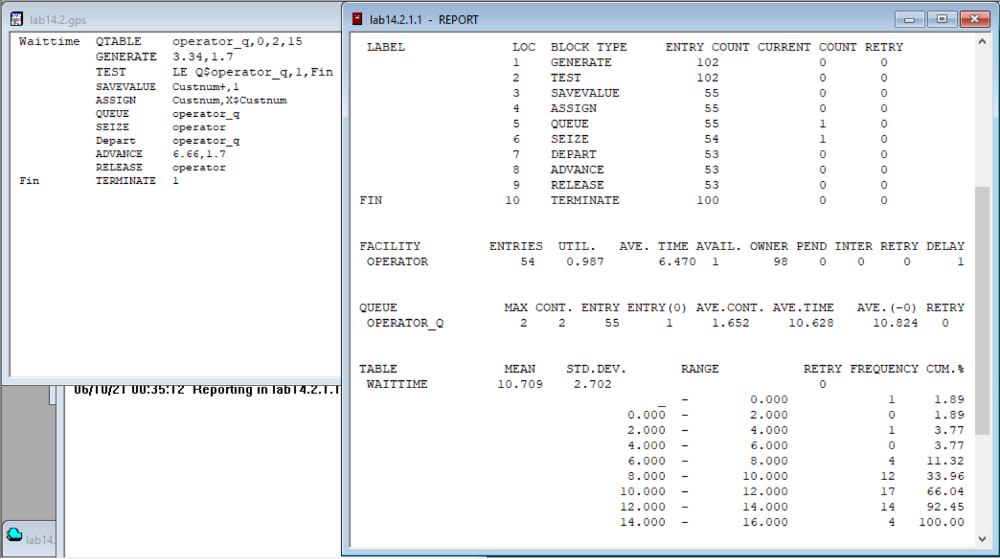

---
## Front matter
lang: "ru"
title: Лабораторная работа № 14
author: Ли Тимофей Александрович, НФИбд-01-18

## Formatting
toc: false
slide_level: 2
theme: metropolis
header-includes: 
 - \metroset{progressbar=frametitle,sectionpage=progressbar,numbering=fraction}
 - '\makeatletter'
 - '\beamer@ignorenonframefalse'
 - '\makeatother'
aspectratio: 43
section-titles: true
---

# Цель работы

Построить и проанализировать модели обработки заказов в GPSS. 

# Ход работы

Построил модель и запустил симуляцию: (рис. -@fig:001):

{ #fig:001 }

# Ход работы

Изменил распределения интервалов получения заказов и времени обработки, запустил симуляцию: (рис. -@fig:002)

{ #fig:002 }

# Ход работы

Построил гистограмму: (рис. -@fig:003)

{ #fig:003 }

# Ход работы

отчет: (рис. -@fig:004)

{ #fig:004 }

# Ход работы

Построил модель обслуживания двух типов заказов: (рис. -@fig:005)

{ #fig:005 }

# Ход работы

Внес изменения, что заявок с доп.услугами теперь 30%: (рис. -@fig:006)

{ #fig:006 }

# Ход работы

Увеличил время, теперь из 332 заявок 116 с доп.услугами, что ближе к 30%: (рис. -@fig:007)

{ #fig:007 }

# Ход работы

Построил модель обработки несколькими операторами: (рис. -@fig:008)

{ #fig:008 }

# Ход работы

Изменил модель, чтобы новые заявки не попадали в очередь, если в ней больше 2 заявок: (рис. -@fig:009)

{ #fig:009 }

# Ход работы

Чтобы увидеть отсечение заявок, увеличил время обработки: (рис. -@fig:010)

{ #fig:010 }

# Выводы

Построил и проанализировал различные модели обработки заявок в GPSS.