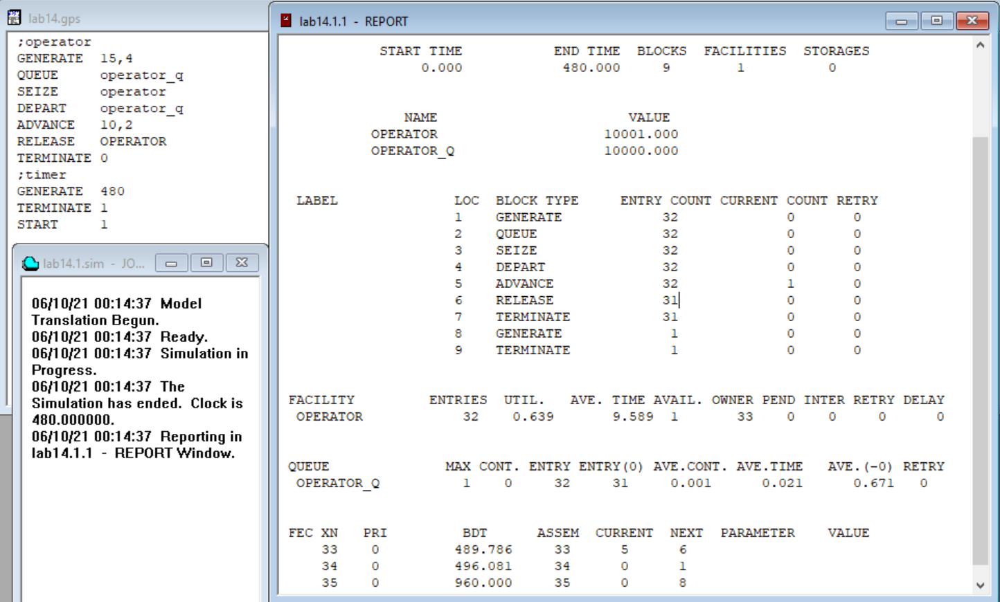
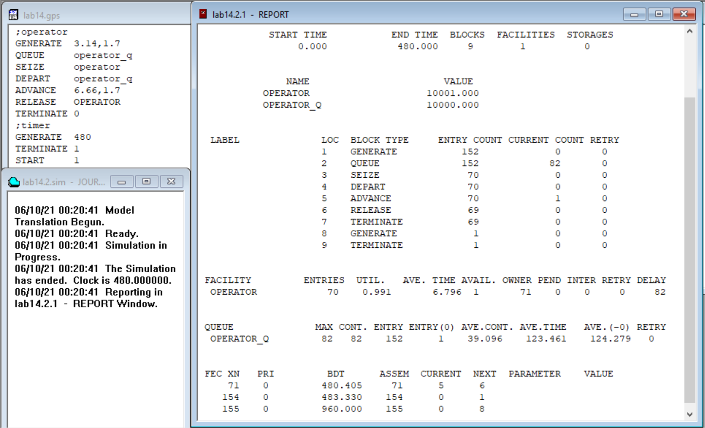
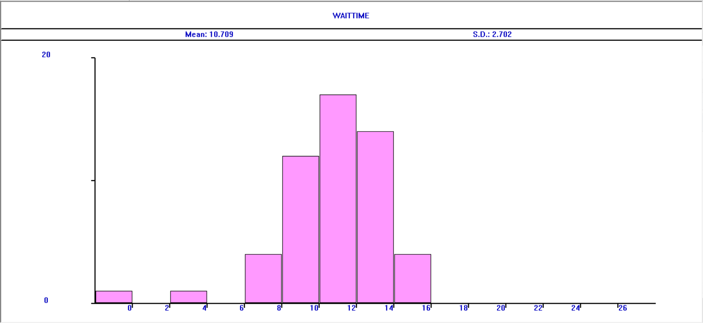
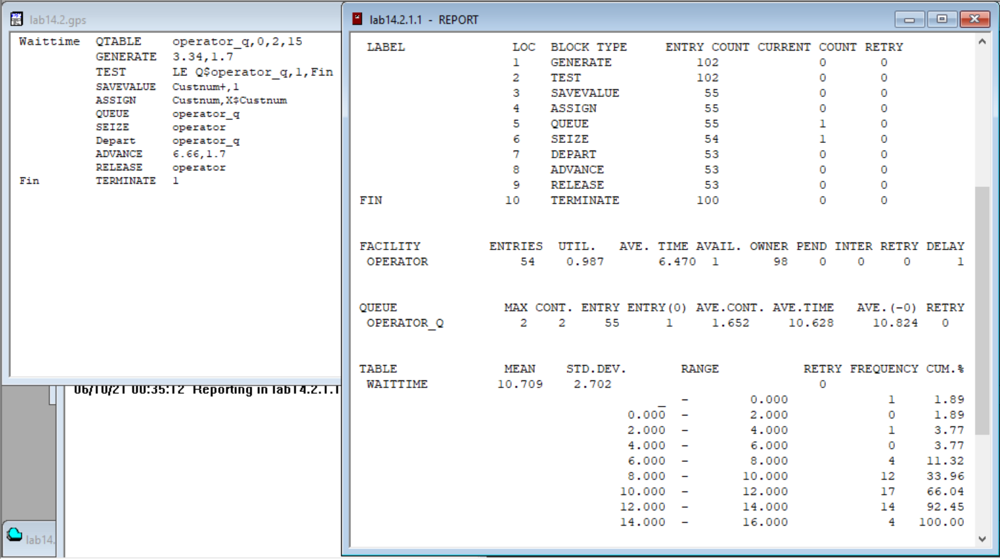
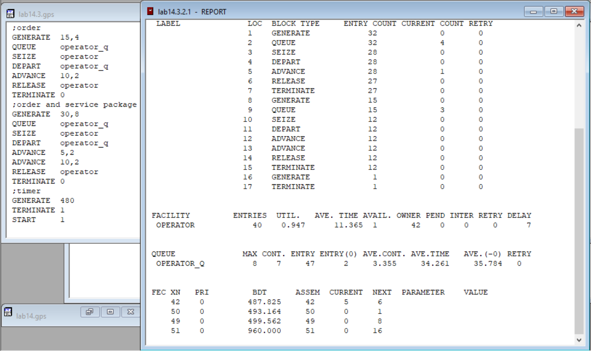
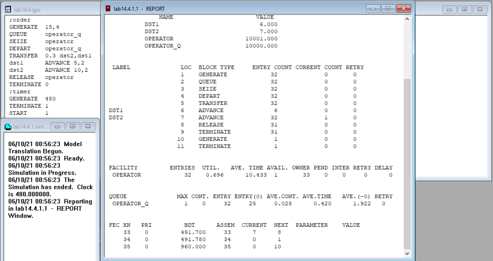
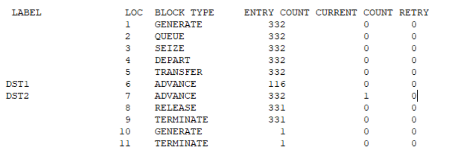
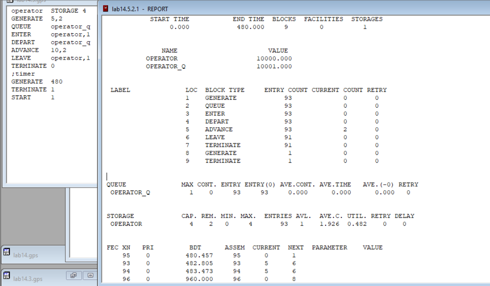
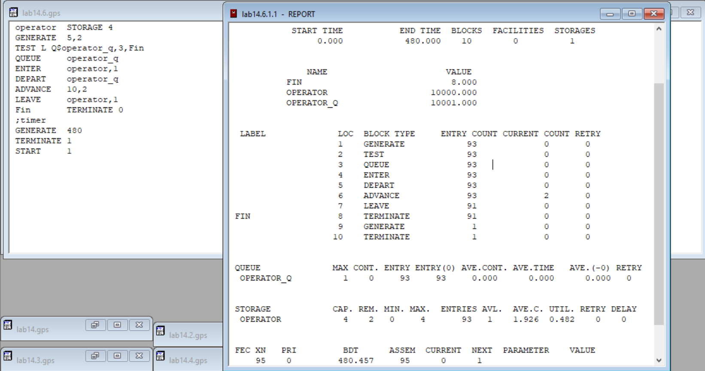
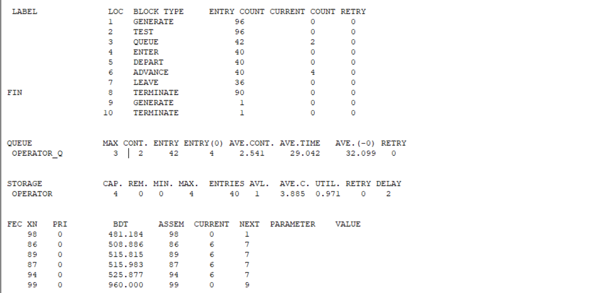


---
# Front matter
lang: "ru"
title: "Лабораторная работа №14"
subtitle: "Модели обработки заказов"
author: "Ли Тимофей Александрович"

# Formatting
toc-title: "Содержание"
toc: true # Table of contents
toc_depth: 2
lof: true # List of figures
fontsize: 12pt
linestretch: 1.5
papersize: a4paper
documentclass: scrreprt
mainfont: PT Serif
romanfont: PT Serif
sansfont: PT Sans
monofont: Fira Code
mainfontoptions: Ligatures=TeX
romanfontoptions: Ligatures=TeX
sansfontoptions: Ligatures=TeX,Scale=MatchLowercase
monofontoptions: Scale=MatchLowercase
indent: true
pdf-engine: xelatex
header-includes:
  - \linepenalty=10 # the penalty added to the badness of each line within a paragraph (no associated penalty node) Increasing the value makes tex try to have fewer lines in the paragraph.
  - \interlinepenalty=0 # value of the penalty (node) added after each line of a paragraph.
  - \hyphenpenalty=50 # the penalty for line breaking at an automatically inserted hyphen
  - \exhyphenpenalty=50 # the penalty for line breaking at an explicit hyphen
  - \binoppenalty=700 # the penalty for breaking a line at a binary operator
  - \relpenalty=500 # the penalty for breaking a line at a relation
  - \clubpenalty=150 # extra penalty for breaking after first line of a paragraph
  - \widowpenalty=150 # extra penalty for breaking before last line of a paragraph
  - \displaywidowpenalty=50 # extra penalty for breaking before last line before a display math
  - \brokenpenalty=100 # extra penalty for page breaking after a hyphenated line
  - \predisplaypenalty=10000 # penalty for breaking before a display
  - \postdisplaypenalty=0 # penalty for breaking after a display
  - \floatingpenalty = 20000 # penalty for splitting an insertion (can only be split footnote in standard LaTeX)
  - \raggedbottom # or \flushbottom
  - \usepackage{float} # keep figures where there are in the text
  - \floatplacement{figure}{H} # keep figures where there are in the text
---

# Цель работы

Построить и проанализировать модели обработки заказов в GPSS. 

# Выполнение лабораторной работы

## Ход работы

Построил модель и запустил симуляцию: (рис. -@fig:001):

{ #fig:001 }

Изменил распределения интервалов получения заказов и времени обработки, запустил симуляцию: (рис. -@fig:002)

{ #fig:002 }

Время, число задействованных блоков и устройств не изменилось. Успело поступить больше (152) заявки, а обслужено было только 69 (70 не была завершена). Так получилось, потому что в этот раз, в отличие от прошлого, заказы поступали быстрее, чем оператор их обрабатывал. Заявок было больше и получено, и обработано, потому что период поступления уменьшился, и время обработки тоже.
Оператор получил 71 заявку, принял в обработку 70. У оператора повысилась полезность (он не сидел без работы, ожидая заявок). Уменьшилось среднее время обработки (следствие уменьшения параметра в модели).
У очереди максимальное значение значительно увеличилось (с 1 до 82), и на выходе осталось 82 заявки в очереди. Всего одна заявка прошла без ожидания. Средняя длина возросла до 39, среднее время до 123,5 (без учёта единственной прошедшей без ожидания заявки до 124,3).
В последнем блоке изменились только числа, смысл остался тот же – какими будут следующие события.

Построил гистограмму: (рис. -@fig:003)

{ #fig:003 }

отчет: (рис. -@fig:004)

{ #fig:004 }

По гистограмме видно что для большинства заявок время ожидания лежит в пределах от 8 до 14 минут, встречаются и другие случаи, но их намного меньше.

Здесь мы задавали число заявок, а не время, время получилось автоматически. Из-за того, что заявки отбрасывались, в очередь попали только 55 из 102. Завершена была обработка 53. При этом получено для обработки было 98 заявок. Появился новый блок, в котором видим данные, по которым строится гистограмма.

Построил модель обслуживания двух типов заказов: (рис. -@fig:005)

{ #fig:005 }

Поступило 32 простых заявки и 15 с доп. услугами. Из них попало в обработку 28 и 12 соответственно (по 4 и 3 осталось в очереди к концу симуляции). В момент завершения симуляции обрабатывалась обычная заявка. В блоках про оператора и очередь видим общую статистику: к оператору попало 42 заказа, обработал он 40, полезность 95%, среднее время обработки 11,4 минуты, то есть, меньше, чем если бы поступали только заявки с доп. услугами, и больше, чем если бы только простые. Длина очереди максимально – 8, по окончании рабочего времени 7 (как видно выше, 4 обычных и 3 с доп. услугами). Без ожидания к оператору попали 2 заявки. Средняя длина очереди 3,6, время ожидания 34 (36 без тех заявок, которые прошли без ожидания).

Внес изменения, что заявок с доп.услугами теперь 30%: (рис. -@fig:006)

{ #fig:006 }

Поступило 32 заявки, из них 6 – с доп.услугами (должно быть около 10), скорее всего, из-за того, что заявок мало, получаем такое отклонение.

Обслужена 31 заявка, 1 обычная находилась в обработке в момент завершения рабочего времени. Оператору успело поступить 33 заявки, а принять он успел 32. Его полезность 70%, обрабатывал заявки в среднем 10.4 минуты, что меньше, чем в предыдущем примере, т.к. и процент заявок с доп.услугами получается меньше. Длина очереди не превышала 1, и 25 заявок прошло без ожидания. Поэтому средняя длина и время ожидания низкие.

Увеличил время, теперь из 332 заявок 116 с доп.услугами, что ближе к 30%: (рис. -@fig:007)

{ #fig:007 }

Построил модель обработки несколькими операторами: (рис. -@fig:008)

{ #fig:008 }

Видим, что в данном случае используется одно многоканальное устройство, а не одноканальное. Получено 93 заявки, 91 обработана, 2 не завершены. Очередь составляла не более 1 заявки, все заявки прошли без задержек, поэтому средняя длина и время ожидания в очереди нулевые. В блоке многоканального устройства видим, что всего у нас 4 оператора, из которых 2 не занято на момент окончания симуляции. Вошло в устройство 93 заявки. Среднее кол-во занятых операторов 1,9. Полезность 48%. Максимально за весь период было занято 4 оператора сразу, минимально 0.

Изменил модель, чтобы новые заявки не попадали в очередь, если в ней больше 2 заявок: (рис. -@fig:009)

{ #fig:009 }

Получаем, что максимальная длина очереди 1, и все заявки проходят без очереди. Нагрузка на операторов – 48%. В среднем загружены 2 из 4 операторов. Так получается потому, что операторы, в среднем, обрабатывают заявки быстрее, чем они поступают.

Чтобы увидеть отсечение заявок, увеличил время обработки: (рис. -@fig:010)

{ #fig:010 }

Видим, что из 96 заявок только 40 пошли в обработку, а максимальная длина очереди 3.

# Выводы

Построил и проанализировал различные модели обработки заявок в GPSS.