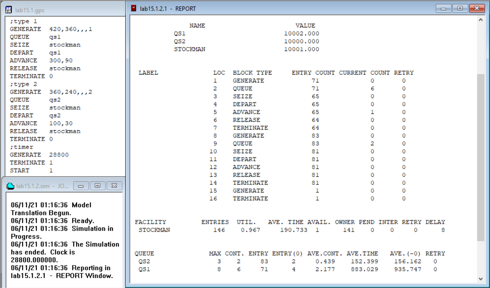
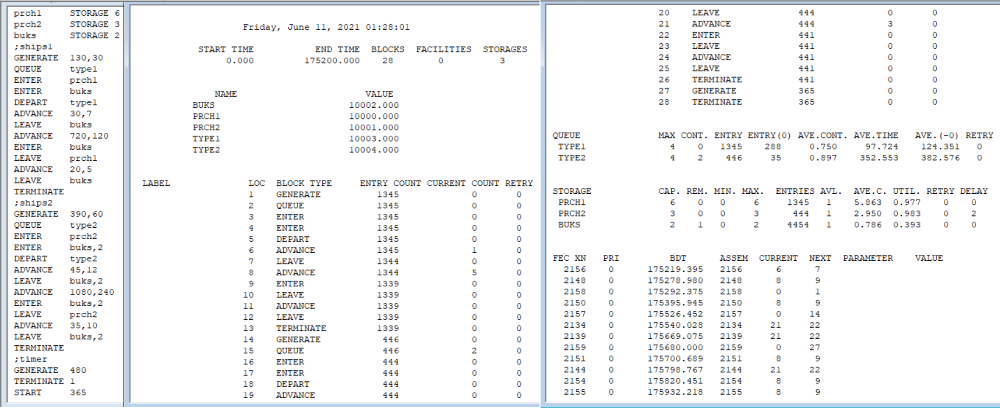


---
# Front matter
lang: "ru"
title: "Лабораторная работа №15"
subtitle: "Модели обслуживания с приоритетом"
author: "Ли Тимофей Александрович"

# Formatting
toc-title: "Содержание"
toc: true # Table of contents
toc_depth: 2
lof: true # List of figures
fontsize: 12pt
linestretch: 1.5
papersize: a4paper
documentclass: scrreprt
mainfont: PT Serif
romanfont: PT Serif
sansfont: PT Sans
monofont: Fira Code
mainfontoptions: Ligatures=TeX
romanfontoptions: Ligatures=TeX
sansfontoptions: Ligatures=TeX,Scale=MatchLowercase
monofontoptions: Scale=MatchLowercase
indent: true
pdf-engine: xelatex
header-includes:
  - \linepenalty=10 # the penalty added to the badness of each line within a paragraph (no associated penalty node) Increasing the value makes tex try to have fewer lines in the paragraph.
  - \interlinepenalty=0 # value of the penalty (node) added after each line of a paragraph.
  - \hyphenpenalty=50 # the penalty for line breaking at an automatically inserted hyphen
  - \exhyphenpenalty=50 # the penalty for line breaking at an explicit hyphen
  - \binoppenalty=700 # the penalty for breaking a line at a binary operator
  - \relpenalty=500 # the penalty for breaking a line at a relation
  - \clubpenalty=150 # extra penalty for breaking after first line of a paragraph
  - \widowpenalty=150 # extra penalty for breaking before last line of a paragraph
  - \displaywidowpenalty=50 # extra penalty for breaking before last line before a display math
  - \brokenpenalty=100 # extra penalty for page breaking after a hyphenated line
  - \predisplaypenalty=10000 # penalty for breaking before a display
  - \postdisplaypenalty=0 # penalty for breaking after a display
  - \floatingpenalty = 20000 # penalty for splitting an insertion (can only be split footnote in standard LaTeX)
  - \raggedbottom # or \flushbottom
  - \usepackage{float} # keep figures where there are in the text
  - \floatplacement{figure}{H} # keep figures where there are in the text
---

# Цель работы

Построить модели обслуживания с приоритетами в GPSS. 

# Выполнение лабораторной работы

## Ход работы

Построил модель обслуживания механиков и запустил симуляцию: (рис. -@fig:001):

{ #fig:001 }

В ходе выполнения задействуются 16 блоков и 1 одноканальное устройство – кладовщик. Поступает 71 заявка первой категории и 83 второй. Из них соответственно 65 и 81 поступают на обработку, 6 и 2 остаётся в очереди к концу смены, 1 из первой категории находится в обработке. Всего закончена обработка 64 запросов первой категории и 81 второй.
Всего кладовщик получает 146 запросов, обрабатывает их в среднем за 190,7 секунд, его полезность 97%. Задержка составляет 8 – столько всего запросов в обеих очередях на момент окончания симуляции.
В очереди первой категории было максимум 8 заявок, второй – 3. Средняя длина также выше у первой очереди (2,177 против 0,439). То же самое со средним временем ожидания – оно выше у заявок первого типа в несколько раз, как с учётом заявок, прошедших без ожидания, так без учёта.

Построил одель обслуживания судов в порту и запустил симуляцию: (рис. -@fig:002)

{ #fig:002 }

Время моделирования составило 175200 минут. Использовалось 28 блоков. 3 многоканальных устройства – 2 причала и буксиры.
Всего прибыло 1345 малотоннажных кораблей, из них 1339 покинуло порт, 1 причаливает в момент окончания симуляции, 5 стоят на разгрузке. Большегрузов прибыло 446, из них 2 ожидают входа в порт, 3 на разгрузке, 441 покинул порт.
Статистика по очередям: малотоннажных в очереди было максимум 4, на конец симуляции 0, без ожидания в порт вошли 288, в среднем очередь состояла из 0,75 корабля. В среднем время ожидания входа в порт составило около 98 минут с учётом кораблей, прошедших без ожидания и 124 минуты без их учёта. 
Для крупных кораблей очередь так же не превышала 4 кораблей, на момент окончания симуляции состояла из двух, без ожидания прошло 35 кораблей. В среднем в очереди стояло 0,897 корабля. Среднее время ожидания входа в порт кораблей этого типа составило около 353 минут с учётом прошедших, не ожидая, и 383 без учёта таковых.
Статистика по причалам и буксирам. Причал для малых судов содержит 6 мест, на момент окончания симуляции свободных нет. Минимальная и максимальная занятость 0 и 6 мест. Принято 1345 судов (судно, в данный момент буксируемое к причалу, учитывается, т. к. место для него уже выделено). В среднем занято было 5,9 мест. Полезность первого причала составила 98%.
Причал для крупных судов вмещает 3 корабля, на данный момент нет свободных мест. Минимально было занято 0 мест, максимально 3. Принято за всё время 444 корабля. В среднем занято 2,95 мест. Полезность второго причала 98%. Задержка 2 – это те корабли, что ожидают в очереди.
Буксиров всего 2, доступен 1. Минимально задействовано было 0, максимально 2. Всего буксиры были задействованы 4454 раза – по одному на каждый вход малых судов, по два на больших, по столько же на каждый выход. В среднем было задействовано 0,786 буксира. Их полезность – 39%.
В последнем разделе видим, какие события должны происходить далее – причаливание буксируемого корабля, отчаливание одного из малых кораблей, стоящих у причала, прибытие нового малого корабля, отчаливание малого, снова прибытие нового, но большого, отчаливание двух больших, окончание рабочего дня, отчаливание малого, большого, двух малых.

# Выводы

Построил и проанализировал различные модели обслуживания с приоритетом в GPSS.