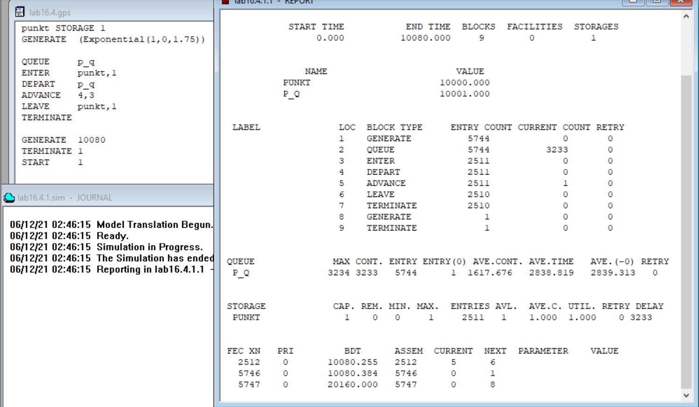

---
## Front matter
lang: "ru"
title: Лабораторная работа № 16
author: Ли Тимофей Александрович, НФИбд-01-18

## Formatting
toc: false
slide_level: 2
theme: metropolis
header-includes: 
 - \metroset{progressbar=frametitle,sectionpage=progressbar,numbering=fraction}
 - '\makeatletter'
 - '\beamer@ignorenonframefalse'
 - '\makeatother'
aspectratio: 43
section-titles: true
---

# Цель работы

Изучить задачи оптимизации, реализовать модели двух стратегий обслуживания в GPSS. 

# Ход работы

Построил модель первой стратегии и запустил симуляцию: (рис. -@fig:001):

{ #fig:001 }

# Ход работы

Построил модель второй стратегии и запустил симуляцию: (рис. -@fig:002)

{ #fig:002 }

# Ход работы

Составил таблицу: (рис. -@fig:003)

{ #fig:003 }

# Ход работы

1 с 1: (рис. -@fig:004)

{ #fig:004 }

# Ход работы

1 с 3: (рис. -@fig:005)

{ #fig:005 }

# Ход работы

1 с 4: (рис. -@fig:006)

{ #fig:006 }

# Ход работы

Таблица оцениваемых параметров: (рис. -@fig:007)

{ #fig:007 }

# Ход работы

2 с 1: (рис. -@fig:008)

{ #fig:008 }

# Ход работы

2 с 3: (рис. -@fig:009)

{ #fig:009 }

# Ход работы

2 с 4: (рис. -@fig:010)

{ #fig:010 }

# Ход работы

Таблица оцениваемых параметров: (рис. -@fig:011)

{ #fig:011 }

# Выводы

Изучил задачи оптимизации, реализовал модели двух стратегий обслуживания в GPSS.