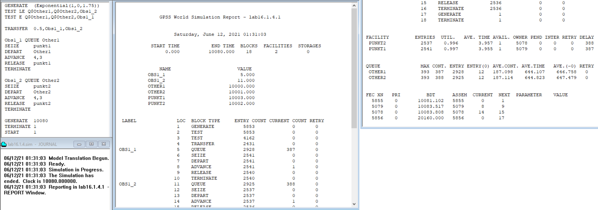
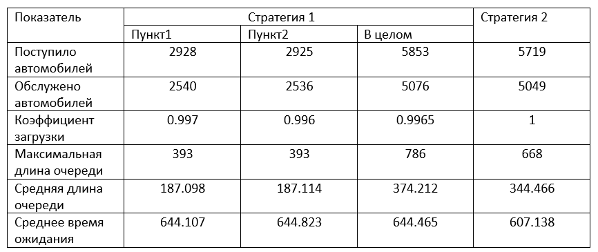
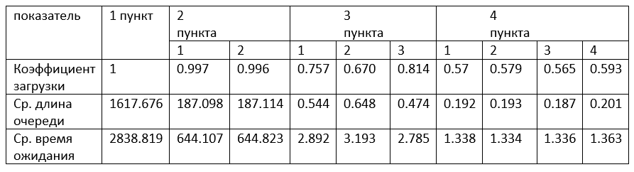
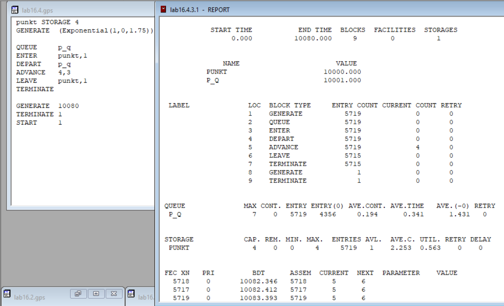

---
# Front matter
lang: "ru"
title: "Лабораторная работа №16"
subtitle: "Задачи оптимизации"
author: "Ли Тимофей Александрович"

# Formatting
toc-title: "Содержание"
toc: true # Table of contents
toc_depth: 2
lof: true # List of figures
fontsize: 12pt
linestretch: 1.5
papersize: a4paper
documentclass: scrreprt
mainfont: PT Serif
romanfont: PT Serif
sansfont: PT Sans
monofont: Fira Code
mainfontoptions: Ligatures=TeX
romanfontoptions: Ligatures=TeX
sansfontoptions: Ligatures=TeX,Scale=MatchLowercase
monofontoptions: Scale=MatchLowercase
indent: true
pdf-engine: xelatex
header-includes:
  - \linepenalty=10 # the penalty added to the badness of each line within a paragraph (no associated penalty node) Increasing the value makes tex try to have fewer lines in the paragraph.
  - \interlinepenalty=0 # value of the penalty (node) added after each line of a paragraph.
  - \hyphenpenalty=50 # the penalty for line breaking at an automatically inserted hyphen
  - \exhyphenpenalty=50 # the penalty for line breaking at an explicit hyphen
  - \binoppenalty=700 # the penalty for breaking a line at a binary operator
  - \relpenalty=500 # the penalty for breaking a line at a relation
  - \clubpenalty=150 # extra penalty for breaking after first line of a paragraph
  - \widowpenalty=150 # extra penalty for breaking before last line of a paragraph
  - \displaywidowpenalty=50 # extra penalty for breaking before last line before a display math
  - \brokenpenalty=100 # extra penalty for page breaking after a hyphenated line
  - \predisplaypenalty=10000 # penalty for breaking before a display
  - \postdisplaypenalty=0 # penalty for breaking after a display
  - \floatingpenalty = 20000 # penalty for splitting an insertion (can only be split footnote in standard LaTeX)
  - \raggedbottom # or \flushbottom
  - \usepackage{float} # keep figures where there are in the text
  - \floatplacement{figure}{H} # keep figures where there are in the text
---

# Цель работы

Изучить задачи оптимизации, реализовать модели двух стратегий обслуживания в GPSS. 

# Выполнение лабораторной работы

## Ход работы

Построил модель первой стратегии и запустил симуляцию: (рис. -@fig:001):

{ #fig:001 }

Построил модель второй стратегии и запустил симуляцию: (рис. -@fig:002)

{ #fig:002 }

Составил таблицу: (рис. -@fig:003)

{ #fig:003 }

Получается, что при первой стратегии обслуживается больше автомобилей, но при второй меньше максимальная и средняя длины очередей и время ожидания. Также коэффициент загрузки обоих пунктов тоже выше при второй стратегии, значит, при ней нет простоев. Можно ещё посчитать процент обслуженных автомобилей при каждой стратегии. Видим, что вторая стратегия лучше первой.

Далее Построил модели обеих стратегий с 1, 3 и 4 пунктами (2 уже реализованы) и сравнил, следуя условиям.

1 с 1: (рис. -@fig:004)

{ #fig:004 }

1 с 3: (рис. -@fig:005)

{ #fig:005 }

1 с 4: (рис. -@fig:006)

{ #fig:006 }

Таблица оцениваемых параметров: (рис. -@fig:007)

{ #fig:007 }

Варианты с 1 и 2 пунктами не подходят, потому что их коэффициенты нагрузки выше 0,95, длина очереди и время ожидания тоже выше требуемых. Варианты с 3 и 4 пунктами вписываются в требуемые рамки, у варианта с тремя выше коэффициент нагрузки, зато вариант с 4 делает длину очереди и время ожидания очень маленькими. Я считаю, вариант с 4 пунктами лучше, поскольку в нем очереди меньше, они быстрее проходят, а меньший коэффициент загрузки нельзя назвать в этом случае простоем.

2 с 1: (рис. -@fig:008)

{ #fig:008 }

2 с 3: (рис. -@fig:009)

{ #fig:009 }

2 с 4: (рис. -@fig:010)

{ #fig:010 }

Таблица оцениваемых параметров: (рис. -@fig:011)

{ #fig:011 }

Здесь все так же, как и в первой стратегии: первые два варианта превышают лимит коэффициента нагрузки, а четвертый я считаю лучшим, поскольку очереди меньше, они быстрее проходят, и разницу коэффициентов загрузки нельзя назвать простоем.

# Выводы

Изучил задачи оптимизации, реализовал модели двух стратегий обслуживания в GPSS.