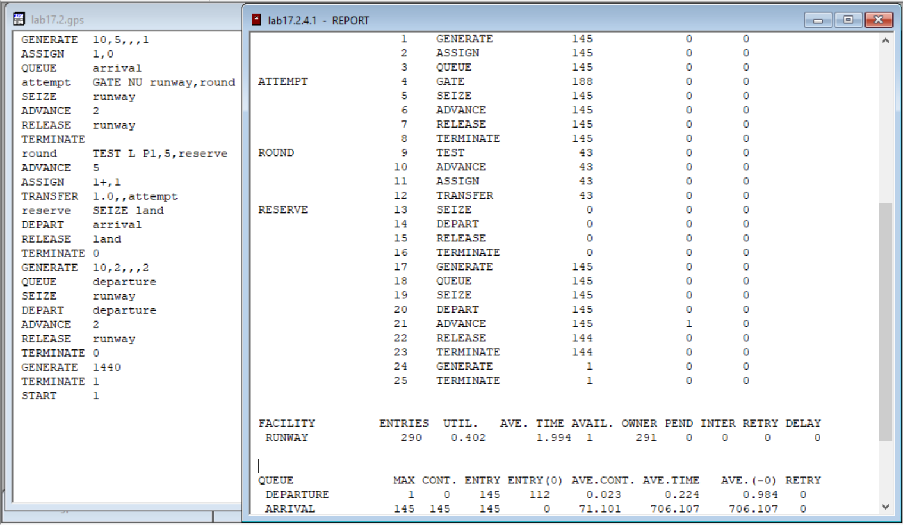
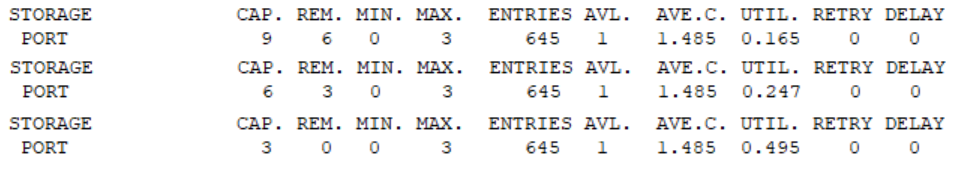
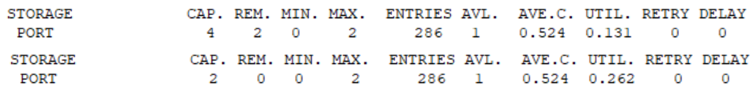

---
## Front matter
lang: "ru"
title: Лабораторная работа № 17
author: Ли Тимофей Александрович, НФИбд-01-18

## Formatting
toc: false
slide_level: 2
theme: metropolis
header-includes: 
 - \metroset{progressbar=frametitle,sectionpage=progressbar,numbering=fraction}
 - '\makeatletter'
 - '\beamer@ignorenonframefalse'
 - '\makeatother'
aspectratio: 43
section-titles: true
---

# Цель работы

Выполнить задания по моделированию вычислительного центра, аэропорта и морского порта. 

# Ход работы

17.1 Построил модель ЭВМ и запустил симуляцию: (рис. -@fig:001):

{ #fig:001 width=80%}

# Ход работы

17.2 Построил модель аэропорта и запустил симуляцию: (рис. -@fig:002)

{ #fig:002 width=80%}

# Ход работы

17.3 1) Построил модель морского порта и запустил симуляцию: (рис. -@fig:003)

{ #fig:003 width=80%}

# Ход работы

Данные для 9, 6 и 3 причалов соответственно: (рис. -@fig:004)

{ #fig:004 }

# Ход работы

17.3 2) Построил модель морского порта и запустил симуляцию: (рис. -@fig:005)

{ #fig:005 width=80%}

# Ход работы

Данные для 4 и 2 причалов: (рис. -@fig:006)

{ #fig:006 }

# Выводы

Выполнил поставленные задачи, используя GPSS.