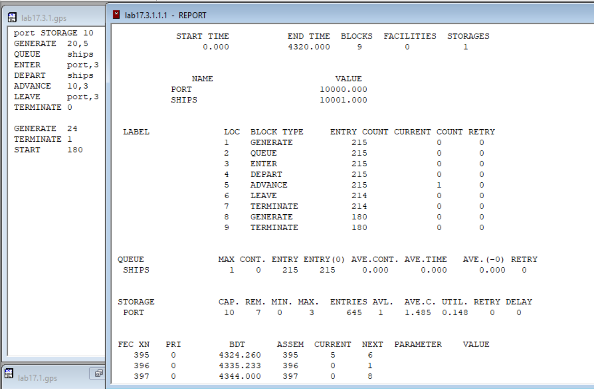

---
# Front matter
lang: "ru"
title: "Лабораторная работа №17"
subtitle: "Задания для самостоятельной работы"
author: "Ли Тимофей Александрович"

# Formatting
toc-title: "Содержание"
toc: true # Table of contents
toc_depth: 2
lof: true # List of figures
fontsize: 12pt
linestretch: 1.5
papersize: a4paper
documentclass: scrreprt
mainfont: PT Serif
romanfont: PT Serif
sansfont: PT Sans
monofont: Fira Code
mainfontoptions: Ligatures=TeX
romanfontoptions: Ligatures=TeX
sansfontoptions: Ligatures=TeX,Scale=MatchLowercase
monofontoptions: Scale=MatchLowercase
indent: true
pdf-engine: xelatex
header-includes:
  - \linepenalty=10 # the penalty added to the badness of each line within a paragraph (no associated penalty node) Increasing the value makes tex try to have fewer lines in the paragraph.
  - \interlinepenalty=0 # value of the penalty (node) added after each line of a paragraph.
  - \hyphenpenalty=50 # the penalty for line breaking at an automatically inserted hyphen
  - \exhyphenpenalty=50 # the penalty for line breaking at an explicit hyphen
  - \binoppenalty=700 # the penalty for breaking a line at a binary operator
  - \relpenalty=500 # the penalty for breaking a line at a relation
  - \clubpenalty=150 # extra penalty for breaking after first line of a paragraph
  - \widowpenalty=150 # extra penalty for breaking before last line of a paragraph
  - \displaywidowpenalty=50 # extra penalty for breaking before last line before a display math
  - \brokenpenalty=100 # extra penalty for page breaking after a hyphenated line
  - \predisplaypenalty=10000 # penalty for breaking before a display
  - \postdisplaypenalty=0 # penalty for breaking after a display
  - \floatingpenalty = 20000 # penalty for splitting an insertion (can only be split footnote in standard LaTeX)
  - \raggedbottom # or \flushbottom
  - \usepackage{float} # keep figures where there are in the text
  - \floatplacement{figure}{H} # keep figures where there are in the text
---

# Цель работы

Выполнить задания по моделированию вычислительного центра, аэропорта и морского порта. 

# Выполнение лабораторной работы

## Ход работы

17.1 Построил модель ЭВМ и запустил симуляцию: (рис. -@fig:001):

{ #fig:001 }

Здесь мы видим, что загрузка ЭВМ составляет 99,4%. Также замечаем, что задачи типа С не успевают занять память, поскольку первой поступает задача другого типа, а потом память полностью не освобождается, что необходимо для задач С.

17.2 Построил модель аэропорта и запустил симуляцию: (рис. -@fig:002)

{ #fig:002 }

Количество взлетевших самолётов – это число самолетов, вошедших в блок 24, то есть 144. Также видим, что один самолет взлетает на момент окончания моделирования. Севшие – вошедшие в 9 блок, то есть 145. Ушедшие на запасной аэродром – вошедшие в 17 блок, то есть 0. Коэффициент загрузки взлётно-посадочной полосы равен 40,2%.

17.3 1) Построил модель морского порта и запустил симуляцию: (рис. -@fig:003)

{ #fig:003 }

Коэффициент загрузки - 14,8%. Очевидно, для повышения коэффициента надо перебирать случаи, когда число причалов кратно трем, поскольку прибывающие корабли занимают и освобождают по три причала одновременно.
Я проверил модель с 9 причалами, и коэффициент составил 16,5%. Далее решил проверить 6 и 3 и получил соответственно 24,7% и 49,5%. Видим увеличение продуктивности по мере уменьшения числа причалов, значит варианты более 10 причалов смотреть не будем, а меньше трех - невозможно. Значит, оптимальное число - 3 причала.

Данные для 9, 6 и 3 причалов соответственно: (рис. -@fig:004)

{ #fig:004 }

17.3 2) Построил модель морского порта и запустил симуляцию: (рис. -@fig:005)

{ #fig:005 }

Загрузка - 8,7%. По той же логике, что и прошлом пункте, проверяет варианты, кратные двум. Я решил проверить варианты меньше шести, и здесь это так же работает, при 4 и 2 причалах загрузка увеличилась, и при двух она максимальная - 26,2%.

Данные для 4 и 2 причалов: (рис. -@fig:006)

{ #fig:006 }

Вообще загрузка увеличивается с уменьшением числа причалов, но без увеличения очереди, потому что у нас максимальное время обработки корабля меньше, чем минимальное время прибытия, соответственно причалы простаивают в любом случае. Во втором пункте разница минимального прибытия и максимальной обработки больше, чем в первом, и из-за этого загрузка меньше.

# Выводы

Выполнил поставленные задачи, используя GPSS.