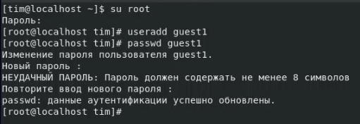
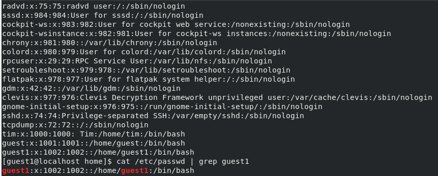

---
## Front matter
lang: "ru"
title: Лабораторная работа № 1
author: Ли Тимофей Александрович, НФИбд-01-18

## Formatting
toc: false
slide_level: 2
theme: metropolis
header-includes: 
 - \metroset{progressbar=frametitle,sectionpage=progressbar,numbering=fraction}
 - '\makeatletter'
 - '\beamer@ignorenonframefalse'
 - '\makeatother'
aspectratio: 43
section-titles: true
---

# Цель работы

Приобретение практических навыков установки операционной системы на виртуальную машину, настройки минимально необходимых для дальнейшей работы сервисов. 

# Выполнение лабораторной работы

Скачал iso-образ CentOS, запустил VirtualBox и создал виртуальную машину Base со всеми необходимыми параметрами: (рис. -@fig:001):

{ #fig:001 }

# Выполнение лабораторной работы

Запустил ВМ, произвел установку операционной системы, поставил пароль на root, а также создал пользователя Tim. Затем я обновил менеджер пакетов yum: (рис. -@fig:002)

{ #fig:002 }

# Выполнение лабораторной работы

Также с помощью yum я установил midnight commander (mc): (рис. -@fig:003)

{ #fig:003 }

# Выводы

Выполнил задание, установил ОС на ВМ, настроил минимально необходимые сервисы.