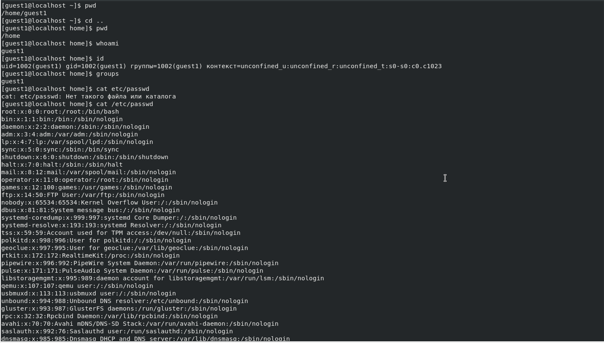

---
## Front matter
lang: "ru"
title: Лабораторная работа № 2
author: Ли Тимофей Александрович, НФИбд-01-18

## Formatting
toc: false
slide_level: 2
theme: metropolis
header-includes: 
 - \metroset{progressbar=frametitle,sectionpage=progressbar,numbering=fraction}
 - '\makeatletter'
 - '\beamer@ignorenonframefalse'
 - '\makeatother'
aspectratio: 43
section-titles: true
---

# Цель работы

Получение практических навыков работы в консоли с атрибутами файлов, закрепление теоретических основ дискреционного разграничения доступа в современных системах с открытым кодом на базе ОС Linux.

# Выполнение лабораторной работы

{ #fig:001 }

# Выполнение лабораторной работы

{ #fig:002 }

# Выполнение лабораторной работы

{ #fig:003 }

# Выполнение лабораторной работы

{ #fig:004 }

# Выполнение лабораторной работы

{ #fig:005 }

# Выполнение лабораторной работы

{ #fig:006 }

# Выполнение лабораторной работы

{ #fig:007 }

# Выполнение лабораторной работы

{ #fig:008 }

# Выполнение лабораторной работы

{ #fig:009 }

# Выводы

Получил практические навыки работы в консоли с атрибутами файлов, закрепил теоретические основы дискреционного разграничения доступа в современных системах с открытым кодом на базе ОС Linux.
