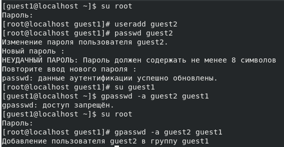
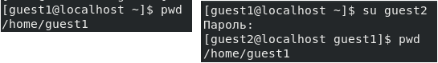
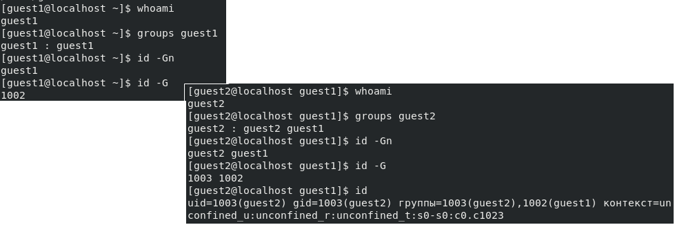
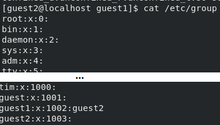
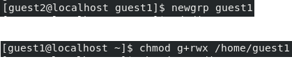
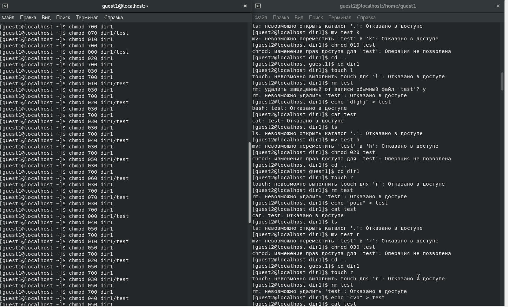
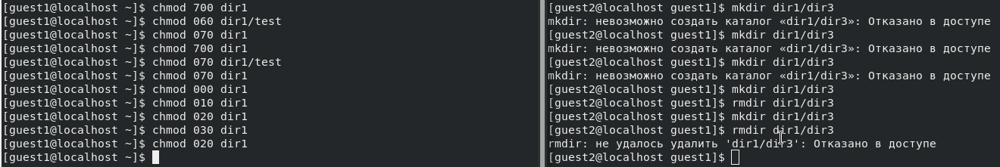


---
# Front matter
lang: "ru"
title: "Лабораторная работа №3"
subtitle: "Дискреционное разграничение прав в Linux. Два пользователя"
author: "Ли Тимофей Александрович"

# Formatting
toc-title: "Содержание"
toc: true # Table of contents
toc_depth: 2
lof: true # List of figures
lot: true # List of tables
fontsize: 12pt
linestretch: 1.5
papersize: a4paper
documentclass: scrreprt
mainfont: PT Serif
romanfont: PT Serif
sansfont: PT Sans
monofont: Fira Code
mainfontoptions: Ligatures=TeX
romanfontoptions: Ligatures=TeX
sansfontoptions: Ligatures=TeX,Scale=MatchLowercase
monofontoptions: Scale=MatchLowercase
indent: true
pdf-engine: xelatex
header-includes:
  - \linepenalty=10 # the penalty added to the badness of each line within a paragraph (no associated penalty node) Increasing the value makes tex try to have fewer lines in the paragraph.
  - \interlinepenalty=0 # value of the penalty (node) added after each line of a paragraph.
  - \hyphenpenalty=50 # the penalty for line breaking at an automatically inserted hyphen
  - \exhyphenpenalty=50 # the penalty for line breaking at an explicit hyphen
  - \binoppenalty=700 # the penalty for breaking a line at a binary operator
  - \relpenalty=500 # the penalty for breaking a line at a relation
  - \clubpenalty=150 # extra penalty for breaking after first line of a paragraph
  - \widowpenalty=150 # extra penalty for breaking before last line of a paragraph
  - \displaywidowpenalty=50 # extra penalty for breaking before last line before a display math
  - \brokenpenalty=100 # extra penalty for page breaking after a hyphenated line
  - \predisplaypenalty=10000 # penalty for breaking before a display
  - \postdisplaypenalty=0 # penalty for breaking after a display
  - \floatingpenalty = 20000 # penalty for splitting an insertion (can only be split footnote in standard LaTeX)
  - \raggedbottom # or \flushbottom
  - \usepackage{float} # keep figures where there are in the text
  - \floatplacement{figure}{H} # keep figures where there are in the text
---

# Цель работы

Получение практических навыков работы в консоли с атрибутами файлов для групп пользователей.

# Выполнение лабораторной работы

Пользователь guest1 у меня уже был с прошлой лабораторной работы, поэтому, используя root, создал пользователя guest2, установил для него пароль и добавил его в группу к пользователю guest1: (рис. -@fig:001):

{ #fig:001 }

Затем, в другом окне терминала зашел в пользователя guest2 и в обоих окнах посмотрел папку, в которой нахожусь: (рис. -@fig:002)

{ #fig:002 }

Для первого пользователя местонахождение совпадает с приглашением командной строки, а для второго нет, поскольку вход в терминал был осуществлен через первого пользователя.

В обоих окнах уточнил имя пользователя командой whoami, вывел, в какие группы входят пользователи: (рис. -@fig:003)

{ #fig:003 }

Посмотрел файл etc/group: (рис. -@fig:004)

{ #fig:004 }

Как видно, действительно в группу guest1 входят оба пользователя, а в guest2 только guest2.

Далее, зарегистрировался от второго пользователя в группе первого и от имени первого разрешил членам группы все действия (рис. -@fig:005)

{ #fig:005 }

Затем, с помощью уже существующих папки dir1 и файла test я от имени guest1 начал менять права доступа, а от имени guest2 начал проверять, какие операции разрешены, а какие нет. Для этого использовал команды cd (смена директории), touch (создание файла), rm (удаление файла), echo (запись в файл), cat (чтение файла), ls (просмотр содержимого), mv (переименование файла), chmod (смена атрибутов): (рис. -@fig:006)

{ #fig:006 }

На основе полученных ответов заполнил таблицу (таб. 3.1)

|Права директории|Права файла|Создание файла|Удаление файла|Запись в файл|Чтение файла|Смена директории|Просмотр файлов в директории|Переименование файла|Смена атрибутов файла|
|----------------|-----------|--------------|--------------|-------------|------------|----------------|----------------------------|--------------------|---------------------|
|d(000)          |(000)      |-             |-             |-            |-           |-               |-                           |-                   |-                    |
|d(000)          |(010)      |-             |-             |-            |-           |-               |-                           |-                   |-                    |
|d(000)          |(020)      |-             |-             |-            |-           |-               |-                           |-                   |-                    |
|d(000)          |(030)      |-             |-             |-            |-           |-               |-                           |-                   |-                    |
|d(000)          |(040)      |-             |-             |-            |-           |-               |-                           |-                   |-                    |
|d(000)          |(050)      |-             |-             |-            |-           |-               |-                           |-                   |-                    |
|d(000)          |(060)      |-             |-             |-            |-           |-               |-                           |-                   |-                    |
|d(000)          |(070)      |-             |-             |-            |-           |-               |-                           |-                   |-                    |
|d(010)          |(000)      |-             |-             |-            |-           |+               |-                           |-                   |-                    |
|d(010)          |(010)      |-             |-             |-            |-           |+               |-                           |-                   |-                    |
|d(010)          |(020)      |-             |-             |+            |-           |+               |-                           |-                   |-                    |
|d(010)          |(030)      |-             |-             |+            |-           |+               |-                           |-                   |-                    |
|d(010)          |(040)      |-             |-             |-            |+           |+               |-                           |-                   |-                    |
|d(010)          |(050)      |-             |-             |-            |+           |+               |-                           |-                   |-                    |
|d(010)          |(060)      |-             |-             |+            |+           |+               |-                           |-                   |-                    |
|d(010)          |(070)      |-             |-             |+            |+           |+               |-                           |-                   |-                    |
|d(020)          |(000)      |-             |-             |-            |-           |-               |-                           |-                   |-                    |
|d(020)          |(010)      |-             |-             |-            |-           |-               |-                           |-                   |-                    |
|d(020)          |(020)      |-             |-             |-            |-           |-               |-                           |-                   |-                    |
|d(020)          |(030)      |-             |-             |-            |-           |-               |-                           |-                   |-                    |
|d(020)          |(040)      |-             |-             |-            |-           |-               |-                           |-                   |-                    |
|d(020)          |(050)      |-             |-             |-            |-           |-               |-                           |-                   |-                    |
|d(020)          |(060)      |-             |-             |-            |-           |-               |-                           |-                   |-                    |
|d(020)          |(070)      |-             |-             |-            |-           |-               |-                           |-                   |-                    |
|d(030)          |(000)      |+             |+             |-            |-           |+               |-                           |+                   |-                    |
|d(030)          |(010)      |+             |+             |-            |-           |+               |-                           |+                   |-                    |
|d(030)          |(020)      |+             |+             |+            |-           |+               |-                           |+                   |-                    |
|d(030)          |(030)      |+             |+             |+            |-           |+               |-                           |+                   |-                    |
|d(030)          |(040)      |+             |+             |-            |+           |+               |-                           |+                   |-                    |
|d(030)          |(050)      |+             |+             |-            |+           |+               |-                           |+                   |-                    |
|d(030)          |(060)      |+             |+             |+            |+           |+               |-                           |+                   |-                    |
|d(030)          |(070)      |+             |+             |+            |+           |+               |-                           |+                   |-                    |
|d(040)          |(000)      |-             |-             |-            |-           |-               |+                           |-                   |-                    |
|d(040)          |(010)      |-             |-             |-            |-           |-               |+                           |-                   |-                    |
|d(040)          |(020)      |-             |-             |-            |-           |-               |+                           |-                   |-                    |
|d(040)          |(030)      |-             |-             |-            |-           |-               |+                           |-                   |-                    |
|d(040)          |(040)      |-             |-             |-            |-           |-               |+                           |-                   |-                    |
|d(040)          |(050)      |-             |-             |-            |-           |-               |+                           |-                   |-                    |
|d(040)          |(060)      |-             |-             |-            |-           |-               |+                           |-                   |-                    |
|d(040)          |(070)      |-             |-             |-            |-           |-               |+                           |-                   |-                    |
|d(050)          |(000)      |-             |-             |-            |-           |+               |+                           |-                   |-                    |
|d(050)          |(010)      |-             |-             |-            |-           |+               |+                           |-                   |-                    |
|d(050)          |(020)      |-             |-             |+            |-           |+               |+                           |-                   |-                    |
|d(050)          |(030)      |-             |-             |+            |-           |+               |+                           |-                   |-                    |
|d(050)          |(040)      |-             |-             |-            |+           |+               |+                           |-                   |-                    |
|d(050)          |(050)      |-             |-             |-            |+           |+               |+                           |-                   |-                    |
|d(050)          |(060)      |-             |-             |+            |+           |+               |+                           |-                   |-                    |
|d(050)          |(070)      |-             |-             |+            |+           |+               |+                           |-                   |-                    |
|d(060)          |(000)      |-             |-             |-            |-           |-               |+                           |-                   |-                    |
|d(060)          |(010)      |-             |-             |-            |-           |-               |+                           |-                   |-                    |
|d(060)          |(020)      |-             |-             |-            |-           |-               |+                           |-                   |-                    |
|d(060)          |(030)      |-             |-             |-            |-           |-               |+                           |-                   |-                    |
|d(060)          |(040)      |-             |-             |-            |-           |-               |+                           |-                   |-                    |
|d(060)          |(050)      |-             |-             |-            |-           |-               |+                           |-                   |-                    |
|d(060)          |(060)      |-             |-             |-            |-           |-               |+                           |-                   |-                    |
|d(060)          |(070)      |-             |-             |-            |-           |-               |+                           |-                   |-                    |
|d(070)          |(000)      |+             |+             |-            |-           |+               |+                           |+                   |-                    |
|d(070)          |(010)      |+             |+             |-            |-           |+               |+                           |+                   |-                    |
|d(070)          |(020)      |+             |+             |+            |-           |+               |+                           |+                   |-                    |
|d(070)          |(030)      |+             |+             |+            |-           |+               |+                           |+                   |-                    |
|d(070)          |(040)      |+             |+             |-            |+           |+               |+                           |+                   |-                    |
|d(070)          |(050)      |+             |+             |-            |+           |+               |+                           |+                   |-                    |
|d(070)          |(060)      |+             |+             |+            |+           |+               |+                           |+                   |-                    |
|d(070)          |(070)      |+             |+             |+            |+           |+               |+                           |+                   |-                    |

: Установленные права и разрешённые действия для групп

У полученной таблицы лишь одно отличие от таблицы 2.1 - сменить атрибуты файла на этот раз не получилось нигде.

Затем, на основе полученных ответов заполнил таблицу 3.2. Также для заполнения этой таблицы проверил минимальные разрешения для создания/удаления поддиректории: (рис. -@fig:007):

{ #fig:007 }

В итоге получил следующую таблицу: (таб. 2.2)

|Операция              |min права на директорию|min права на файл|
|----------------------|-----------------------|-----------------|
|Создание файла        |d(030)                 |(000)            |
|Удаление файла        |d(030)                 |(000)            |
|Чтение файла          |d(010)                 |(040)            |
|Запись в файл         |d(010)                 |(020)            |
|Переименование файла  |d(030)                 |(000)            |
|Создание поддиректории|d(030)                 |(000)            |
|Удаление поддиректории|d(030)                 |(000)            |

: Минимальные права для совершения операций от имени пользователей, входящих в группу

# Выводы

Получил практических навыков работы в консоли с атрибутами файлов для групп пользователей.
