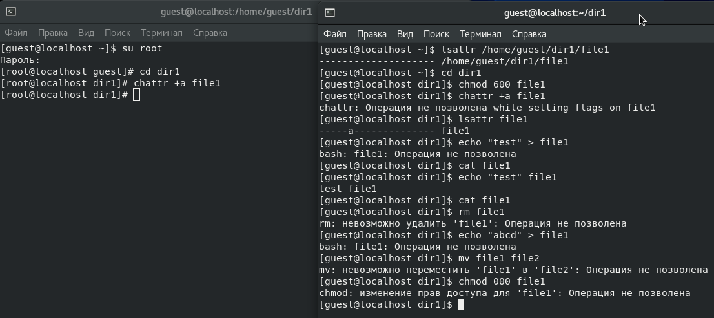
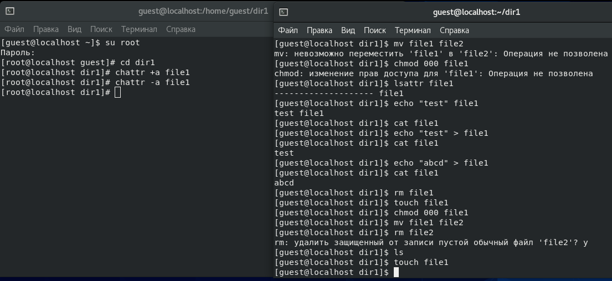
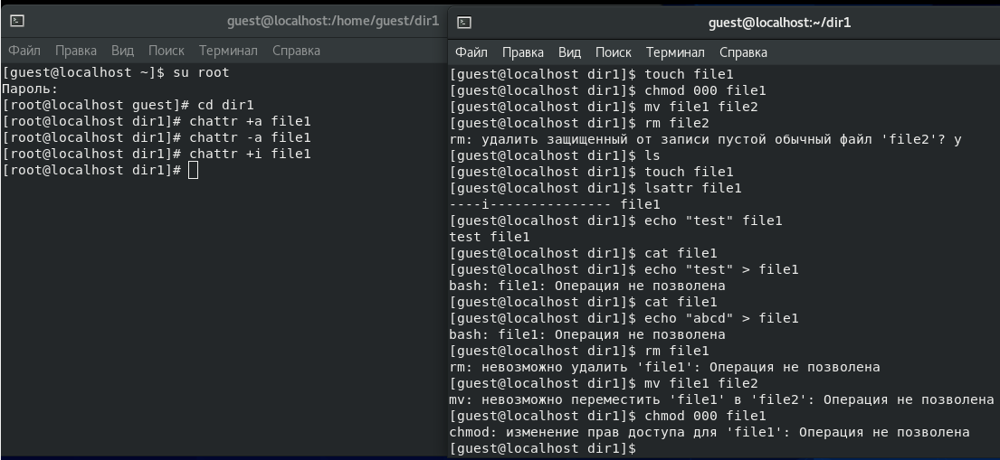


---
# Front matter
lang: "ru"
title: "Лабораторная работа №4"
subtitle: "Дискреционное разграничение прав в Linux. Расширенные атрибуты"
author: "Ли Тимофей Александрович"

# Formatting
toc-title: "Содержание"
toc: true # Table of contents
toc_depth: 2
lof: true # List of figures
lot: true # List of tables
fontsize: 12pt
linestretch: 1.5
papersize: a4paper
documentclass: scrreprt
mainfont: PT Serif
romanfont: PT Serif
sansfont: PT Sans
monofont: Fira Code
mainfontoptions: Ligatures=TeX
romanfontoptions: Ligatures=TeX
sansfontoptions: Ligatures=TeX,Scale=MatchLowercase
monofontoptions: Scale=MatchLowercase
indent: true
pdf-engine: xelatex
header-includes:
  - \linepenalty=10 # the penalty added to the badness of each line within a paragraph (no associated penalty node) Increasing the value makes tex try to have fewer lines in the paragraph.
  - \interlinepenalty=0 # value of the penalty (node) added after each line of a paragraph.
  - \hyphenpenalty=50 # the penalty for line breaking at an automatically inserted hyphen
  - \exhyphenpenalty=50 # the penalty for line breaking at an explicit hyphen
  - \binoppenalty=700 # the penalty for breaking a line at a binary operator
  - \relpenalty=500 # the penalty for breaking a line at a relation
  - \clubpenalty=150 # extra penalty for breaking after first line of a paragraph
  - \widowpenalty=150 # extra penalty for breaking before last line of a paragraph
  - \displaywidowpenalty=50 # extra penalty for breaking before last line before a display math
  - \brokenpenalty=100 # extra penalty for page breaking after a hyphenated line
  - \predisplaypenalty=10000 # penalty for breaking before a display
  - \postdisplaypenalty=0 # penalty for breaking after a display
  - \floatingpenalty = 20000 # penalty for splitting an insertion (can only be split footnote in standard LaTeX)
  - \raggedbottom # or \flushbottom
  - \usepackage{float} # keep figures where there are in the text
  - \floatplacement{figure}{H} # keep figures where there are in the text
---

# Цель работы

Получение практических навыков работы в консоли с расширенными атрибутами файлов.

# Выполнение лабораторной работы

От имени пользователя guest определил расширенные атрибуты файла home/guest/dir1/file1 с помощью команды lsattr (их не оказалось).
Затем установил на файл права 600, разрешающие чтение и запись для владельца с помощью команды chmod.
Попробовал установить на файл расширенный атрибут а, используя команду chattr, но получил отказ.
Открыл новое окно терминала, зашел в нем в суперпользователя root и установил этот атрибут.
От пользователя guest проверил наличие атрибута а и проверил выполнение операций:

- Дозапись в файл (на скриншоте команда написана с ошибкой, правильное написание " echo "test" >> file1 ", выполнение программы я проверил позже, с атрибутом a операция прошла успешно, а с i нет)
- Чтение файла командой cat
- Удаление файла командой rm
- Перезапись файла командой " echo > "
- Переименование файла командой mv
- Смена прав командой chmod

Выполнение вышеперечисленных действий: (рис. -@fig:001):

{ #fig:001 }

Затем, от имени root снял расширенный атрибут a и повторил все те же действия от имени guest: (рис. -@fig:002)

{ #fig:002 }

Далее, от имени root установил расширенный атрибут i и еще раз повторил все действия: (рис. -@fig:003)

{ #fig:003 }

Полученные результаты внес в таблицу: (таб. 4.1)

|Операция              |Без расш. атрибутов|С расш. атрибутом a|С расш. атрибутом i|
|----------------------|-------------------|-------------------|-------------------|
|Дозапись в файл       |+                  |+                  |-                  |
|Чтение файла          |+                  |+                  |+                  |
|Перезапись файла      |+                  |-                  |-                  |
|Удаление файла        |+                  |-                  |-                  |
|Переименование файла  |+                  |-                  |-                  |
|Установка прав        |+                  |-                  |-                  |

: Результат проведения операция с расширенными атрибутами

Как видим, с расширенным атрибутом i у нас получилось только прочитать файл, а с атрибутом a также вышло дозаписать в конец файла.
Без расширенных атрибутов у нас получились все операции.

# Выводы

Получил практических навыков работы в консоли с расширенными атрибутами файлов.
