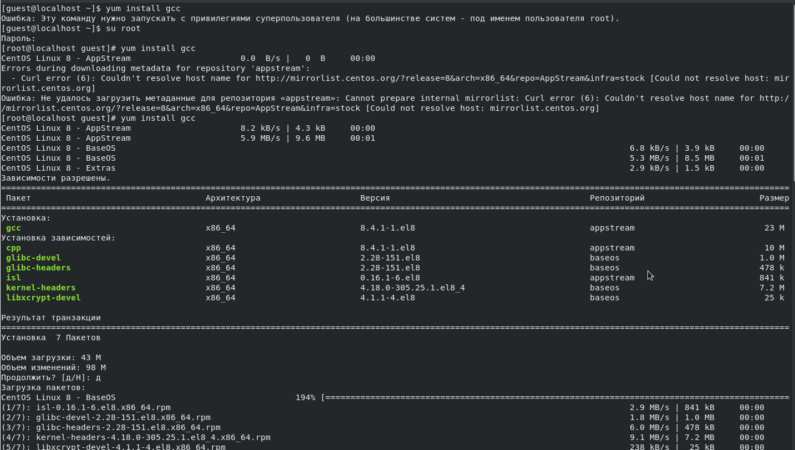
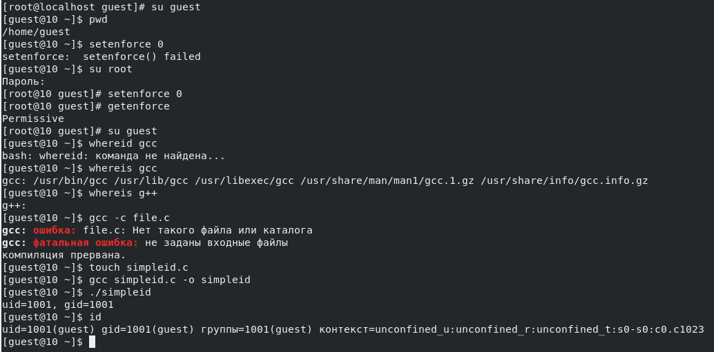
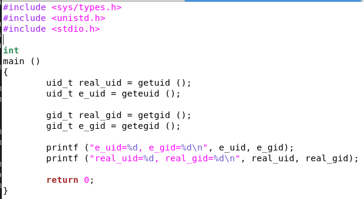
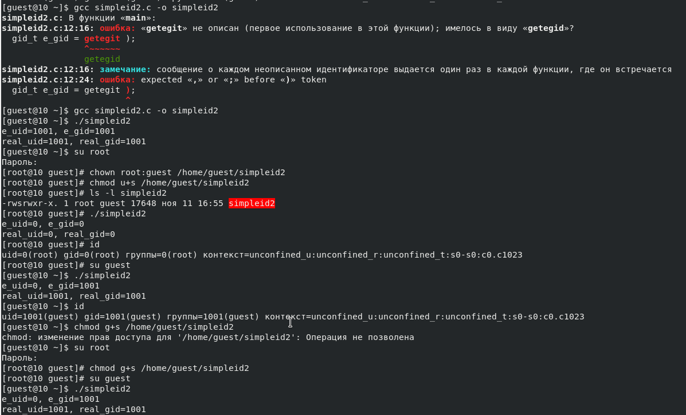
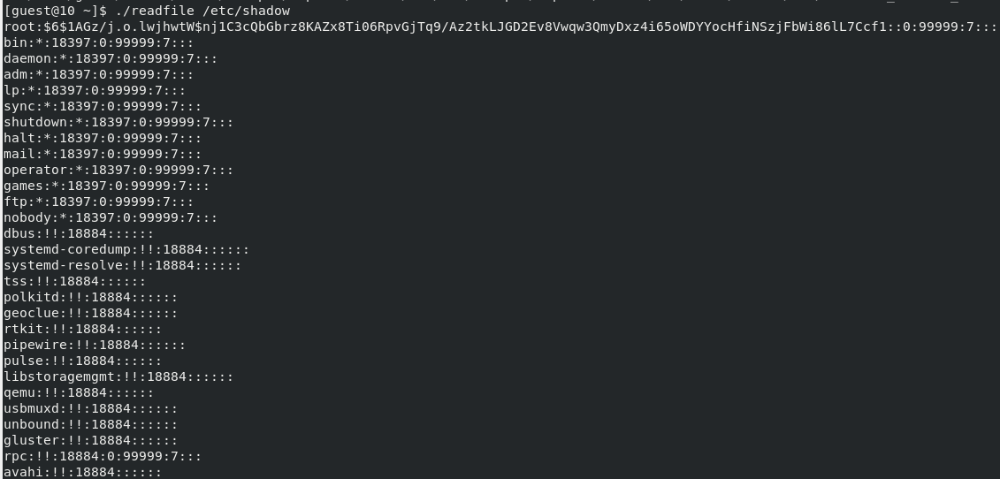

---
# Front matter
lang: "ru"
title: "Лабораторная работа №5"
subtitle: "Дискреционное разграничение прав в Linux. Исследование влияния дополнительных атрибутов."
author: "Ли Тимофей Александрович"

# Formatting
toc-title: "Содержание"
toc: true # Table of contents
toc_depth: 2
lof: true # List of figures
lot: true # List of tables
fontsize: 12pt
linestretch: 1.5
papersize: a4paper
documentclass: scrreprt
mainfont: PT Serif
romanfont: PT Serif
sansfont: PT Sans
monofont: Fira Code
mainfontoptions: Ligatures=TeX
romanfontoptions: Ligatures=TeX
sansfontoptions: Ligatures=TeX,Scale=MatchLowercase
monofontoptions: Scale=MatchLowercase
indent: true
pdf-engine: xelatex
header-includes:
  - \linepenalty=10 # the penalty added to the badness of each line within a paragraph (no associated penalty node) Increasing the value makes tex try to have fewer lines in the paragraph.
  - \interlinepenalty=0 # value of the penalty (node) added after each line of a paragraph.
  - \hyphenpenalty=50 # the penalty for line breaking at an automatically inserted hyphen
  - \exhyphenpenalty=50 # the penalty for line breaking at an explicit hyphen
  - \binoppenalty=700 # the penalty for breaking a line at a binary operator
  - \relpenalty=500 # the penalty for breaking a line at a relation
  - \clubpenalty=150 # extra penalty for breaking after first line of a paragraph
  - \widowpenalty=150 # extra penalty for breaking before last line of a paragraph
  - \displaywidowpenalty=50 # extra penalty for breaking before last line before a display math
  - \brokenpenalty=100 # extra penalty for page breaking after a hyphenated line
  - \predisplaypenalty=10000 # penalty for breaking before a display
  - \postdisplaypenalty=0 # penalty for breaking after a display
  - \floatingpenalty = 20000 # penalty for splitting an insertion (can only be split footnote in standard LaTeX)
  - \raggedbottom # or \flushbottom
  - \usepackage{float} # keep figures where there are in the text
  - \floatplacement{figure}{H} # keep figures where there are in the text
---

# Цель работы

Изучение механизмов изменения идентификаторов, применения SetUID- и Sticky-битов. Получение практических навыков работы в консоли с дополнительными атрибутами.
Рассмотрение работы механизма смены идентификатора процессов пользователей, а также влияние бита Sticky на запись и удаление файлов.

# Выполнение лабораторной работы

Для начала я, зайдя в root, установил компилятор gcc со всеми сопутствующими пакетами. (рис. -@fig:001):

{ #fig:001 }

Затем, установил setenforce 0, проверил запуск gcc и g++. Создал файл simpleid.c, скомпилировал его и запустил. Сравнил вывод с выводом команды id: (рис. -@fig:002)

{ #fig:002 }

Код файла simpleid.c: (рис. -@fig:003)

{ #fig:003 }

Как видим, вывод программы и команды id совпадают.

Добавил в код вывод действительных идентификаторов и сохранил файл как simpleid2.c: (рис. -@fig:004)

{ #fig:004 }

Скомпилировал код и от имени root изменил владельца полученной программы на root и группу guest, а также добавил владельцу программы право на выполнение от имени суперпользователя.
Затем, убедился в правильности установки атрибутов с помощью ls -l, запустил программу и вызвал команду id.
Далее, с помощью root установил на программу для группы право выполнения от имени суперпользователя (SetGID бит) и повторил запуск программы (конец действий на скриншоте 6): (рис. -@fig:005)

{ #fig:005 }

Затем, написал программу readfile и скомпилировал ее: (рис. -@fig:006)

{ #fig:006 }

Далее Сменил владельца программы на root и сменил права так, что только суперпользователь может читать этот файл. Убедился, что guest не может прочитать файл.
Сменил владельца у скомпилированной программы и установил SetUID бит. Попробовал от имени guest прочитать файл readfile.c с помощью программы: (рис. -@fig:007)

{ #fig:007 }

Также попробовал прочитать файл etc/shadow: (рис. -@fig:008)

{ #fig:008 }

Оба файла прочитались несмотря на отсутствие прав у пользователя guest, поскольку программа запускается пользователем guest от имени суперпользователя.

Далее, начал работать с битом Sticky: (рис. -@fig:009)

{ #fig:009 }

Выяснил, что на директорию tmp установлен этот бит, тк среди атрибутов в конец есть t.
Создал файл file01.txt в директории tmp и записал в него слово test.
Посмотрел расширенные атрибуты и добавил чтение и запись для других пользователей.
От пользователя tim (не явл. владельцем) прочитал файл, дозаписал в него и перезаписал его. Затем попробовал удалить файл, но безуспешно.
Далее от имени root удалил атрибут t (Sticky бит) с директории tmp и повторил все действия от имени пользователя tim.
На этот раз вышло то же самое, но еще удалось удалить файл. Это потому, что Sticke-бит защищает файлы, запрещая удаление файлов не владельцами.
В конце вернул Sticky бит директории tmp.

# Выводы

Изучил механизмы изменения идентификаторов, применения SetUID- и Sticky-битов. Получил практические навыки работы в консоли с дополнительными атрибутами.
Рассмотрел работу механизма смены идентификатора процессов пользователей, а также влияние бита Sticky на запись и удаление файлов.