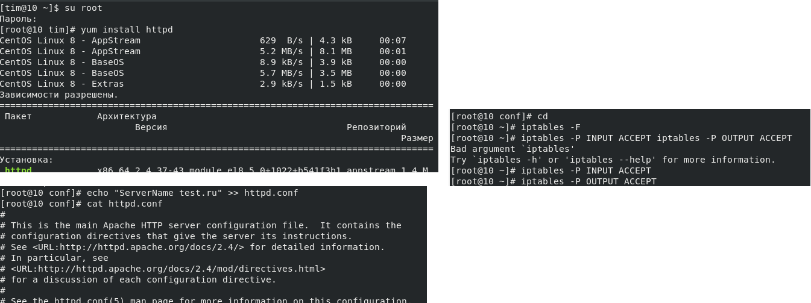
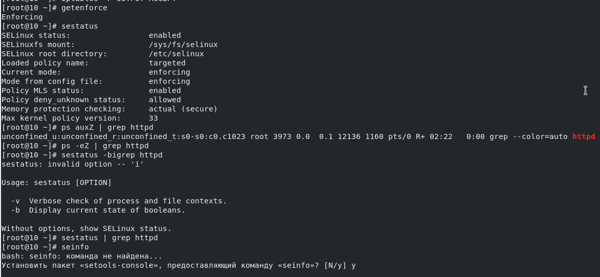
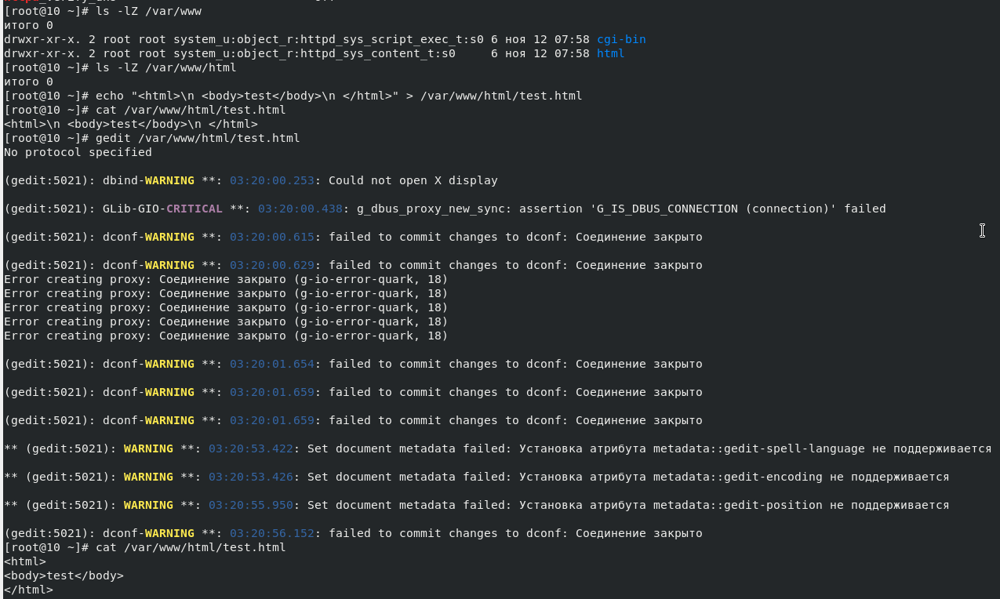
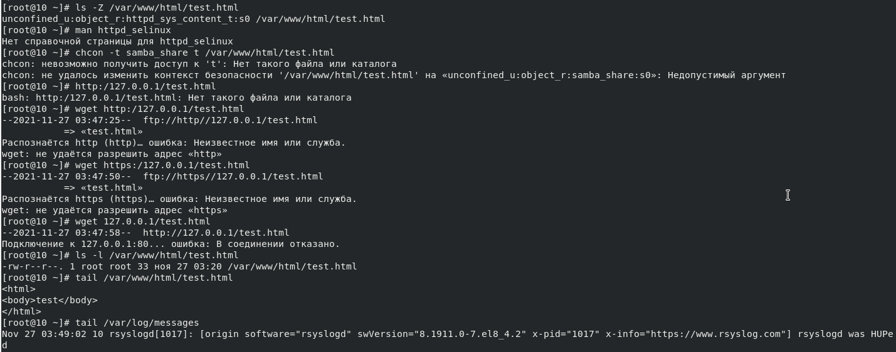
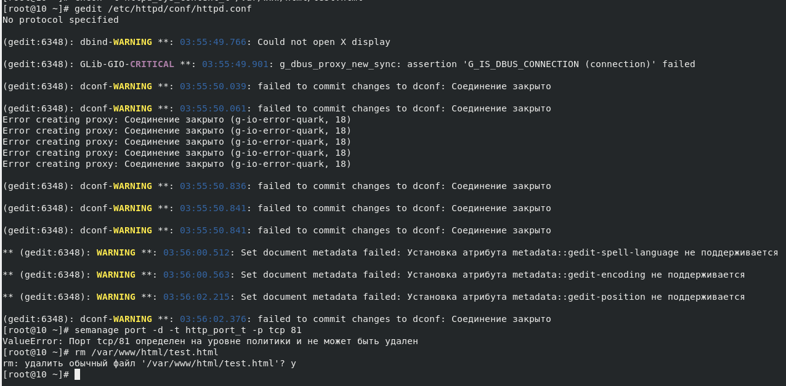

---
## Front matter
lang: "ru"
title: Лабораторная работа № 6
author: Ли Тимофей Александрович, НФИбд-01-18

## Formatting
toc: false
slide_level: 2
theme: metropolis
header-includes: 
 - \metroset{progressbar=frametitle,sectionpage=progressbar,numbering=fraction}
 - '\makeatletter'
 - '\beamer@ignorenonframefalse'
 - '\makeatother'
aspectratio: 43
section-titles: true
---

# Цель работы

Развить навыки администрирования ОС Linux. Получить первое практическое знакомство с технологией SELinux1.
Проверить работу SELinx на практике совместно с веб-сервером Apache.

# Выполнение лабораторной работы

Для начала я, зайдя в root, установил apache, задал servername в конфигурационном файле и отключил пакетный фильтр. (рис. -@fig:001):

{ #fig:001 }

# Выполнение лабораторной работы

Убедился, что SElinux работает в нужном режиме. Нашел apache в списке процессов: (рис. -@fig:002)

{ #fig:002 }

# Выполнение лабораторной работы

посмотрел состояние переключателей SElinux: (рис. -@fig:003)

{ #fig:003 }

# Выполнение лабораторной работы

Определил типы файлов и поддиректорий в www и www/html. Создал файл test.html: (рис. -@fig:004)

{ #fig:004 }

# Выполнение лабораторной работы

Получившийся файл: (рис. -@fig:005)

{ #fig:005 }

# Выполнение лабораторной работы

Затем, не смог отобразить файл через браузер. Проверил контекст файла и попробовал его изменить (получил сообщение об ошибке). Посмотрел лог-файл: (рис. -@fig:006)

{ #fig:006 }

# Выполнение лабораторной работы

Попробовал запустить веб-сервер на прослушивание порта 81, изменив файл httpd.conf: (рис. -@fig:007)

{ #fig:007 }

# Выполнение лабораторной работы

Не смог запустить веб-сервер, проанализировал лог-файлы. Выполнил команды semanage и убедился, что порт 81 есть в списках: (рис. -@fig:008)

{ #fig:008 }

# Выполнение лабораторной работы

Вернул контекст файлу test.html, исправил обратно конфигурационный файл, попытался удалить привязку к порту 81 и удалил файл test.html: (рис. -@fig:009)

{ #fig:009 }

# Выводы

Развил навыки администрирования ОС Linux. Получил первое практическое знакомство с технологией SELinux1.
Проверил работу SELinx на практике совместно с веб-сервером Apache.