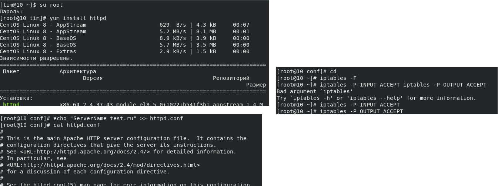
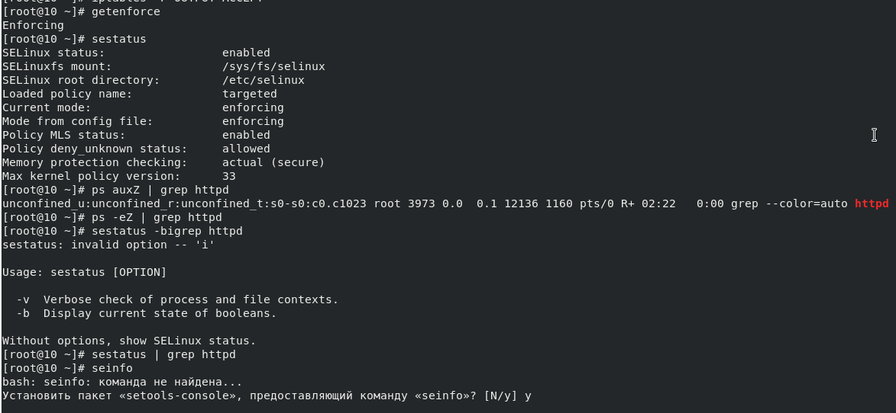
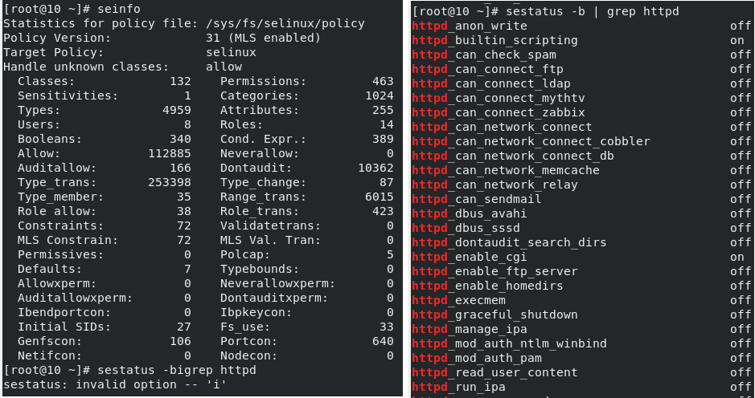
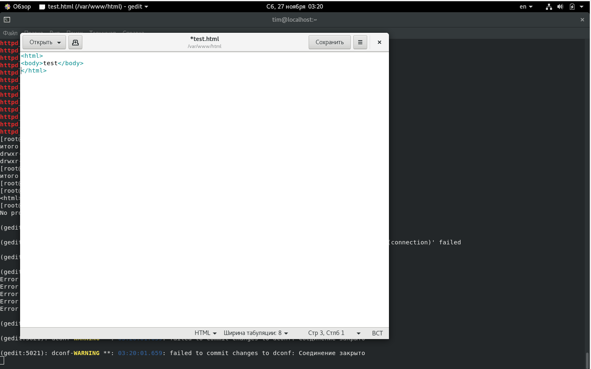
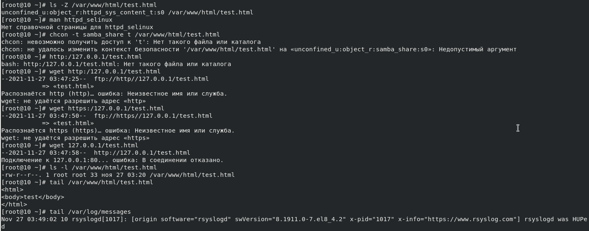
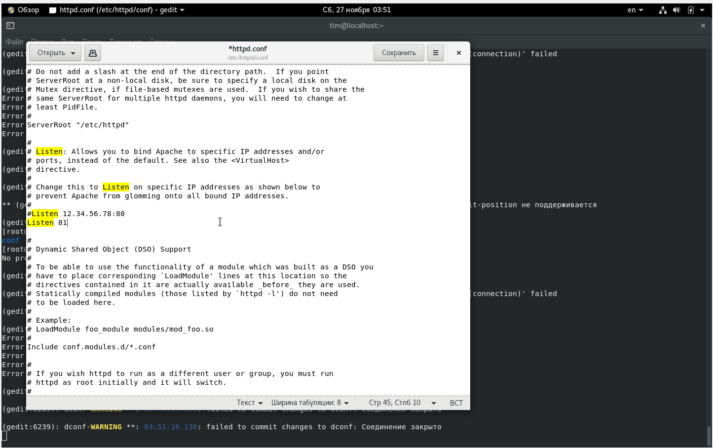
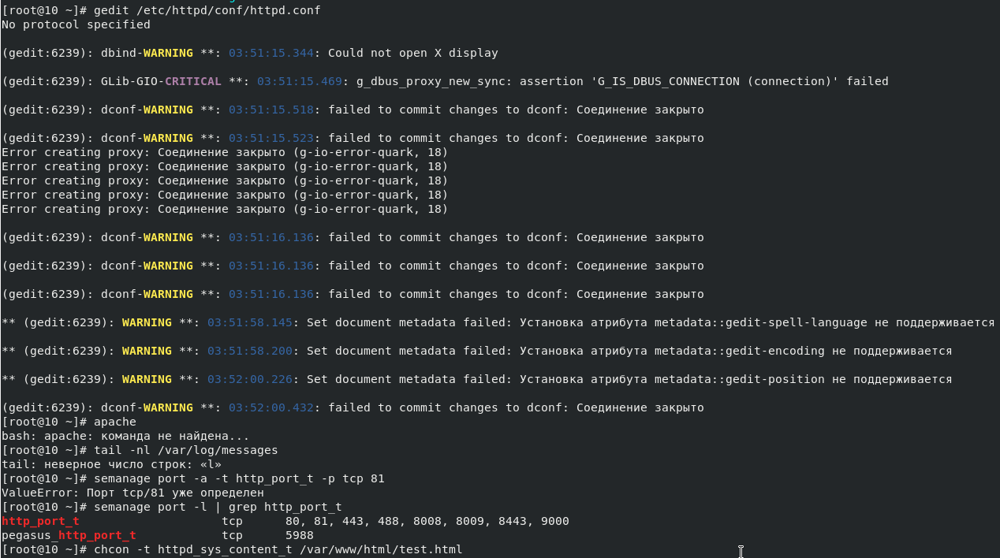
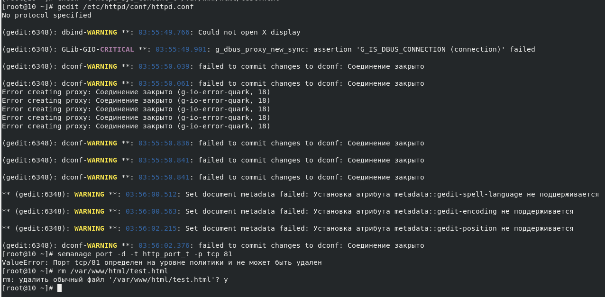


---
# Front matter
lang: "ru"
title: "Лабораторная работа №6"
subtitle: "Мандатное разграничение прав в Linux"
author: "Ли Тимофей Александрович"

# Formatting
toc-title: "Содержание"
toc: true # Table of contents
toc_depth: 2
lof: true # List of figures
lot: true # List of tables
fontsize: 12pt
linestretch: 1.5
papersize: a4paper
documentclass: scrreprt
mainfont: PT Serif
romanfont: PT Serif
sansfont: PT Sans
monofont: Fira Code
mainfontoptions: Ligatures=TeX
romanfontoptions: Ligatures=TeX
sansfontoptions: Ligatures=TeX,Scale=MatchLowercase
monofontoptions: Scale=MatchLowercase
indent: true
pdf-engine: xelatex
header-includes:
  - \linepenalty=10 # the penalty added to the badness of each line within a paragraph (no associated penalty node) Increasing the value makes tex try to have fewer lines in the paragraph.
  - \interlinepenalty=0 # value of the penalty (node) added after each line of a paragraph.
  - \hyphenpenalty=50 # the penalty for line breaking at an automatically inserted hyphen
  - \exhyphenpenalty=50 # the penalty for line breaking at an explicit hyphen
  - \binoppenalty=700 # the penalty for breaking a line at a binary operator
  - \relpenalty=500 # the penalty for breaking a line at a relation
  - \clubpenalty=150 # extra penalty for breaking after first line of a paragraph
  - \widowpenalty=150 # extra penalty for breaking before last line of a paragraph
  - \displaywidowpenalty=50 # extra penalty for breaking before last line before a display math
  - \brokenpenalty=100 # extra penalty for page breaking after a hyphenated line
  - \predisplaypenalty=10000 # penalty for breaking before a display
  - \postdisplaypenalty=0 # penalty for breaking after a display
  - \floatingpenalty = 20000 # penalty for splitting an insertion (can only be split footnote in standard LaTeX)
  - \raggedbottom # or \flushbottom
  - \usepackage{float} # keep figures where there are in the text
  - \floatplacement{figure}{H} # keep figures where there are in the text
---

# Цель работы

Развить навыки администрирования ОС Linux. Получить первое практическое знакомство с технологией SELinux1.
Проверить работу SELinx на практике совместно с веб-сервером Apache.

# Выполнение лабораторной работы

Для начала я, зайдя в root, установил apache, задал servername в конфигурационном файле и отключил пакетный фильтр. (рис. -@fig:001):

{ #fig:001 }

Убедился, что SElinux работает в нужном режиме. Нашел apache в списке процессов: (рис. -@fig:002)

{ #fig:002 }

посмотрел состояние переключателей SElinux: (рис. -@fig:003)

{ #fig:003 }

Определил типы файлов и поддиректорий в www и www/html. Создал файл test.html: (рис. -@fig:004)

{ #fig:004 }

Получившийся файл: (рис. -@fig:005)

{ #fig:005 }

Затем, не смог отобразить файл через браузер. Проверил контекст файла и попробовал его изменить (получил сообщение об ошибке). Посмотрел лог-файл: (рис. -@fig:006)

{ #fig:006 }

Попробовал запустить веб-сервер на прослушивание порта 81, изменив файл httpd.conf: (рис. -@fig:007)

{ #fig:007 }

Не смог запустить веб-сервер, проанализировал лог-файлы. Выполнил команды semanage и убедился, что порт 81 есть в списках: (рис. -@fig:008)

{ #fig:008 }

Вернул контекст файлу test.html, исправил обратно конфигурационный файл, попытался удалить привязку к порту 81 и удалил файл test.html: (рис. -@fig:009)

{ #fig:009 }

# Выводы

Развил навыки администрирования ОС Linux. Получил первое практическое знакомство с технологией SELinux1.
Проверил работу SELinx на практике совместно с веб-сервером Apache.