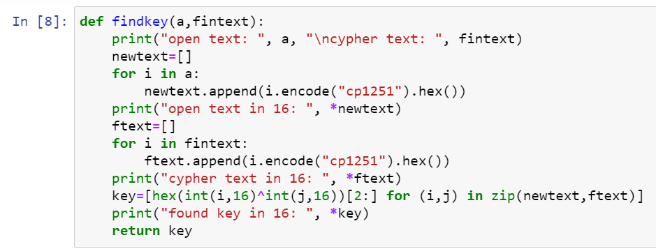

---
## Front matter
lang: "ru"
title: Лабораторная работа № 7
author: Ли Тимофей Александрович, НФИбд-01-18

## Formatting
toc: false
slide_level: 2
theme: metropolis
header-includes: 
 - \metroset{progressbar=frametitle,sectionpage=progressbar,numbering=fraction}
 - '\makeatletter'
 - '\beamer@ignorenonframefalse'
 - '\makeatother'
aspectratio: 43
section-titles: true
---

# Цель работы

Освоить на практике применение режима однократного гаммирования.

# Выполнение лабораторной работы

Написал функцию для определения вида шифротекста при известном ключе и известном открытом тексте. (рис. -@fig:001):

{ #fig:001 width=80%}

# Выполнение лабораторной работы

Вывод функции: (рис. -@fig:002)

{ #fig:002 }

# Выполнение лабораторной работы

Написал функцию для определения ключа по открытому тексту и шифротексту. (рис. -@fig:003)

{ #fig:003 }

# Выполнение лабораторной работы

Вывод: (рис. -@fig:004)

{ #fig:004 }

# Выполнение лабораторной работы

В конце проверил полученный ключ и тот, который был изначально сгенерирован: (рис. -@fig:005)

{ #fig:005 }

Как видим, ключ действительно тот.

# Контрольные вопросы

1. Поясните смысл однократного гаммирования.

Гаммирование – выполнение операции XOR между элементами гаммы и
элементами подлежащего сокрытию текста. Если в методе шифрования используется
однократная вероятностная гамма (однократное гаммирование) той же длины, что и
подлежащий сокрытию текст, то текст нельзя раскрыть. Даже при раскрытии части
последовательности гаммы нельзя получить информацию о всём скрываемом тексте.

# Контрольные вопросы

2. Перечислите недостатки однократного гаммирования.

Абсолютная стойкость шифра доказана только для случая, когда однократно 
используемый ключ, длиной, равной длине исходного сообщения, является 
фрагментом истинно случайной двоичной последовательности с равномерным 
законом распределения.

# Контрольные вопросы

3. Перечислите преимущества однократного гаммирования.

Во-первых, такой способ симметричен, т.е. двойное прибавление одной и той 
же величины по модулю 2 восстанавливает исходное значение. Во-вторых, 
шифрование и расшифрование может быть выполнено одной и той же программой. 
Наконец, Криптоалгоритм не даёт никакой информации об открытом тексте: при 
известном зашифрованном сообщении C все различные ключевые 
последовательности K возможны и равновероятны, а значит, возможны и любые 
сообщения P.

# Контрольные вопросы

4. Почему длина открытого текста должна совпадать с длиной ключа?

Если ключ короче текста, то операция XOR будет применена не ко всем 
элементам и конец сообщения будет не закодирован. Если ключ будет длиннее, то 
появится неоднозначность декодирования.

# Контрольные вопросы

5. Какая операция используется в режиме однократного гаммирования, назовите её особенности?

Наложение гаммы по сути представляет собой выполнение побитовой 
операции сложения по модулю 2, т.е. мы должны сложить каждый элемент гаммы с 
соответствующим элементом ключа. Данная операция является симметричной, так 
как прибавление одной и той же величины по модулю 2 восстанавливает исходное 
значение.

# Контрольные вопросы

6. Как по открытому тексту и ключу получить шифротекст?

В таком случае задача сводится к правилу: 

Ci = Pi (+) Ki

т.е. мы поэлементно получаем символы зашифрованного сообщения, 
применяя операцию исключающего или к соответствующим элементам ключа и 
открытого текста. 

# Контрольные вопросы

7. Как по открытому тексту и шифротексту получить ключ?

Подобная задача решается путем применения операции исключающего или к 
последовательностям символов зашифрованного и открытого сообщений: 

Ki = Pi (+) Ci.

# Контрольные вопросы

8. В чем заключаются необходимые и достаточные условия абсолютной стойкости шифра?

Необходимые и достаточные условия абсолютной стойкости шифра: 
- полная случайность ключа;
- равенство длин ключа и открытого текста;
- однократное использование ключа.

# Выводы

Освоил на практике применение режима однократного гаммирования.