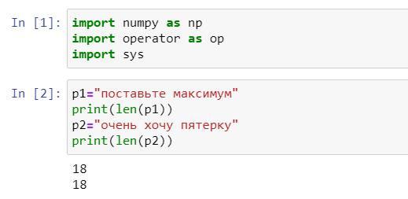
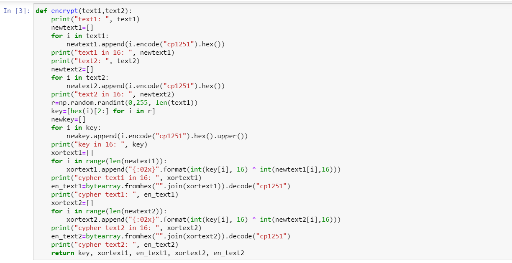
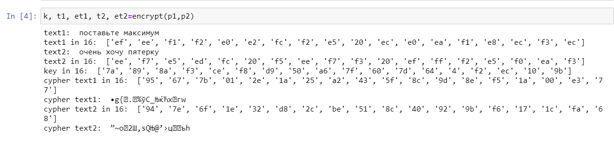
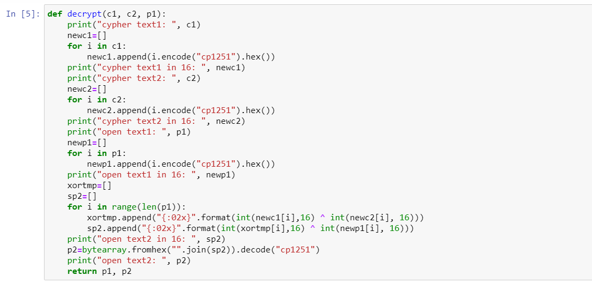
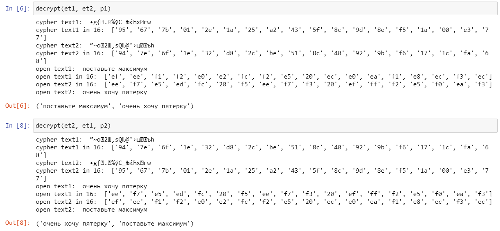

---
## Front matter
lang: "ru"
title: Лабораторная работа № 8
author: Ли Тимофей Александрович, НФИбд-01-18

## Formatting
toc: false
slide_level: 2
theme: metropolis
header-includes: 
 - \metroset{progressbar=frametitle,sectionpage=progressbar,numbering=fraction}
 - '\makeatletter'
 - '\beamer@ignorenonframefalse'
 - '\makeatother'
aspectratio: 43
section-titles: true
---

# Цель работы

Освоить на практике применение режима однократного гаммирования на примере кодирования различных исходных текстов одним ключом.

# Выполнение лабораторной работы

Импортировал нужные библиотеки и задал два текста одной длины. (рис. -@fig:001):

{ #fig:001 }

# Выполнение лабораторной работы

Написал функцию, определяющую вид шифротекстов C1 и C2 обеих строк при известном ключе. (рис. -@fig:002)

{ #fig:002 }

# Выполнение лабораторной работы

Вывод функции: (рис. -@fig:003)

{ #fig:003 }

# Выполнение лабораторной работы

Написал функцию, которая при известных двух шифротекстах и одном открытом тексте находит вид второго открытого текста без ключа. (рис. -@fig:004)

{ #fig:004 }

# Выполнение лабораторной работы

Вывод функции: (рис. -@fig:005)

{ #fig:005 }

Так же проверил нахождение первого текста при известном втором, и, как видно, функция работает исправно.

# Контрольные вопросы

1. Как, зная один из текстов (P1 или P2), определить другой, не зная при этом ключа?

Для этого надо воспользоваться формулой:

C1(+)C2(+)P1 = P1(+)P2(+)P1 = P2,

где С1 и С2 – шифротексты. Как видно, ключ в данной формуле не используется.

# Контрольные вопросы

2. Что будет при повторном использовании ключа при шифровании текста?

В таком случае мы получим исходное сообщение.

# Контрольные вопросы

3. Как реализуется режим шифрования однократного гаммирования одним ключом двух открытых текстов?

Он реализуется по следующей формуле:

C1=P1(+)K

C2=P2(+)K,

где Сi – шифротексты, Pi – открытые тексты, K – единый ключ шифрования.

# Контрольные вопросы

4. Перечислите недостатки шифрования одним ключом двух открытых текстов.

Во-первых, имея на руках одно из сообщений в открытом виде и оба шифротекста, злоумышленник способен расшифровать каждое сообщение, не зная ключа.

Во-вторых, зная шаблон сообщений, злоумышленник получает возможность определить те символы сообщения P2, которые находятся на позициях известного шаблона сообщения P1. 

# Контрольные вопросы

В соответствии с логикой сообщения P2, злоумышленник имеет реальный шанс узнать ещё некоторое количество символов сообщения P2. 
Таким образом, применяя формулу из п. 1, с подстановкой вместо P1 полученных на предыдущем шаге новых символов 
сообщения P2 злоумышленник если не прочитает оба сообщения, то значительно уменьшит пространство их поиска. 
Наконец, зная ключ, злоумышленник смоет расшифровать все сообщения, которые были закодированы при его помощи.

# Контрольные вопросы

5. Перечислите преимущества шифрования одним ключом двух открытых текстов.

Такой подход помогает упростить процесс шифрования и дешифровки. 
Также, при отправке сообщений между 2-я компьютерами, удобнее пользоваться одним общим ключом для передаваемых данных

# Выводы

Освоил на практике применение режима однократного гаммирования на примере кодирования различных исходных текстов одним ключом.
